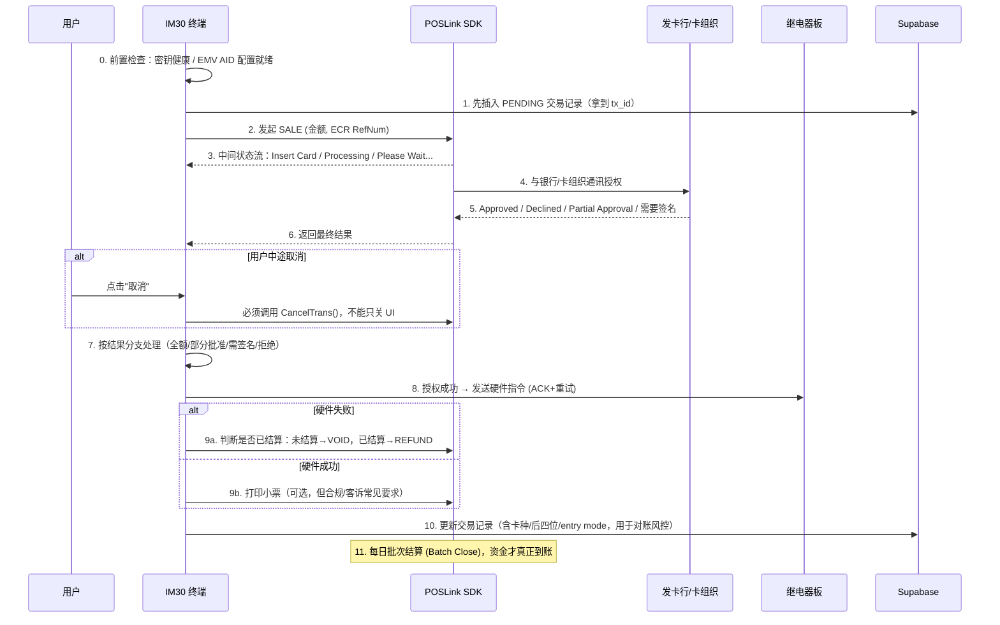

# 刷卡支付 (Card Payment) 端到端方案与待办清单

本文档描述基于 PAX POSLink 的插卡/挥卡/感应支付（Tap/Insert/Swipe）应有的完整端到端设计，并对照当前代码给出差距分析与待办任务。与 `docs/qr_payment_integration.md`（扫码支付）配套，两者是 `startPaymentFlow` 里并列的两条支付路径。背景讨论见 `docs/system_architecture.md` 第 2.2 / 5.3 / 10 章。

> **[v2.2]** 进入本流程的入口现在由 `KioskSettings.payment_method_mode` 云端配置驱动：为 `1`（CARD_ONLY）时，`MainActivity.showPaymentDialog()` 跳过"选择支付方式"弹窗，直接进入本文档描述的刷卡流程；为 `0`（ALL，默认）时行为不变，用户仍需先在选择弹窗里点选。详见 `docs/system_architecture.md` §0 changelog。

---

## 1. 完整端到端流程 (Target Design)

### 1.1 各环节说明

| # | 环节 | 关键约束 |
| :-- | :-- | :-- |
| 0 | 前置检查 | 密钥健康异常必须直接拒绝发起交易，而不是等 SALE 失败才发现 |
| 1 | 交易先落库 | 在调用 `ProcessTrans()` 之前就写入 PENDING 记录，防止 App 崩在 SALE 中途导致这笔钱"云端无痕迹" |
| 2 | 发起 SALE | 传金额、唯一 ECR 参考号 |
| 3 | 中间状态回调 | 真实 POSLink 集成通常提供状态监听（Insert Card / Processing 等），用于驱动 UI 实时反馈，而不是固定动画 |
| 4-6 | 银行授权 | 由 SDK 内部处理，App 只需正确处理最终返回码 |
| 取消 | 用户中途取消 | 必须调用 SDK 的 `CancelTrans()`（或等价接口）通知银行侧中止，**不能只是关闭本地 UI**，否则可能出现"银行已扣款，App 不知情"的孤儿交易 |
| 7 | 结果分支 | 除了"批准/拒绝"，还要处理**部分批准**（预付卡/礼品卡余额不足）与**需要签名**两类中间态 |
| 8 | 触发硬件 | 复用串口 ACK+重试机制（已实现） |
| 9a | 硬件失败退款 | 未结算前用 VOID；一旦交易已被批次结算，VOID 会失败，必须改走 REFUND |
| 9b | 打印小票 | 无人值守场景的常见合规/客诉要求 |
| 10 | 记账 | 除金额/状态外，应记录卡种、卡号后四位、Entry Mode，供财务对账与风控 |
| 11 | 批次结算 | 每日/定期 Batch Close，资金才真正入账商户账户；由 PAX 网关侧还是需要 App/后端显式触发，需与网关文档确认 |

---

## 2. 当前实现状态 (As-Built)

| 环节 | 状态 | 说明 |
| :-- | :-- | :-- |
| 密钥健康前置检查 | ✅ 已实现 | `KeyHealthMonitor.isPaymentAllowed()`，SALE 前拦截；但具体 PAX 错误码是基于关键字猜测的，未经真实 POSLink 文档核实 |
| 交易先落库再发起 | ❌ 未实现 | 现在是 `ProcessTrans()` 全部跑完、成功了才在 `startFinalizationSequence` 里插入交易记录；SALE 调用期间若 App 崩溃，这笔钱云端完全无痕迹 |
| ECR 参考号生成 | 🟡 部分实现 | 用 `System.currentTimeMillis()`，同毫秒内理论上可能碰撞，且未与云端 tx_id 显式关联，只能事后模糊对账 |
| 发起 SALE | ✅ 已实现 | `PaymentService.startCardPayment()`，但 `tenderType` 硬编码为信用卡，未区分 Interac 借记卡等（多数场景由 SDK 自动识别卡种，影响有限） |
| 中间状态回调 | ❌ 不存在 | 本地 `PosLink` 桩是一次性阻塞返回，无 status listener 接口；UI 上只有固定敲卡动画，非真实状态驱动 |
| 用户中途取消 | ❌ **未实现，真实资金风险** | 点击"取消"(`btn_back_pay`) 只是 `dialog.dismiss()`，未调用 SDK 取消接口；底层交易可能仍在处理，银行侧可能已扣款但 App 不知情，也不会触发硬件或 VOID——形成"孤儿交易" |
| 授权结果处理 | 🟡 只有二元判断 | `resultCode=="000000"` 即成功，否则一律按 Declined 处理；Partial Approval 与需要签名两类中间态完全没有分支 |
| 硬件失败退款 | 🟡 只有 VOID，无 REFUND | 也没有"是否已跨批次结算"的判断；过了每日结算点后硬件故障，VOID 会失败但代码只记一行日志，不会自动转 REFUND 重试 |
| 每日批次结算 | ❌ 未涉及 | 需确认由网关自动完成还是需要 App/后端显式触发 |
| 打印小票 | ✅ 已实现，可配置 | `ReceiptPrinterManager` + `KioskSettings.print_receipt_enabled`（云端配置，默认 `false`）。硬件不可用时自动降级为日志打印（mock），不阻塞支付流程；已在模拟器上实测跑通完整链路（选套餐→模拟刷卡→打印日志输出）。**未覆盖**：真实小票内容目前只有金额/时间/RefNum/设备号，卡种/后四位等字段要等 §3.3 的记录字段补全后才能一并印上 |
| 交易记录字段完整性 | ❌ 不完整 | `TransactionRecord` 只有 `auth_code`/`ecr_ref_num`/`amount`/`payment_status`/`hardware_status`；POSLink 返回的卡种、卡号后四位、Entry Mode 未落库 |
| 断网离线补报 | ✅ 已实现 | `OfflineQueueManager` + `TransactionReplayWorker`，这块相对完整 |
| 硬件 ACK + 重试 | ✅ 已实现 | `SerialPortManager.sendCommandWithAck`，500ms 超时 × 3 次重试 |

**结论**：一笔顺利刷卡成功的主干路径基本走通（SALE → 授权 → 触发硬件 → 记账 → 打印小票（可配置）→ 失败自动 VOID），已在模拟器的模拟模式下端到端验证过，包括刷卡动画 → 卡类型识别 → 支付成功 → 打印日志 → 回到待机主界面的完整循环。但围绕主干的边界情况和合规环节仍大多空缺，其中**"取消不联动 SDK"和"崩溃时交易无痕迹"是能直接导致纠纷/丢钱的真实缺口**，优先级应高于签名确认、REFUND 路径这类相对少见的场景。

> **附带修复**：验证打印功能时发现 `PaxScannerManager`（卡类型识别所依赖的 NFC/PICC 探测模块）的硬件可用性检测逻辑有误——它只用 `Class.forName` 检查类是否可加载，但本仓库的 `com.pax.**` 桩类本身就一直在 classpath 上，导致该检测在任何环境下都会误判为"真实硬件可用"，结果是在模拟器上直接走真实硬件分支并 NPE 崩溃，用户会卡在"Tap Card"界面永远无法继续。已修正为额外探测 `getDal(context)` 是否真的返回非空对象，`ReceiptPrinterManager` 从一开始就采用了修正后的写法。

---

## 3. 待办任务 (TODO)

### 3.1 高优先级 — 资金安全类
- [ ] **交易先落库再发起 SALE**：在调用 `ProcessTrans()` 前，先向 `transactions` 表写入一条 `PENDING` 记录并拿到 `tx_id`，SALE 返回后再更新状态，杜绝"崩溃中途无痕迹"。
- [ ] **实现取消联动**：`btn_back_pay`/`btn_back_qr` 的取消动作在刷卡进行中时，必须调用 POSLink 的取消接口（真实 SDK 是否提供 `CancelTrans()` 需要对照 POSLink 集成文档确认），并且在联动成功前禁用取消按钮或给出"正在取消，请稍候"的过渡态，避免用户以为已取消但银行侧仍在处理。
- [ ] **REFUND 路径**：`PaymentService` 新增 REFUND 调用（`transType` 需对照 POSLink 文档确认具体码值），并在 VOID 失败时判断失败原因（是否为"已结算无法 VOID"）自动改走 REFUND 重试。

### 3.2 中优先级 — 合规与体验
- [ ] **部分批准 (Partial Approval) 处理**：识别该状态后提示用户实际扣款金额与套餐金额不符，走"补差价"或"按已批准金额触发对应时长"的业务分支（需产品决策具体规则）。
- [ ] **签名确认流程**：识别 POSLink 返回的"需要签名"状态后，弹出签名捕获界面（IM30 触屏具备条件），签名数据回传 SDK。
- [x] **打印小票（可配置）** — 已实现：`ReceiptPrinterManager` 封装 `com.pax.dal.IPrinter`（新增的本地占位桩，真实 AAR 落地后会被替换），是否打印由 `KioskSettings.print_receipt_enabled` 云端配置驱动（默认 `false`），硬件/SDK 不可用时自动降级为日志打印，不阻塞支付流程。打印内容目前只有金额/时间/RefNum/设备号；待 §3.3 记录字段补全后可加上卡种/后四位。电子收据（短信/邮件）仍是未评估的替代方案。
- [ ] **中间状态回调**：若真实 POSLink SDK 提供 status listener，接入后把 UI 从固定动画改为跟随真实状态（Insert Card / Processing / Approved）。

### 3.3 低优先级 — 对账与运营
- [ ] **交易记录字段补全**：`TransactionRecord` 增加卡种 (Visa/MC/Interac/...)、卡号后四位、Entry Mode (插卡/挥卡/感应) 字段，`transactions` 表同步加列。
- [ ] **批次结算确认**：与 PAX/网关方确认 Batch Close 是自动完成还是需要 App/后端定时触发；若需要，实现每日定时任务。
- [ ] **密钥错误码核实**：`KeyHealthMonitor` 的关键字匹配逻辑需对照真实 POSLink 集成文档，替换成确认过的错误码列表（与 `docs/system_architecture.md` 第 10.2 节的待办一致）。

---

## 4. 相关文件索引

| 文件 | 作用 |
| :-- | :-- |
| `app/src/main/java/com/goldsky/carwash/payment/PaymentService.kt` | SALE / VOID 调用，`KeyHealthMonitor` 前置校验 |
| `app/src/main/java/com/goldsky/carwash/payment/KeyHealthMonitor.kt` | 密钥健康状态机 |
| `app/src/main/java/com/goldsky/carwash/payment/TransactionRepository.kt` | 交易记录读写，含离线补报 |
| `app/src/main/java/com/goldsky/carwash/MainActivity.kt` | `initCardPayment()` / `startFinalizationSequence()` 串联刷卡 → 触发硬件 → 记账 |
| `app/src/main/java/com/pax/poslink/*.java` | PAX POSLink 本地占位桩（非真实厂商 SDK） |
| `docs/system_architecture.md` | 第 2.2（交易时序）/ 5.3（密钥注入行业基准）/ 10 章（已知限制）有该功能的架构级描述 |
| `docs/qr_payment_integration.md` | 配套的扫码支付方案文档 |
