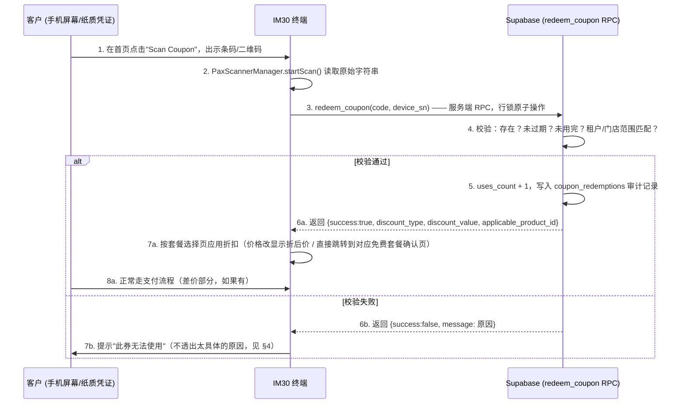

# IM30 主动扫码核销（优惠券/促销券/补偿券）设计方案

本文档分析 IM30 **主动用自己的扫描仪去扫客户手机屏幕或纸质凭证上的条码/二维码**这个功能——方向跟 `docs/qr_payment_integration.md` 里"终端展码、客户用手机扫"完全相反。首页已经有对应的 UI 文案（`R.string.scan_voucher_hint`＝"Scan Coupon / Member QR Code Below"，带一个相机图标），但目前完全没有接后端逻辑，是纯装饰。硬件层入口也已经存在并且可用：`PaxScannerManager.startScan()`（真机走 `IScanner` 硬件 SDK，无硬件时自动降级为模拟扫码，4 秒后返回一个假条码）——这正是之前从 `MainActivity.initQrPayment()` 里删掉的那段代码用的同一个方法；删掉是因为它被错误地接到了"判断 Stripe 有没有付款成功"这件事上，但 `startScan()` 本身这个硬件能力没有问题，只是需要接到正确的业务逻辑上，也就是本文档要设计的这个功能。

---

## 1. 场景定义

| 类型 | 说明 | 典型来源 | 扣款方式 |
| :-- | :-- | :-- | :-- |
| **优惠券 (Discount)** | 按百分比或固定金额减免 | 营销活动、会员权益 | 从套餐价里扣减，差额仍需正常支付（刷卡/扫码/VIP 余额） |
| **促销券 (Promotion)** | 通常是"某个具体套餐免费"或"低价套餐" | 拉新活动、异业合作 | 全额或部分覆盖，可能仍有差价 |
| **补偿券 (Compensation)** | 因硬件故障等原因，运营方主动补偿客户的一次免费/折扣洗车 | **[已确定，2026-07-24]** 由该租户的 `MERCHANT_ADMIN`（不是技师/GoldSky 的 `OPS_STAFF`）在云管平台开具，通常关联到某一笔失败的历史交易；面额和次数上限（`value`/`max_uses`）都是开具时手动填写，不预设固定值；不需要额外审批流程 | **[已确定]** 存一个金额（开具时填写，比如 $4、$6，对应套餐价），不是单独的类型，机制上等同于 `FIXED_OFF`，只是 `issued_reason='COMPENSATION'` 用于审计报表区分来源 |
| **会员码 (Member QR)** | 客户手机上出示的会员二维码，用来识别 VIP 身份，走 VIP 余额扣款 | 会员 App/小程序 | **[已确定，2026-07-24 修正为文本型]** 固定长度 **12 位字符**（字母+数字，不再限定纯数字），靠"长度=12"这个格式特征跟券码区分（券码建议 16+ 位，见 §4.2，长度上天然不重叠）；识别后走已有的 `deduct_vip_balance()` RPC，不是新逻辑，只是识别方式从 NFC 拍卡换成扫码 |

首页的"Scan Coupon / Member QR Code Below"这一个入口同时覆盖优惠券/促销券/补偿券和会员码识别，靠扫描结果的**内容格式**区分（见 §2.1）：`^[A-Za-z0-9]{12}$`（12 位字母数字组合）路由到会员识别，其他一律当券码去 `redeem_coupon()` 查。不需要让客户先选"我要扫的是券还是会员码"。

---

## 2. 端到端流程



关键约束（对照 `deduct_vip_balance()` 已有的原子扣款模式）：
- **核销判定必须在服务端一次性、原子性完成**，绝不能是"客户端先查一遍这张券有效，再单独调用一次'标记已用'"——中间的时间差正是并发重复核销的窗口期。做法跟 `deduct_vip_balance()`/`sync_device_identity()` 一样：一个 `SECURITY DEFINER` 的 Postgres 函数，`SELECT ... FOR UPDATE` 锁行，检查+扣减在同一个事务里完成。
- **客户端只负责"读到了什么字符串"，不做任何有效性判断**——理由跟 VIP 扣款的文档注释完全一致：APK 里嵌的 anon key 一旦被反编译，客户端如果自己判断"这张券有效"，就等于把核销逻辑的信任边界放在了不可信的设备上。

### 2.1 客户端路由逻辑（已确定：按格式区分）

**修正**：12 位会员码不等于 `card_uid`。对照 `docs/cloud_management_platform_design.md` §3.3.1（"Automated generation of 12-character codes for every `vip_cards` record"），这个码是给每张 VIP 卡**另外生成**的一个字段，不是复用 NFC 那个 `card_uid`（现有 `card_uid` 种子数据是 `"VIP_CARD_UID_6789"` 这种，跟会员码本身格式也不一样）。所以 `vip_cards` 需要新增一列存这个码，核销前要先拿它反查出 `card_uid`，不能直接把扫到的会员码当 `card_uid` 传给 `deductBalance()`。

**2026-07-24 修正**：会员码格式由"12 位纯数字"改为**文本型（12 位字母+数字组合）**，运管平台生成时可以用更大的字符集（不必强行凑纯数字），碰撞概率更低、生成也更灵活；客户端路由逻辑只依赖"长度=12"这个特征，不再要求纯数字。

Schema 补充（`vip_cards` 加一列）：
```sql
ALTER TABLE public.vip_cards ADD COLUMN IF NOT EXISTS qr_code TEXT UNIQUE; -- 12 位字符会员码（字母+数字），运管平台生成
CREATE INDEX IF NOT EXISTS idx_vip_cards_qr_code ON public.vip_cards(qr_code);
```

```kotlin
val scanned = result.trim()
if (Regex("^[A-Za-z0-9]{12}$").matches(scanned)) {
    // 会员码：先反查 card_uid，再走已有的 VIP 识别/扣款逻辑
    val cardUid = VipRepository.resolveCardUidByQrCode(scanned) // 新增：SELECT card_uid FROM vip_cards WHERE qr_code = ?
    if (cardUid != null) {
        initVipPayment(cardUid, priceInCents, startHex, dialog)
    } else {
        // 会员码格式对，但查不到对应的卡 -- 提示"会员码无效"
    }
} else {
    // 其余一律当券码处理
    val redemption = CouponRepository.redeemCoupon(scanned, deviceSn)
    // 按 redemption.type/value/applicable_product_id 计算折后价，见 §3.2
}
```

会员码固定 12 位字符，跟券码（建议 16+ 位随机字符串，见 §4.2）在长度上天然不重叠，不用担心两种格式互相误判。

---

## 3. Schema 设计

```sql
-- 优惠券/促销券/补偿券定义。写入（发放）不由 IM30 完成，见 §3.1；这里只是
-- IM30 核销侧要读取的表结构。
CREATE TABLE public.coupons (
    code TEXT PRIMARY KEY,               -- 条码/二维码里编码的原始内容，建议用不可猜测的随机字符串（见 §4.2）
    org_id UUID NOT NULL REFERENCES public.organizations(id) ON DELETE CASCADE, -- [已确定] 不支持跨租户，必填
    type TEXT NOT NULL CHECK (type IN ('PERCENT_OFF', 'FIXED_OFF', 'FREE_WASH')), -- [已确定] 补偿券不单独建类型，就是 FIXED_OFF + issued_reason='COMPENSATION'
    value INTEGER NOT NULL,              -- PERCENT_OFF: 0-100；FIXED_OFF: 分为单位的金额（补偿券的 $4/$6 就存在这里，400/600）；FREE_WASH: 忽略，取 applicable_product_id 的原价全免
    applicable_product_id UUID REFERENCES public.products(id), -- NULL = 适用于任意套餐；FREE_WASH 类型建议必填，避免"免费券套最贵的包"这种滥用（见 §4.4）
    max_uses INTEGER NOT NULL DEFAULT 1, -- 绝大多数场景是 1（单次核销）；营销活动码可以设更大
    uses_count INTEGER NOT NULL DEFAULT 0,
    expires_at TIMESTAMPTZ,
    issued_reason TEXT,                  -- 'PROMOTION' | 'COMPENSATION' | 'MARKETING'，纯审计/报表用
    issued_by_profile_id UUID REFERENCES public.profiles(id), -- 补偿券：哪个 MERCHANT_ADMIN 开具的，用于审计追责；[2026-07-24 已落地] profiles/org_members（MVP 范围：仅 SYS_ADMIN+MERCHANT_ADMIN）已经在 docs/supabase_full_schema.sql 里，外键已经生效，由 issue_compensation_coupon() RPC 写入（校验调用者的 org_members 角色，同时写一条 audit_logs）。还差的是云管平台自己的登录页面/人类账号注册流程——RPC 已经能调，只是还没有 UI 去调它
    related_transaction_id UUID REFERENCES public.transactions(id), -- 补偿券：关联的那笔失败交易，审计追溯用
    is_active BOOLEAN DEFAULT true,      -- 运营方可以手动作废一批券（比如发现某个批次被盗用）
    created_at TIMESTAMPTZ DEFAULT now()
);
CREATE INDEX idx_coupons_org ON public.coupons(org_id) WHERE is_active;

-- 核销审计流水（一次成功核销一条，即使同一张券 max_uses > 1）
CREATE TABLE public.coupon_redemptions (
    id UUID PRIMARY KEY DEFAULT gen_random_uuid(),
    coupon_code TEXT NOT NULL REFERENCES public.coupons(code),
    device_sn TEXT NOT NULL REFERENCES public.devices(sn) ON DELETE SET NULL,
    transaction_id UUID REFERENCES public.transactions(id), -- 核销后实际产生的那笔（折后）交易，可为空（扫描成功但客户最终没有继续支付流程）
    redeemed_at TIMESTAMPTZ DEFAULT now()
);
CREATE INDEX idx_coupon_redemptions_code ON public.coupon_redemptions(coupon_code);
```

RPC（原子核销，模式完全照抄 `deduct_vip_balance()`）：

```sql
CREATE OR REPLACE FUNCTION public.redeem_coupon(p_code TEXT, p_device_sn TEXT)
RETURNS JSON
LANGUAGE plpgsql
SECURITY DEFINER
SET search_path = public
AS $$
DECLARE
  v_coupon RECORD;
  v_device_org_id UUID;
BEGIN
  SELECT org_id INTO v_device_org_id FROM public.devices WHERE sn = p_device_sn;
  IF NOT FOUND THEN
    RETURN json_build_object('success', false, 'message', 'device_not_registered');
  END IF;

  SELECT * INTO v_coupon FROM public.coupons WHERE code = p_code FOR UPDATE;

  IF NOT FOUND THEN
    RETURN json_build_object('success', false, 'message', 'not_found');
  END IF;
  IF NOT v_coupon.is_active THEN
    RETURN json_build_object('success', false, 'message', 'inactive');
  END IF;
  IF v_coupon.expires_at IS NOT NULL AND v_coupon.expires_at < now() THEN
    RETURN json_build_object('success', false, 'message', 'expired');
  END IF;
  IF v_coupon.uses_count >= v_coupon.max_uses THEN
    RETURN json_build_object('success', false, 'message', 'already_used');
  END IF;
  IF v_coupon.org_id != v_device_org_id THEN -- 不支持跨租户，org_id 两边都是 NOT NULL，直接比较
    RETURN json_build_object('success', false, 'message', 'wrong_org');
  END IF;

  UPDATE public.coupons SET uses_count = uses_count + 1 WHERE code = p_code;
  INSERT INTO public.coupon_redemptions (coupon_code, device_sn) VALUES (p_code, p_device_sn);

  RETURN json_build_object(
    'success', true,
    'type', v_coupon.type,
    'value', v_coupon.value,
    'applicable_product_id', v_coupon.applicable_product_id
  );
END;
$$;

REVOKE ALL ON FUNCTION public.redeem_coupon(TEXT, TEXT) FROM public;
GRANT EXECUTE ON FUNCTION public.redeem_coupon(TEXT, TEXT) TO authenticated;
```

RLS：`coupons`/`coupon_redemptions` 都不需要给 `anon`/`authenticated` 开放直接读写——所有交互都通过上面这个 `SECURITY DEFINER` RPC，跟 `vip_cards.balance_cents` 只能通过 `deduct_vip_balance()` 修改是同一个道理（`REVOKE UPDATE, INSERT, DELETE ... FROM anon, authenticated`）。

### 3.1 发放侧不在本文档范围内

`coupons` 表的 INSERT **不由 IM30 完成**——发放渠道是运管平台，或者第三方系统调用云管平台的 API（跟本仓库里另外那份 `docs/cloud_management_platform_design.md` 应该是同一套体系，具体怎么对接需要看那边的设计，这里不重复）。IM30 端只消费 `redeem_coupon()` 这一个只读+核销的 RPC，不需要、也不应该有直接写 `coupons` 表的权限。

### 3.2 折后价计算与封顶（客户端 + 下单前）

拿到 `redeem_coupon()` 的返回值后，按 `type` 计算最终价格，并且**折扣不能让价格变成负数**：

```kotlin
val finalPriceCents = when (redemption.type) {
    "PERCENT_OFF" -> priceInCents - (priceInCents * redemption.value / 100)
    "FIXED_OFF"   -> maxOf(0, priceInCents - redemption.value) // 补偿券 $6 用在 $4 套餐上 -> 免费，不是补 $2 给客户
    "FREE_WASH"   -> 0 // 前提是 applicable_product_id 匹配当前选中套餐，否则要求先选那个套餐或提示补差价
    else -> priceInCents
}
```

`FIXED_OFF`（含补偿券）用 `maxOf(0, ...)` 封顶在 0，绝不能出现"倒找客户钱"的情况。`finalPriceCents == 0` 时直接跳过刷卡/扫码/VIP 扣款环节，直接触发硬件指令（参考 `startFinalizationSequence` 里 `successAck` 之后的逻辑，但要在此之前插入"是否有已核销的免费券"这个分支）。

---

## 4. 防伪 / 防滥用分析

| # | 攻击/滥用场景 | 防御手段 |
| :-- | :-- | :-- |
| **4.1 重复核销**（截图转发给多人、纸质券复印） | `uses_count`/`max_uses` + `FOR UPDATE` 行锁原子判断——第一次成功核销后，不管后面来多少张"复制品"（截图、复印件、转发），核销时读到的都是同一行数据库记录，`uses_count` 已达上限直接拒绝。**这是最核心的防线，且天然覆盖"纸质券被复印"这种物理层面的复制，因为防伪的锚点是数据库记录而不是纸张本身。** |
| **4.2 伪造/猜测券码** | 券码（`code` 列）生成时必须用**不可预测的随机字符串**（建议 16+ 位、密码学随机源生成，不要用 `COUPON0001` 这种连续编号）。核销时"这个码根本不存在"和"存在但已用完"分别返回 `not_found`/`already_used`，两者都归为面向客户的同一句"此券无法使用"（见 4.6），避免暴露信息帮助攻击者判断哪些码"曾经有效"。 |
| **4.3 并发重复核销**（同一张券几乎同时在两台设备/同一设备连续两次扫到） | `SELECT ... FOR UPDATE` 行锁：第二个事务会阻塞到第一个提交为止，再读到的 `uses_count` 已经是更新后的值，天然串行化，不需要额外加锁逻辑。 |
| **4.4 跨门店/跨租户使用** | 不支持跨租户（已确定），RPC 里用设备的 `org_id` 跟券的 `org_id`（两边都 `NOT NULL`）直接比对，不匹配即拒绝，没有例外分支。 |
| **4.5 套餐/额度不匹配滥用**（"任意免费"券套用在最贵套餐上） | `FREE_WASH` 类型强烈建议必须绑定 `applicable_product_id`（免掉某个具体套餐的价格，而不是"免掉当前选中套餐，不管多贵"）；如果客户选择了更贵的套餐，UI 侧提示"这张券只能免抵 $X，需要补差价 $Y"，走正常支付流程付差价。 |
| **4.6 面向客户的报错信息粒度** | 除了"已过期"可以明确提示（客户能理解、不算敏感信息），其余失败原因（不存在/已用完/门店不匹配）统一显示成一句不透出细节的"此券无法使用，请联系工作人员"——细分原因只记录在服务端日志/`coupon_redemptions` 缺失记录里，供后台排查，不在客户端暴露。 |
| **4.7 补偿券开具权限** | 补偿券应该只能从 Tech Dashboard（PIN 网关）里开具，且强制关联 `related_transaction_id`（具体是哪一笔失败交易触发的补偿），产生的操作记录走跟 `DiagnosticManager.recordMaintenance()` 一样的审计模式——防止技师权限被滥用来无限制发免费券给自己人。这一部分的具体交互（Tech Dashboard 加一个"开具补偿券"按钮）本文档先不展开，需要先确认补偿券的业务规则（谁能开、金额上限、需不需要二次审批）。 |
| **4.8 扫描硬件本身的可信度** | 扫描动作用的是 PAX 官方 `IScanner` SDK，客户端只上报"扫到的原始字符串"，不做任何有效性判断（呼应第 2 节的约束）——这条防线的前提是 §3 的 RPC 设计被严格执行，客户端代码里不能出现"如果字符串看起来像优惠券格式就直接应用折扣"这种绕过服务端校验的写法。 |

---

## 5. 已确定 / 仍待决策

**已确定**（本轮沟通明确）：
- 不支持跨租户通用券，`coupons.org_id` 必填。
- 发放渠道是运管平台 / 云管平台 API，不在 IM30 端实现，IM30 只消费 `redeem_coupon()`。
- 补偿券不是独立类型，就是 `FIXED_OFF` + `issued_reason='COMPENSATION'`，存实际金额（$4/$6 等）。
- 会员码固定格式：12 位字符（字母+数字组合，2026-07-24 由纯数字改为文本型），靠长度跟券码路由区分。
- **[2026-07-24]** 补偿券开具规则：由该租户的 `MERCHANT_ADMIN` 在云管平台开具（不是 IM30 本机的技师入口，也不是 GoldSky 的 `OPS_STAFF`）；单张面额、可核销次数（`max_uses`）都在开具时手动填写，不预设固定值；**不需要审批**——`MERCHANT_ADMIN` 对自己租户内的补偿券开具有完全自主权，跟 `organizations` 的租户隔离边界一致。**[2026-07-24 更新]** `profiles`/`org_members`（MVP 角色范围）+ `issue_compensation_coupon()` RPC 已经落地（见 §3 的 schema），`coupons.issued_by_profile_id` 外键已生效——数据库这一侧已经不再是占位状态。仍然缺的是云管平台自己的人类账号登录（Supabase Auth 邮箱/密码或 SSO）和实际发券按钮的 UI，这两个目前都还不存在，`org_members` 里的角色授予现阶段只能靠手动 SQL 引导。

**仍待决策**：
- （暂无——上一轮唯一悬而未决的补偿券开具规则已在本轮确定）

---

## 6. 与现有功能的关系

| 文件 | 关系 |
| :-- | :-- |
| `PaxScannerManager.kt` | 直接复用 `startScan()`/`stopScan()`，不需要改动这个文件本身 |
| `docs/qr_payment_integration.md` | 方向相反的功能（终端展码 vs 终端扫码），两者硬件/网络路径完全独立，不共享代码，只是都叫"扫码" |
| `VipRepository.deductBalance()` / `deduct_vip_balance()` RPC | 本文档的 `redeem_coupon()` RPC 在原子性设计上完全照抄这个已经跑通、验证过的模式 |
| `MainActivity.kt` | 需要新增一个入口方法（比如 `initCouponScan()`），挂到首页"Scan Coupon"按钮的点击事件上；`showPaymentDialog()`/`startPaymentFlow()` 这套现有的支付方式选择、`paymentInFlight` 保护等逻辑需要评估是否也要在扫券等待期间生效（客户等待扫描结果时理论上也不应该被广告空闲屏打断） |
