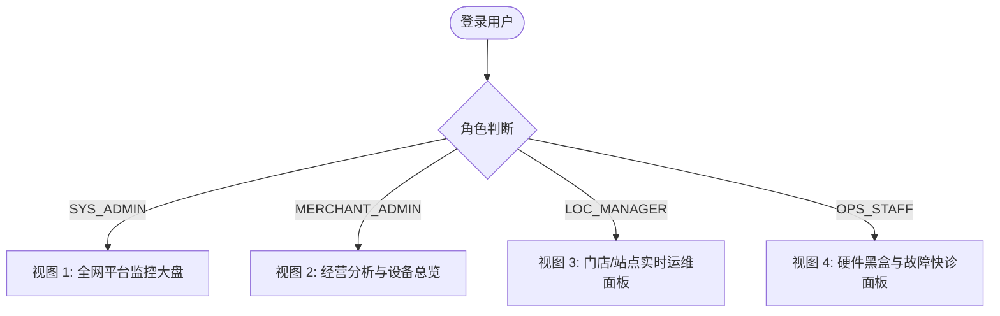
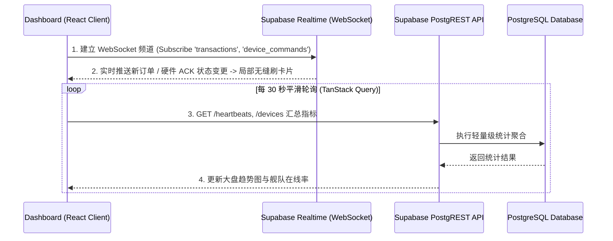

# GS-SSP 云端管理平台 (CMP) Dashboard 专项设计规范

本文档补齐并规范 GS-SSP 云管平台中 **Dashboard（指挥中心与经营分析仪表盘）** 的详细设计，参照 **Nayax Core (Core Financial View + MoMa Operational View)** 的商用工业级标准，结合科技感暗黑高奢 (Industrial Tech Dark Mode) 视觉规范进行制定。

---

## 1. 差异化多角色视图体系 (Role-Based Dashboard Specs)

针对 GS-SSP 系统的多租户与角色权限架构，Dashboard 划分为 4 种角色定制视图：



### 1.1 系统超级管理员视图 (SYS_ADMIN)
- **核心关注**：平台全网设备总量、各租户/商户活跃度、全网硬件故障率、SAAS 平台服务健康度。
- **特有组件**：多商户营收排行榜 (Top Organizations)、硬件批次/固件版本分布图 (Firmware Version Matrix)、全网 WebSocket 连接数。

### 1.2 商户/运营商老板视图 (MERCHANT_ADMIN) - **【核心主视图】**
- **核心关注**：门店营业额、支付渠道构成 (信用卡/扫码/VIP/券)、低效设备预警、营销券核销转化率。
- **特有组件**：营收同比/环比折线图、支付方式占比环形图、低效设备 (Underperformers) 侦测榜、服务补偿审计日志。

### 1.3 门店经理/技师视图 (LOC_MANAGER / OPS_STAFF)
- **核心关注**：管辖站点内设备的实时联机状态、继电器脉冲 ACK 响应、实时交易流、一键远程控机。
- **特有组件**：洗车位状态网格 (Station Grid)、实时 Hardware Proof 交易流、Logcat 远程控制台抽窗。

---

## 2. Nayax Core 双驱动面板结构设计 (Dual-Core Layout)

面板结构借鉴 Nayax Core 架构，划分为 **“MoMa 实时运维”** 与 **“Core 经营决策”** 两大核心工作区：

```
+-----------------------------------------------------------------------------------+
| GS-SSP CMP Command Center Header (租户/门店选择器 | 实时时间 | 全局 WebSocket 状态)  |
+---------------------------------------------------+-------------------------------+
| [板块 1] 舰队脉搏卡片组 (Fleet Health Bento Cards)                                 |
|  - 今日净营收  - 在线设备率  - 硬件故障 (FAULT)  - 离线超时                          |
+---------------------------------------------------+-------------------------------+
| [板块 2] 智能告警轮播 (Smart Alerts Carousel)                                      |
|  - P0 紧急: 扣款未洗车 (ACK Missing) -> [一键补偿]                                |
|  - P1 警告: 高峰期 4 小时 0 笔订单 (低效预警)                                       |
+---------------------------------------------------+-------------------------------+
| [板块 3 - 左 7 栏]                              | [板块 4 - 右 5 栏]            |
|  实时 Hardware Proof 交易流 (Live Feed)          |  设备矩阵拓扑与快速抽窗          |
|  - 订单号 | 终端 | 金额 | 渠道 | ACK 状态         |  - 节点状态 (绿/红/灰)         |
|  - [一键补偿发券] 快捷入口                       |  - 点击唤起 Device Drawer     |
+---------------------------------------------------+-------------------------------+
| [板块 5] 经营趋势与支付渠道混合图 (Analytics Charts)                                |
|  - 24 小时/7天 营收趋势折线图  - 信用卡/扫码/VIP/券 占比环形图                        |
+-----------------------------------------------------------------------------------+
```

---

## 3. 核心板块与组件指标计算规范

### 3.1 舰队脉搏卡片组 (Fleet Health Cards)
1. **今日净营收 (Net Sales)**：
   $$\text{Revenue} = \sum_{\text{status}=\text{PAID}} \text{amount\_cents} - \sum_{\text{status}=\text{VOIDED}} \text{amount\_cents}$$
   - **展示**：大字号格式化金额（如 `¥12,480.00`），附带与上周同期的百分比对比（`+14.2%`）。
2. **在线率与设备卡片 (Online Fleet Ratio)**：
   $$\text{Online Rate} = \frac{N_{\text{ONLINE}}}{N_{\text{TOTAL}}} \times 100\%$$
   - **颜色逻辑**：$\ge 95\%$ 翡翠绿，$< 90\%$ 警告黄，$< 80\%$ 危险红。
3. **硬件故障计数器 (FAULT Counter)**：
   - 筛选 `status = 'FAULT'` 且过去 15 分钟内串口 ACK 超时未复位的终端数量，点击直接过滤展示故障设备。

### 3.2 智能告警轮播 (Smart Alert Engine)
告警引擎依据以下逻辑产生卡片并动态轮播：

| 级别 | 触发条件 | 告警文案模版 | 联动快捷操作 |
| :--- | :--- | :--- | :--- |
| **P0 紧急** | 交易 `PAID` 但 60 秒内未收到继电器 ACK (ACK Missing) | `[扣款未洗车] 终端 {device_sn} 订单 {tx_id} 扣款成功的未收到脉冲 ACK！` | **[一键开具补偿券]** 弹窗 |
| **P1 警告** | 黄金营业时段 (09:00-19:00) 内连续 4 小时 0 订单 | `[低效预警] 终端 {device_sn} ({loc_name}) 过去 4 小时无任何交易！` | **[下发自检测试指令]** |
| **P2 提示** | 终端离线超过 30 分钟 (`last_seen < now() - 30m`) | `[设备离线] 终端 {device_sn} 已断开 WebSocket 通信` | **[查看黑盒排查日志]** |

### 3.3 实时 Hardware Proof 交易流 (Live Transaction Ticker)
- **数据源**：Supabase Realtime `transactions` 表 INSERT/UPDATE 事件。
- **行状态徽章规范**：
  - **ACK Verified (绿色)**：`payment_status = 'PAID'` 且 `hardware_ack = true`。
  - **ACK Missing (红色闪烁)**：`payment_status = 'PAID'` 且 `hardware_ack = false`。
- **行快捷按钮**：针对 `ACK Missing` 行，直接渲染 Amber 色 **"补偿 (Compensate)"** 按钮，点击唤起 `issue_compensation_coupon()` RPC 模态框。

### 3.4 低效设备与经营深度分析 (Underperformer & Analytics)
- **低效设备检测算法 (Underperformer Insight)**：
  对所有 `ONLINE` 终端统计最近 24 小时营收，计算全网均值 $\bar{R}$。若终端营收 $R_i < 0.25 \times \bar{R}$，则标记为“低效设备”，提醒运营商检查枪头、水压或设备放置位置。
- **支付渠道分布图 (Payment Method Mix)**：
  使用 Recharts 环形图展示 `CREDIT_CARD` (信用卡/POSLink)、`QR_CODE` (聚合扫码)、`VIP_CARD` (储值卡) 与 `COUPON` (营销/补偿券) 的金额与笔数占比。

---

## 4. 实时数据通信与更新机制 (Sync Strategy)

Dashboard 采用 **混合同步协议**，确保低延迟与高可靠性：



---

## 5. 深层联动与抽窗交互规范 (Drill-Down Workflows)

1. **设备节点深钻 (Device Node Drill-Down)**：
   在大盘设备矩阵中点击任意设备卡片，右侧弹出 **“设备黑盒诊断抽窗 (Device Drawer)”**：
   - 实时显示该设备的 RSSI 信号、剩余存储、APK 版本。
   - 提供 `REBOOT` (重启)、`LOCK` (锁机)、`FETCH_LOGS` (调取 Logcat) 快捷操控。
2. **异常交易深钻 (Fault Order Compensation)**：
   点击交易流中的红标订单，唤起 **“服务补偿模态框”**：
   - 自动填入建议补偿金额 (原订单金额)。
   - 点击确认后调用 `issue_compensation_coupon` SECURITY DEFINER RPC，自动生成 16 位补偿券码并写审计日志。

---

## 6. UI 设计 Token 与主题规范 (Theme & Design Tokens)

为营造现代工业级高奢 (Industrial High-Tech) 氛围，设计遵从以下 Token：

- **背景主色**：深灰蓝近黑 `#0F172A` (Slate-900) 或暗黑 `#090D16`。
- **卡片材质**： Glassmorphic 玻璃半透明 (`bg-slate-900/80 backdrop-blur-md`)，带 `border-slate-800` 微弱边框。
- **语义色彩**：
  - 翡翠绿 `#10B981`：在线、ACK 成功、正常营收。
  - 琥珀黄 `#F59E0B`：预警、低效、待开具补偿。
  - 玫瑰红 `#EF4444`：硬件故障、ACK Missing、设备断连。
  - 电光蓝 `#3B82F6`：指令下发、系统通信、基础数据。

---

## 7. 总结

本 Dashboard 专项规范补充了 GS-SSP 管理平台在**数据指标算式、双驱动布局、智能告警引擎、实时通信协议及深层联动交互**上的完整设计，全面参照并打通了 Nayax Core 的运维与财务双闭环。
