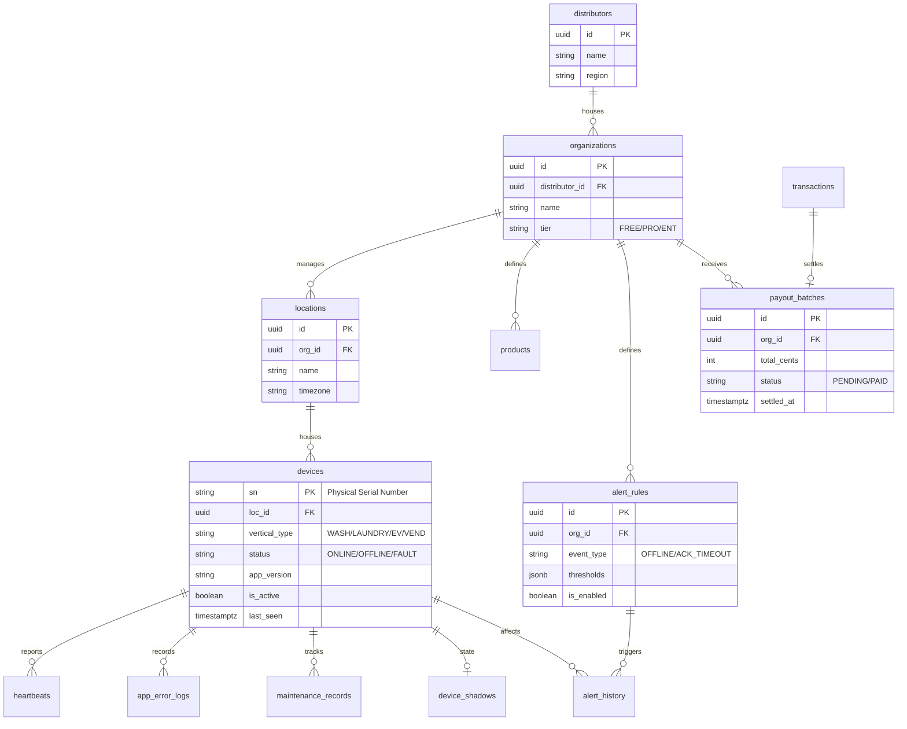

# GS-SSP Database Design Specification v2.6 (Nayax-Core Evolution)

This document defines the backend data model for the GS-SSP platform, now evolved to support high-level fleet management, financial reconciliation, and hierarchical multi-tenancy inspired by **Nayax Core**.

## 1. Entity Relationship Diagram (ER Diagram)

---

## 2. Core CMP Table Definitions

### 2.1 distributors (Global Hierarchy)
Represents regional branches or master partners managing multiple operators.

| Column | Type | Description |
| :--- | :--- | :--- |
| `id` | UUID | Primary Key. |
| `name` | TEXT | Distributor Name. |
| `settings` | JSONB | Global commissions and branding overrides. |

### 2.2 alert_rules & alert_history (Proactive Monitoring)
The "Smart Alerts" system to detect and notify staff of fleet issues.

| Table | Column | Description |
| :--- | :--- | :--- |
| `alert_rules` | `event_type` | Trigger type: `OFFLINE`, `HARDWARE_FAULT`, `LOW_SALES`. |
| `alert_history` | `status` | Alert lifecycle: `NEW`, `ACKNOWLEDGED`, `RESOLVED`. |

### 2.3 profiles (RBAC Identity)
Maps authentication users to specific scopes within the hierarchical model.

| Column | Type | Description |
| :--- | :--- | :--- |
| `role` | TEXT | `SYS_ADMIN`, `DISTRIBUTOR`, `MERCHANT_ADMIN`, `LOC_MANAGER`. |
| `scope_id` | UUID | FK to either distributor_id, org_id, or loc_id based on role. |

### 2.4 audit_logs (Management Accountability)
Captures every administrative action performed via the CMP web portal.

| Column | Type | Description |
| :--- | :--- | :--- |
| `action` | TEXT | e.g., `CHANGE_PRICE`, `REMOTE_REBOOT`. |
| `payload` | JSONB | Diff showing old vs. new values. |

---

## 3. Row Level Security (RLS) & Multi-Tenancy

The system enforces isolation at the **Organization (Operator)** level for all business data, while allowing **Distributors** and **SYS_ADMINs** to view aggregated data across multiple tenants.

### 3.1 Policy Inheritance
*   **Merchant Admin**: `profiles.org_id = current.org_id`.
*   **Distributor**: `profiles.distributor_id = current_org.distributor_id`.
*   **System Admin**: Bypass filters for global maintenance and diagnostics.

---

## 4. Digital Twin & Shadowing Strategy
Used for non-blocking remote configuration.
1.  **Desired State**: Cloud writes to `device_shadows.desired`.
2.  **Edge Sync**: Terminal receives realtime event, applies hardware change (e.g., set brightness), and writes to `reported`.
3.  **Conflict Resolution**: Uses incremental version numbers to ensure stale cloud commands don't overwrite newer local technician changes.
