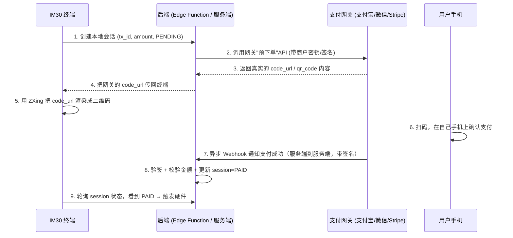

# 扫码支付 (Scan-to-Pay) 端到端方案与待办清单

本文档描述"商户展码、用户扫码"支付流程（Alipay / 微信 / Apple Pay / Stripe 等钱包类支付）应有的完整端到端设计，并对照当前代码给出差距分析与待办任务。背景讨论见 `docs/system_architecture.md` 第 10 章「待实现功能」。

> **[v2.2]** 进入本流程的入口现在由 `KioskSettings.payment_method_mode` 云端配置驱动：为 `2`（SCAN_ONLY）时，`MainActivity.showPaymentDialog()` 跳过"选择支付方式"弹窗，直接进入本文档描述的扫码流程；为 `0`（ALL，默认）时行为不变，用户仍需先在选择弹窗里点选。详见 `docs/system_architecture.md` §0 changelog 与 `docs/card_payment_integration.md`。

---

## 1. 完整端到端流程 (Target Design)

### 1.1 各环节说明

| # | 环节 | 关键约束 |
| :-- | :-- | :-- |
| 1 | 创建本地会话 | 记录 tx_id / amount_cents / device_sn / status=PENDING，供后续轮询与对账 |
| 2 | 调用网关下单 API | **必须在服务端完成**，商户密钥/私钥绝不能出现在 APK 里 |
| 3-4 | 拿到真实二维码内容 | 二维码必须编码网关签发的 `code_url`/`qr_code`，钱包 App 才认得 |
| 5 | 本地渲染二维码 | ZXing 生成 Bitmap，纯本地操作，无外部依赖 |
| 6 | 用户扫码支付 | 发生在用户手机上，终端无法感知，只能等结果 |
| 7 | 网关异步 Webhook | 网关服务端主动回调一个**公网可达**的地址；IM30 在 NAT 后面收不到，必须有独立后端 |
| 8 | 验签 + 更新状态 | 必须校验网关签名（防伪造回调）+ 校验金额一致，再写 `status=PAID`；**绝不能由客户端直接写这个字段** |
| 9 | 终端轮询 | 轮询本地 session 状态，看到 PAID 才触发硬件指令与语音播报 |

### 1.2 容易被忽略但必需的两个兜底机制

- **超时兜底查询 (Reconciliation)**：Webhook 不保证一定送达（网络抖动、服务重启窗口等）。轮询超时前应主动调用一次网关的"查单"API，避免"用户其实付款成功了，但因为回调丢失，终端却提示失败"。
- **超时关单 (Close Order)**：终端侧超时放弃后，应调用网关的"关单"API，防止用户走后网关的回调才姗姗来迟，导致状态被错误置为 PAID（此时终端早已离开该笔交易的上下文，硬件也不会响应，但云端记账会错乱）。

---

## 2. 当前实现状态 (As-Built)

| 环节 | 状态 | 代码位置 |
| :-- | :-- | :-- |
| 创建本地会话 | ✅ 已实现 | `QrPaymentRepository.createSession()` |
| 会话表 + 权限隔离 | ✅ 已实现，`anon`/`authenticated` 只有 INSERT/SELECT，UPDATE 仅限 service role | `docs/supabase_full_schema.sql`（`qr_payment_sessions` 表 + 对应 RLS 策略） |
| 调用网关下单 API | ❌ 未实现 | — |
| 二维码内容 | 🟡 渲染逻辑已实现，但编码的是自造的假 URL (`https://gs-ssp.ca/pay?tx=...`)，非网关签发内容 | `PaymentService.generateQrCode()`, `MainActivity.initQrPayment()` |
| Webhook 接收服务 | ❌ 未实现（不存在任何公网可达端点） | — |
| Webhook 验签 | ❌ 未实现 | — |
| 终端轮询 | ✅ 已实现，2 秒/次，最多 60 次 (2 分钟)，实测在模拟器上跑通 | `QrPaymentRepository.pollUntilPaid()` |
| 超时兜底查询 | ❌ 未实现，超时直接判定失败 | — |
| 超时关单 | ❌ 未实现 | — |
| 商户密钥管理 | ❌ 未实现（没有服务端，也没有密钥可存） | — |

**结论**：终端自己能做的那一半（建会话、渲染码、轮询）已经做完并验证过；真正让"扫码"变成"收到钱"的那一半——网关下单 + Webhook 回调——完全空缺。现状是：只要 `qr_payment_sessions` 表存在，扫码支付会 100% 卡在 PENDING 直到 2 分钟超时，因为没有任何东西会把它改成 PAID。

---

## 3. 待办任务 (TODO)

### 3.1 前置条件
- [x] **网关选定：Stripe**（Checkout Session，见下）。
- [x] 已生成 Stripe **Restricted Key**（`Checkout Sessions: Write` 权限即可，不需要全权限的标准密钥）。
- [x] Webhook 落地在 **Supabase Edge Function**（`payment-webhook`）。

### 3.2 后端 / Edge Function
- [x] **网关无关的骨架**（`supabase/functions/`）：
  - `_shared/gateway.ts` —— `PaymentGateway` 接口（`createPaymentIntent`/`verifyWebhook`）+ `getGateway()` 工厂（读 `PAYMENT_GATEWAY` 环境变量选择实现）。`verifyWebhook` 返回一个三态的 `WebhookVerifyResult`（`invalid`/`ignored`/`event`），不是简单的 `null`——网关会给同一个 webhook 地址推很多跟支付无关的事件类型，"签名有效但不是我们关心的事件"跟"签名校验失败"必须分开处理，否则前者会被当 401 回给网关，网关会一直重试一个我们永远不会处理的事件。
  - `_shared/gateways/stub.ts` —— 占位实现，默认生效，保证没有真实网关凭证时 `create-qr-session` 也能端到端跑通（建会话、渲二维码、轮询），只是永远等不到 PAID。
  - `_shared/gateways/stripe.ts` —— **已实现**。`createPaymentIntent` 建一个 Stripe **Checkout Session**（不是裸 PaymentIntent）——客户在自己手机上扫码打开的是 Stripe 托管收银页，信用卡/Apple Pay/Google Pay（以后账户开通了还能加支付宝/微信）都在同一个页面，比自建支付 UI 简单可靠。`client_reference_id` 设成我们的 `tx_id`，webhook 靠这个字段把回调对应回 `qr_payment_sessions` 行，不需要额外的映射表。`verifyWebhook` 用 `constructEventAsync` + `SubtleCryptoProvider`（Deno 边缘运行时没有 Node 的 `crypto` 模块，必须用这个而不是同步版的 `constructEvent`）。
  - `create-qr-session/index.ts` —— 校验请求体 → 调 `gateway.createPaymentIntent()` → 用 service_role 写入 `qr_payment_sessions` → 把 `code_url` 返回给设备。
  - `payment-webhook/index.ts` —— 调 `gateway.verifyWebhook()` → 按 `invalid`/`ignored`/`event` 三态分别处理 → 幂等 `UPDATE ... WHERE status='PENDING' AND amount_cents=...`。
  - `config.toml` —— `create-qr-session` 走正常 JWT 校验（只有登录设备能调），`payment-webhook` 关掉 JWT 校验（调用方是网关，没有 Supabase 会话，鉴权完全靠 `verifyWebhook()` 的签名校验）。
- [ ] **部署前必须做的（你这边的操作，我做不了）**：
  1. `supabase secrets set PAYMENT_GATEWAY=stripe STRIPE_SECRET_KEY=sk_...`（用你生成的 Restricted Key，不要用 `pk_live_...` 那个 publishable key——那个是给客户端用的，这条流程里用不上）
  2. **强烈建议先用 Stripe 测试模式的 Restricted Key（`sk_test_...`）跑通一遍全流程，再切生产密钥**——这套 webhook 验签、幂等处理目前还没有过一次真实请求的检验。
  3. `supabase functions deploy create-qr-session payment-webhook`
  4. 部署后去 Stripe Dashboard → Developers → Webhooks，新建一个 Endpoint，URL 填 `payment-webhook` 部署后的地址，订阅事件类型：`checkout.session.completed`、`checkout.session.async_payment_succeeded`、`checkout.session.expired`、`checkout.session.async_payment_failed`
  5. Stripe 会给这个 Endpoint 生成一个 Signing Secret（`whsec_...`），`supabase secrets set STRIPE_WEBHOOK_SECRET=whsec_...`
- [ ] 新建定时任务（Supabase Cron / `pg_cron`）：扫描 PENDING 超过 N 分钟且未过期的会话，调用网关"查单"API 兜底，并对彻底超时的会话调用"关单"API。

### 3.3 客户端改动
- [x] `QrPaymentRepository.createSession()` 已改为调用 `create-qr-session` Edge Function（不再直接 INSERT 表），返回值从 `Boolean` 改成 `String?`（拿到网关的真实 `code_url`）。`SupabaseClientProvider.invokeFunction()` 是新增的统一入口——supabase-kt 2.6.1 没有 Functions 插件，所以走的是一个专用的小 Ktor client，但鉴权 token 仍然取自 `client.auth`（同一个共享会话），不会重蹈 v2.7 双重身份的覆辙。
- [x] `MainActivity.initQrPayment()` 已改为渲染 `createSession()` 返回的真实 `code_url`，不再拼接假 URL。
- [ ] 轮询超时（`pollUntilPaid` 返回 false）时的用户提示文案需要区分"支付失败"与"支付确认中，请勿重复扫码"（因为可能网关那边其实还在处理）。

### 3.4 测试与验证
- [x] **2026-07-23 用 Stripe 测试模式跑通了完整链路**：`create-qr-session` 建会话 → 拿到真实 Stripe Checkout 链接 → 测试卡（`4242 4242 4242 4242`）付款 → `payment-webhook` 验签通过 → `qr_payment_sessions` 正确更新为 `status='PAID'` 并写入 `paid_at`。调试过程中顺带修了两个真实 bug：
  - `config.toml` 里 `verify_jwt = false` 对已存在的函数重新部署时可能不生效（Supabase CLI 已知问题），最终靠 Dashboard 手动关闭 "Enforce JWT Verification" 解决；`config.toml` 的配置仍然保留（新建函数/Supabase 修复此 bug 后仍然有效）。
  - 密钥设置时手滑把 Stripe 密钥的值设进了 `PAYMENT_GATEWAY` 变量（`supabase secrets set` 那几条命令名字和值对应错了），导致一直悄悄退化到 stub 网关——加了临时诊断日志才定位到，修复后已移除。
  - "Timestamp outside the tolerance zone" 报错是调试期间 401 失败事件的陈旧重试，不是真 bug，换一个新触发的事件后消失。
- [x] **2026-07-24 真机扫码实测**：手机摄像头对着模拟器屏幕扫码 → 跳转 Stripe 收银页 → 测试卡付款 → 数据库确认 `status='PAID'`。扫码识别、跳转体验均正常。
- [x] **修复扫码支付的等待窗口/取消保护缺口**（真机测试时发现）：`initQrPayment()` 之前完全没有接入 `paymentInFlight`，导致两个问题：(1) 弹窗自带的 60 秒可视倒计时会在 `pollUntilPaid()` 自己 120 秒的轮询预算跑完之前就把弹窗关掉（关闭会连带取消 `pollingJob`），客户如果付款慢一点，钱付了但 App 已经放弃监听；(2) `btn_back_qr` 完全没有取消保护，客户手机上正在付款时点"Back"会直接退出。现在 `initQrPayment()` 全程（建会话到轮询结束）设置 `paymentInFlight = true`，同时补上了 `paid == false`（轮询超时）分支的处理——之前这个分支什么都不做，弹窗会永远卡在原地。模拟器实测确认：等待期间点 Back 不再关闭弹窗。
- [ ] 故意让 Webhook 延迟/丢失一次，验证超时兜底查询能补上状态（依赖 3.2 里还没做的定时任务）。
- [ ] 验证重复 Webhook（网关重试机制）不会导致重复触发硬件/重复记账——`payment-webhook` 的 `WHERE status='PENDING'` 幂等设计理论上覆盖了这个，但还没有专门用 Stripe CLI 故意重放同一个事件测过。
- [ ] `success_url`/`cancel_url` 目前指向不存在的占位域名（`https://gs-ssp.ca/pay/complete`），客户付款后会看到浏览器报错页——虽然不影响支付本身（Stripe 端已经算成功），但体验不好，需要换成真实存在的页面（哪怕只是一个"可以收起手机了"的静态提示页）。
- [x] **发现并修复一个跟本次网关接入无关、但被它牵出来的严重资金安全漏洞**：`MainActivity.initQrPayment()` 里除了真正的 `pollUntilPaid()` 轮询，还并行挂了一段 `scannerManager?.startScan(...)`——这是早期遗留代码，任何"扫描仪扫到东西"（`PaxScannerManager` 无真实硬件时会在模拟模式下 4 秒后自动模拟"扫到了"）都会直接调用 `startFinalizationSequence()` 当作已付款处理，完全不管 Stripe 那边是否真的收到钱。模拟器上实测复现：不付款，4 秒后界面照样显示 "Payment Successful"。真机上如果扫描仪硬件在等待付款期间扫到任意条码/二维码（不一定是这笔支付的），同样会被当成付款成功直接放行洗车。已删除这段代码，付款结果现在只由 `pollUntilPaid()` 一条路径判定；模拟器实测确认修复后不再有这个 4 秒误触发。

---

## 4. 相关文件索引

| 文件 | 作用 |
| :-- | :-- |
| `app/src/main/java/com/goldsky/carwash/payment/QrPaymentRepository.kt` | 客户端会话创建与轮询 |
| `app/src/main/java/com/goldsky/carwash/payment/PaymentService.kt` | QR 码本地渲染 (`generateQrCode`) |
| `app/src/main/java/com/goldsky/carwash/MainActivity.kt` | `initQrPayment()` 串联生成二维码 + 创建会话 + 轮询 + 触发硬件 |
| `docs/supabase_full_schema.sql` | 完整数据库 schema（含 `qr_payment_sessions` 表结构与 RLS 权限，以及全部其他表/RPC，是唯一的建表脚本来源） |
| `docs/system_architecture.md` | 第 2.2 / 7.1 / 10 章有该功能的架构级描述与已知限制 |
| `docs/card_payment_integration.md` | 配套的刷卡支付方案文档 |
