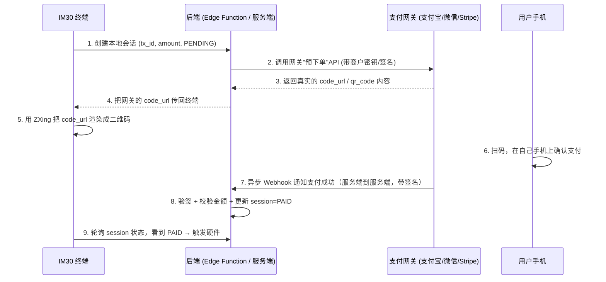

# 扫码支付 (Scan-to-Pay) 端到端方案与待办清单

本文档描述"商户展码、用户扫码"支付流程（Alipay / 微信 / Apple Pay / Stripe 等钱包类支付）应有的完整端到端设计，并对照当前代码给出差距分析与待办任务。背景讨论见 `docs/system_architecture.md` 第 10 章「待实现功能」。

> **[v2.2]** 进入本流程的入口现在由 `KioskSettings.payment_method_mode` 云端配置驱动：为 `2`（SCAN_ONLY）时，`MainActivity.showPaymentDialog()` 跳过"选择支付方式"弹窗，直接进入本文档描述的扫码流程；为 `0`（ALL，默认）时行为不变，用户仍需先在选择弹窗里点选。详见 `docs/system_architecture.md` §0 changelog 与 `docs/card_payment_integration.md`。

---

## 1. 完整端到端流程 (Target Design)

### 1.1 各环节说明

| # | 环节 | 关键约束 |
| :-- | :-- | :-- |
| 1 | 创建本地会话 | 记录 tx_id / amount_cents / device_sn / status=PENDING，供后续轮询与对账 |
| 2 | 调用网关下单 API | **必须在服务端完成**，商户密钥/私钥绝不能出现在 APK 里 |
| 3-4 | 拿到真实二维码内容 | 二维码必须编码网关签发的 `code_url`/`qr_code`，钱包 App 才认得 |
| 5 | 本地渲染二维码 | ZXing 生成 Bitmap，纯本地操作，无外部依赖 |
| 6 | 用户扫码支付 | 发生在用户手机上，终端无法感知，只能等结果 |
| 7 | 网关异步 Webhook | 网关服务端主动回调一个**公网可达**的地址；IM30 在 NAT 后面收不到，必须有独立后端 |
| 8 | 验签 + 更新状态 | 必须校验网关签名（防伪造回调）+ 校验金额一致，再写 `status=PAID`；**绝不能由客户端直接写这个字段** |
| 9 | 终端轮询 | 轮询本地 session 状态，看到 PAID 才触发硬件指令与语音播报 |

### 1.2 容易被忽略但必需的两个兜底机制

- **超时兜底查询 (Reconciliation)**：Webhook 不保证一定送达（网络抖动、服务重启窗口等）。轮询超时前应主动调用一次网关的"查单"API，避免"用户其实付款成功了，但因为回调丢失，终端却提示失败"。
- **超时关单 (Close Order)**：终端侧超时放弃后，应调用网关的"关单"API，防止用户走后网关的回调才姗姗来迟，导致状态被错误置为 PAID（此时终端早已离开该笔交易的上下文，硬件也不会响应，但云端记账会错乱）。

---

## 2. 当前实现状态 (As-Built)

| 环节 | 状态 | 代码位置 |
| :-- | :-- | :-- |
| 创建本地会话 | ✅ 已实现 | `QrPaymentRepository.createSession()` |
| 会话表 + 权限隔离 | ✅ 已实现，`anon`/`authenticated` 只有 INSERT/SELECT，UPDATE 仅限 service role | `docs/supabase_full_schema.sql`（`qr_payment_sessions` 表 + 对应 RLS 策略） |
| 调用网关下单 API | ❌ 未实现 | — |
| 二维码内容 | 🟡 渲染逻辑已实现，但编码的是自造的假 URL (`https://gs-ssp.ca/pay?tx=...`)，非网关签发内容 | `PaymentService.generateQrCode()`, `MainActivity.initQrPayment()` |
| Webhook 接收服务 | ❌ 未实现（不存在任何公网可达端点） | — |
| Webhook 验签 | ❌ 未实现 | — |
| 终端轮询 | ✅ 已实现，2 秒/次，最多 60 次 (2 分钟)，实测在模拟器上跑通 | `QrPaymentRepository.pollUntilPaid()` |
| 超时兜底查询 | ❌ 未实现，超时直接判定失败 | — |
| 超时关单 | ❌ 未实现 | — |
| 商户密钥管理 | ❌ 未实现（没有服务端，也没有密钥可存） | — |

**结论**：终端自己能做的那一半（建会话、渲染码、轮询）已经做完并验证过；真正让"扫码"变成"收到钱"的那一半——网关下单 + Webhook 回调——完全空缺。现状是：只要 `qr_payment_sessions` 表存在，扫码支付会 100% 卡在 PENDING 直到 2 分钟超时，因为没有任何东西会把它改成 PAID。

---

## 3. 待办任务 (TODO)

### 3.1 需要你决策/提供的前置条件（我这边做不了）
- [ ] **选定支付网关**：支付宝 + 微信支付（需要中国大陆或跨境商户资质），或 **Stripe**（一家网关同时支持 Apple Pay / Google Pay / 信用卡，北美场景下集成量远小于分别接支付宝+微信，个人建议优先考虑）。
- [ ] 申请/提供商户号、APPID、API 密钥（或私钥）等网关凭证。
- [ ] 决定 Webhook 服务的落地位置：推荐 **Supabase Edge Function**（离数据库最近，密钥可用 Supabase Secrets 管理，无需额外运维一台服务器）。

### 3.2 后端 / Edge Function（拿到网关凭证后可实现）
- [ ] 新建 Edge Function：`create-qr-session`，服务端持有密钥，调用网关"预下单"API，返回真实 `code_url` 给终端。
- [ ] 新建 Edge Function：`payment-webhook`，接收网关异步回调：
  - [ ] 验证签名（Alipay RSA2 / 微信 HMAC-SHA256 或 RSA / Stripe Webhook Signing Secret）
  - [ ] 校验金额与 `qr_payment_sessions` 记录一致
  - [ ] 更新 `status = 'PAID'`，记录 `paid_at`
  - [ ] 按网关要求的格式应答（如支付宝要求原样返回字符串 `"success"`，否则会重复重试回调）
- [ ] 新建定时任务（Supabase Cron 或 Edge Function + `pg_cron`）：扫描 PENDING 超过 N 分钟且未过期的会话，调用网关"查单"API 兜底，并对彻底超时的会话调用"关单"API。

### 3.3 客户端改动（Edge Function 就绪后需要联动修改）
- [ ] `QrPaymentRepository.createSession()` 改为调用 `create-qr-session` Edge Function（而不是直接 INSERT 表），拿到网关返回的真实 `code_url`。
- [ ] `MainActivity.initQrPayment()` / `PaymentService.generateQrCode()` 改为渲染网关返回的 `code_url`，不再拼接假 URL。
- [ ] 轮询超时（`pollUntilPaid` 返回 false）时的用户提示文案需要区分"支付失败"与"支付确认中，请勿重复扫码"（因为可能网关那边其实还在处理）。

### 3.4 测试与验证
- [ ] 用网关提供的沙箱/测试环境跑一次完整链路：下单 → 沙箱扫码 → Webhook 到达 → 终端轮询捕获 PAID → 触发硬件模拟指令。
- [ ] 故意让 Webhook 延迟/丢失一次，验证超时兜底查询能补上状态。
- [ ] 验证重复 Webhook（网关重试机制）不会导致重复触发硬件/重复记账（需要 `payment-webhook` 做幂等处理，例如已是 PAID 状态则直接返回成功，不重复执行副作用）。

---

## 4. 相关文件索引

| 文件 | 作用 |
| :-- | :-- |
| `app/src/main/java/com/goldsky/carwash/payment/QrPaymentRepository.kt` | 客户端会话创建与轮询 |
| `app/src/main/java/com/goldsky/carwash/payment/PaymentService.kt` | QR 码本地渲染 (`generateQrCode`) |
| `app/src/main/java/com/goldsky/carwash/MainActivity.kt` | `initQrPayment()` 串联生成二维码 + 创建会话 + 轮询 + 触发硬件 |
| `docs/supabase_full_schema.sql` | 完整数据库 schema（含 `qr_payment_sessions` 表结构与 RLS 权限，以及全部其他表/RPC，是唯一的建表脚本来源） |
| `docs/system_architecture.md` | 第 2.2 / 7.1 / 10 章有该功能的架构级描述与已知限制 |
| `docs/card_payment_integration.md` | 配套的刷卡支付方案文档 |
