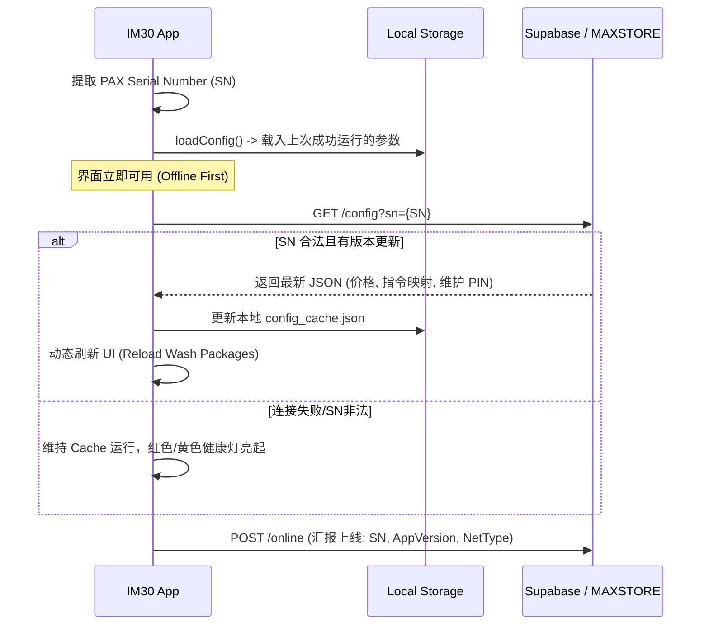
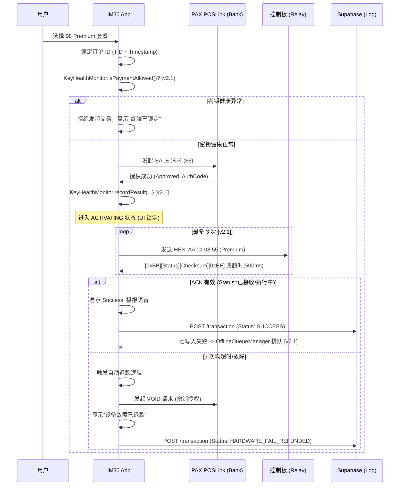

# GS-SSP 系统架构设计规格书 (System Architecture Specification)

## 0. 版本更新记录 (Changelog)

### v2.2 (2026-07-22) — 支付流程可配置化
*   `KioskSettings` 新增 `print_receipt_enabled`（是否打印小票，云端可配置，默认 `false`）与 `payment_method_mode`（0=全部/1=仅卡支付/2=仅扫码，默认 0）。
*   新增 `ReceiptPrinterManager`，封装 `com.pax.dal.IPrinter`（新增的本地占位桩），硬件不可用时自动降级为日志 mock 打印，不阻塞支付流程。
*   `payment_method_mode` 非 0 时，支付方式选择弹窗（"Select Payment Method"）整页跳过，直接进入对应的单一支付流程；为 0 或非法值时行为不变（展示两个选项，安全兜底）。
*   顺带修复：`PaxScannerManager` 的硬件可用性检测此前只用 `Class.forName` 判断类是否可加载，但本仓库自己的 `com.pax.**` 占位桩类本身就一直在 classpath 上，导致该检测在任何环境（含模拟器）下都会误判"真实硬件可用"，进而在无真实硬件时走真实分支并空指针崩溃，用户会卡在"Tap Card"界面。已修正为额外探测 `getDal(context)` 是否真返回非空对象；新写的 `ReceiptPrinterManager` 从一开始就采用了修正后的写法。
*   均已在模拟器上实测跑通三种模式 (0/1/2) 的完整交互，非纸面检查。
*   详见 `docs/card_payment_integration.md`。

### v2.1 (2026-07-22) — 安全与可靠性加固
本轮针对文档中标注为"必须实现"但代码尚未覆盖的缺口做了实现，详见各章节内嵌的 **[v2.1]** 标记。核心变化：
*   VIP 余额扣减改为服务端 RPC 原子操作，堵住客户端直接改表的漏洞。
*   扫码支付从客户端伪造轮询改为真实的云端会话表轮询（网关 webhook 对接仍待完成，见第 10 章）。
*   串口指令新增 ACK 读取与重试，不再是"发了就当作成功"。
*   新增离线交易补报队列，网络中断期间的交易不再丢失审计记录。
*   新增密钥健康监控、设备合法性网关（`devices.is_active`）与远程 LOCK/UNLOCK 的实际执行逻辑。
*   Release 包开启代码混淆与资源瘦身。
*   新增首批单元测试（ACK 帧解析、离线队列、密钥健康状态机）。
*   详见第 10 章「已实现清单」与「待实现功能 / Roadmap」。

---

## 1. 角色定义与职责 (Actor Responsibilities)

### 1.1 IM30 终端 (Android App)
作为系统的控制核心，IM30 负责用户交互、支付处理及硬件调度。
*   **Vertical Engine**: 根据云端下发的 `vertical_type` 动态渲染 UI（如洗车 2x2 布局或洗衣列表）。
*   **ConfigManager**: 实现“三级降级”配置加载逻辑，支持多租户产品目录。
*   **DiagnosticManager**: 实时监听异常并记录技术员维护轨迹，实现故障追溯。
*   **Identity Provider**: 提取 PAX 硬件 SN，作为唯一合法标识。
*   **WashStateMachine**: 管理支付流转，并根据 `Product.attributes` 执行对应的硬件指令。
*   **HAL Layer**: 统一封装 Serial, MDB 与 Pulse 指令。

### 1.2 GS-SSP 云端 (Supabase Backend)
作为系统的运管平台，负责设备群的集中控管。
*   **Provisioning API**: 根据终端 SN 下发对应商户的费率、指令映射及功能开关。
*   **Transaction Audit**: 记录完整交易流水，对比银行支付结果与硬件执行结果。
*   **Realtime Bridge**: 通过 WebSocket 推送紧急指令（如重启、远程停止、调价通知）。
*   **Telemetry Analytics**: 分析各站点设备的在线率及硬件故障趋势。

### 1.3 硬件控制平台 (Relay/MDB Controller)
作为洗车机的物理执行机构。
*   **Instruction Executor**: 接收并解析来自 IM30 的 HEX 指令。
*   **Local Timer**: (针对 Pulse/Simple Serial 模式) 接收指令后独立开启继电器并倒计时，保证即使 App 崩溃，洗车流程也能按时结束。
*   **Feedback Loop**: 发送 ACK 信号给 IM30，确认洗车动作已启动。

---

## 2. 端到端流程设计 (End-to-End Flows)

### 2.1 启动与合法化流程 (Provisioning)
展示设备开机如何获取参数并建立“合法运行”状态。



### 2.2 交易闭环与硬件联动 (Transaction & Hardware)
核心设计目标是“收钱”与“硬件动作”的原子化。

**[v2.1]** 发起刷卡前新增 `KeyHealthMonitor` 前置校验；硬件指令改为 `SerialPortManager.sendCommandWithAck`，单次发送在 500ms 内等待 `[0xBB][Status][Checksum][0xEE]` 反馈帧，超时/故障最多重试 3 次后才判定为硬件失败并触发 VOID。云端写入（`POST /transaction`）若因断网失败，会落入 `OfflineQueueManager` 本地队列，由 `TransactionReplayWorker` 联网后补报，不再直接丢失。



---

## 3. 接口协议规格 (Interface Specs)

### 3.1 云端配置模型 (Sample)
```json
{
  "device_id": "PAX_SN_123456",
  "config_version": "2026.07.21.01",
  "packages": [
    { "id": "p1", "label": "Starter", "price": 400, "cmd": "AA010455" },
    { "id": "p2", "label": "Deluxe",  "price": 600, "cmd": "AA010655" }
  ],
  "settings": {
    "maintenance_pin": "1234",
    "telemetry_sec": 900
  }
}
```

### 3.2 串口通讯协议 (Serial Protocol)
*   **波特率**: 9600 bps, 8-N-1
*   **指令结构**: `[Header(0xAA)] | [Mode] | [Value] | [Footer(0x55)]`
*   **常用码表**:
    *   `AA 01 04 55`: 4分钟模式
    *   `AA 01 06 55`: 6分钟模式
    *   `AA 01 08 55`: 8分钟模式
    *   `AA 00 00 55`: 紧急停止 (Emergency Stop)
*   **[v2.1] 反馈帧（已实现，见 8.1）**: `SerialPortManager.sendCommandWithAck()` 发送指令后等待 `[0xBB][Status][Checksum][0xEE]`，500ms 超时、最多重试 3 次。**Checksum 当前实现为 `XOR(Header, Status)`，这是合理占位，尚未与真实继电器板协议文档核对，量产前必须与硬件厂商确认。**

---

## 4. 无人值守稳定性设计 (Resilience)
1.  **Watchdog（双层）**:
    *   硬件层：`IDeviceControl.watchdogFeed()` 每 15s 喂狗，App 整体死锁/挂起时由 PAX 硬件强制重启整机。
    *   软件层：注册全局 `UncaughtExceptionHandler`（`MainActivity.setupCrashHandler`），Java/Kotlin 异常崩溃时先上报 `DiagnosticManager`（最多等待 2s 让上报发出，避免被 `System.exit` 打断），再拉回 `MainActivity`。**[v2.1]** 崩溃上报此前是发后不等（fire-and-forget），已修正为有界等待。
2.  **Network Resilience**: `DeviceRepository` 的直连 HTTP 调用（认证、设备注册）已接入指数退避重试 (`retryWithBackoff`，3 次/初始 500ms/上限 8s)。**[v2.1]** 此前全仓库未实现，现为部分覆盖——基于 WorkManager 的 Worker（心跳、广告同步、交易补报）依赖 `Result.retry()` 自带的退避策略，未额外包装。
3.  **Kiosk Mode**: 锁定状态栏、导航栏，屏蔽 HOME 键，确保用户无法退出支付界面。
4.  **[v2.1] 离线交易补报 (Offline Transaction Replay)**: `TransactionRepository` 的云端写入失败时落入 `OfflineQueueManager`（本地 JSON 文件队列），由 `TransactionReplayWorker` 每 15 分钟 + 联网条件触发重放，成功后出队、失败继续保留顺序等待下一轮。
5.  **[v2.1] 密钥健康监控 (Key Health Gate)**: `KeyHealthMonitor` 连续 2 次疑似密钥/PIN Pad 相关的 POSLink 失败即锁死刷卡通道，技术员在维护面板执行"强制同步"时一并清除该锁定。
6.  **[v2.1] 设备合法性网关与远程锁定 (Device Access Gate)**: `DeviceAccessManager` 统一管理两类锁定来源——`devices.is_active`（管理员后台禁用）与 `RemoteCommandManager` 收到的 `LOCK`/`UNLOCK` 实时指令，锁定状态持久化于 SharedPreferences，支付入口 (`showPaymentDialog`) 统一拦截，健康灯新增黑色表示"已锁定"。

---

## 5. 行业基准：竞争对手架构模式 (Industry Benchmarks)

为确保 GS-SSP 具备行业领先的专业性，系统架构对标竞争对手（如 Nayax, Cantaloupe）普遍采用的 7 大核心模块。

### 5.1 设备身份与注册 (Device Provisioning)
*   **机制**: 设备出厂烧录唯一 ID (SN/IMEI)，首次上线必须向云平台注册。
*   **云端返回**: 合法性确认、商户绑定信息 (MID/TID)、初始配置版本号。
*   **👉 行业共识**: 设备必须先“被平台认可”，才能开始工作。

### 5.2 配置拉取 (Configuration Fetch)
*   **机制**: 采用“设备主动拉取 + 平台被动推送”双机制。
*   **内容**: 费率映射 (Min ↔ $)、支付开关、网络参数、UI 素材、运营参数。
*   **👉 行业共识**: 所有配置必须可远程下发，且必须具备版本号管理。

### 5.3 密钥注入与安全 (Key Injection / Security)
*   **机制**: 满足 PCI/EMV 要求。支持远程密钥更新 (DUKPT)。
*   **逻辑**: 设备实时监控密钥状态。若密钥异常，立即禁止交易并上报。
*   **👉 行业共识**: 密钥健康状态是设备能否收款的“生死线”。

### 5.4 计费模型 (Tariff / Pricing Model)
*   **机制**: 云端统一管理映射规则，终端仅负责执行。
*   **支持**: 固定费率、阶梯费率、封顶价、峰谷调价。
*   **👉 行业共识**: 计费规则逻辑严禁写死在终端代码中。

### 5.5 实时控制 (Remote Command & Push)
*   **机制**: 基于 MQTT/WebSocket 长连接实现秒级响应。
*   **功能**: 远程重启、锁定设备、即时调价、远程诊断。
*   **👉 行业共识**: 必须具备双向实时通道，否则无法实现运营级管理。

### 5.6 状态汇报 (Telemetry / Heartbeat)
*   **机制**: 30~60s 高频心跳。
*   **画像**: 硬件健康 (CPU/温控)、网络信号 (RSSI)、支付成功率、运营状态 (硬件占用/空闲)。
*   **👉 行业共识**: 终端必须持续汇报画像，否则平台无法进行精细化运营。

### 5.7 交易流程 (Payment Flow)
*   **流程**: 订单生成 -> 支付请求 -> 银行授权 -> 硬件执行 -> 云端留痕。
*   **审计**: 交易必须在云端产生完整链路日志，用于财务对账与风控。
*   **👉 行业共识**: 交易必须云端留痕，实现全链路审计。

### 🏆 行业共同做法总结与实现要求

| 模块 | 行业标准做法 | GS-SSP 实现要求 | **[v2.1] 实现状态** |
| :--- | :--- | :--- | :--- |
| **设备注册** | 云端验证合法性 | **必须实现** (基于 PAX SN) | ✅ 已实现，并新增 `devices.is_active` 网关拦截支付入口 |
| **配置管理** | 主动拉取 + 云端推送 | **必须实现** (三级降级逻辑) | ✅ 已实现 (`ConfigManager`) |
| **密钥注入** | 安全决定收款权限 | **必须实现** (POSLink 托管) | 🟡 部分实现：`KeyHealthMonitor` 基于结果码关键字匹配锁定收款，**具体 PAX 错误码尚未对照真实 POSLink 文档核实**；DUKPT 远程密钥更新本身仍托管于 POSLink SDK，未在 App 侧实现 |
| **计费模型** | 云端统一管理 | **必须实现** (配置驱动 UI) | ✅ 已实现，`Product.attributes` 驱动 UI 与指令 |
| **实时控制** | MQTT / WebSocket | **强烈建议** (Supabase Realtime) | ✅ 已实现，`RemoteCommandManager` 支持 `REBOOT` / `SYNC_CONFIG` / `LOCK` / `UNLOCK` |
| **状态上报** | 心跳 + 硬件健康 | **必须实现** (TelemetryService) | ✅ 已实现 (`HeartbeatWorker`，15 分钟周期) |
| **交易流程** | 云端留痕 / 审计 | **必须实现** (Transaction Table) | ✅ 已实现，并新增离线补报 (`OfflineQueueManager` + `TransactionReplayWorker`) 防止断网丢单 |

---

## 6. IM30 终端详细设计 (IM30 Detailed Design)

IM30 端的 App 采用 **MVVM (Model-View-ViewModel)** 架构，结合 **Repository** 模式，确保业务逻辑与硬件、网络层解耦。

### 6.1 模块架构 (Module Architecture)
*   **UI Layer (Activity/Layout)**: 仅负责数据展示与用户交互事件捕获。
*   **ViewModel Layer**: 维护当前 `WashState` 状态机，驱动支付流转。
*   **Repository Layer**: 
    *   `ConfigManager`: 封装三级降级逻辑（Remote > Cache > Asset）。
    *   `PaymentService`: 封装 POSLink 调用逻辑，处理 `ProcessTrans` 返回结果；**[v2.1]** 发起交易前经 `KeyHealthMonitor` 前置校验。
    *   `VipRepository`: **[v2.1]** 余额扣减改为调用 Supabase `deduct_vip_balance` RPC（服务端原子校验+扣减），不再由客户端直接 PATCH 表。
    *   `QrPaymentRepository`: **[v2.1] 新增**，创建/轮询 `qr_payment_sessions` 会话，替代此前客户端伪造的轮询结果。
    *   `TransactionRepository`: 交易写入失败时经 `OfflineQueueManager` 落盘排队。
    *   `DeviceRepository`: **[v2.1]** Auth Token 持久化于 SharedPreferences（50 分钟 TTL 刷新），直连请求接入指数退避；新增 `checkDeviceActive()` 查询远程锁定状态。
*   **Access Control Layer**: **[v2.1] 新增**
    *   `DeviceAccessManager`: 统一管理 `devices.is_active` 与远程 `LOCK`/`UNLOCK` 两类锁定来源，支付入口单点拦截。
    *   `KeyHealthMonitor`: 追踪 POSLink 密钥相关失败，达到阈值即锁死刷卡通道。
*   **Offline Resilience Layer**: **[v2.1] 新增**
    *   `OfflineQueueManager`: 文件队列，暂存断网期间失败的交易写入。
    *   `TransactionReplayWorker`: WorkManager 周期任务，联网后重放队列。
    *   `NetworkUtils.retryWithBackoff`: 直连 Ktor 请求的通用指数退避封装。
*   **HAL Layer (Hardware Abstraction)**: 
    *   `SerialHAL` (`SerialPortManager`): 封装 `com.pax.dal.IUart`。**[v2.1]** 新增 `receive()` 读取反馈帧，`sendCommandWithAck()` 提供超时+重试。
    *   `ScannerHAL`: 封装 `com.pax.dal.IScanner`。

### 6.2 三级配置同步策略 (3-Tier Config Strategy)
1.  **Level 1 (Memory)**: 启动后 `ConfigManager` 持有单例，全局共享。
2.  **Level 2 (Internal Storage)**: 每次拉取远程配置成功后，写入 `app_config.json`。
3.  **Level 3 (Assets)**: 内置 `default_config.json`，确保设备即使从未联网也能在默认价格下运行。

### 6.3 稳定性保障 (Resilience)
*   **Kiosk 守护**: 屏蔽安卓系统级弹窗，接管 `onBackPressed`。
*   **崩溃自重启**: 注册全局 `UncaughtExceptionHandler`（`setupCrashHandler`），**[v2.1]** 崩溃时先有界等待（≤2s）`DiagnosticManager` 上报完成再重启，避免 `System.exit` 抢跑丢失崩溃遥测。
*   详见第 4 章「无人值守稳定性设计」，第 4 章为完整版，此处不重复列出离线补报 / 密钥健康 / 设备锁定网关等细节。

---

## 7. GS-SSP 云端后台详细设计 (Cloud Detailed Design)

后端采用 **Supabase (Serverless + PostgreSQL)** 架构，提供实时高可用的数据支持。

### 7.1 核心数据库设计 (Key Database Schema)
*   **`devices` 表**:
    *   `sn`: 主键，物理序列号。
    *   `mid/tid`: 商户与终端编号（用于支付路由）。
    *   `config_version`: 当前设备正在运行的配置版本。
    *   `is_active`: 管理员手动锁定开关。**[v2.1]** 迁移脚本 `supabase/migrations/0003_devices_is_active.sql` 确保该列存在；`DeviceRepository.checkDeviceActive()` 读取并驱动 `DeviceAccessManager`。
*   **`app_configs` 表**:
    *   `version`: 时间戳版本号。
    *   `payload`: JSONB 类型，存储价格、指令映射、维护密码。
*   **`transactions` 表**:
    *   `ecr_ref_num`: PAX 生成的交易参考号。
    *   `amount`: 金额。
    *   `payment_status`: APPROVED / DECLINED / VOIDED.
    *   `hardware_status`: ACK_RECEIVED / TIMEOUT / ERROR.
*   **[v2.1] `vip_cards` 表 — 写权限已收紧**: `anon`/`authenticated` 角色的 `INSERT`/`UPDATE`/`DELETE` 已被 `supabase/migrations/0001_vip_deduct_balance_rpc.sql` revoke；余额扣减唯一合法路径是 `deduct_vip_balance(p_card_uid, p_amount_cents)` RPC（`SECURITY DEFINER`，行锁防并发双花）。此前客户端直接 `PATCH` 该表是可被反编译 APK 绕过的安全漏洞，现已修复。
*   **[v2.1] `qr_payment_sessions` 表（新增）**: 见 `supabase/migrations/0002_qr_payment_sessions.sql`。
    *   `tx_id`: 主键，交易 ID。
    *   `device_sn` / `amount_cents`: 发起设备与金额。
    *   `status`: `PENDING` / `PAID` / `EXPIRED` / `CANCELLED`。`anon`/`authenticated` 仅有 `INSERT`/`SELECT` 权限，**只有 service role（支付网关 webhook）能写 `PAID`**，防止客户端伪造支付成功。
    *   **⚠️ 待办**: 目前仅有会话表和轮询逻辑，尚未接入真实支付宝/微信/Stripe 的 webhook 来实际写入 `PAID`，见第 10 章。

### 7.2 实时控制链路 (Realtime Pipeline)
*   **Push 通知**: IM30 订阅 Supabase 的 `device_commands` 表变更。
*   **远程动作**: 管理员在 Web 后台插入一条 `REBOOT` 记录，终端通过 WebSocket 实时捕获并执行。
*   **[v2.1]** `LOCK` / `UNLOCK` 指令此前是空实现（只打日志），现已接入 `DeviceAccessManager.setRemoteLock()`，真正阻断终端的支付发起入口。

---

## 8. 硬件平台详细设计 (Hardware Detailed Design)

通过 RS232 串口与洗车机控制板（继电器）进行工业级可靠通讯。

### 8.1 帧结构规范 (Frame Specification)
*   **发送帧 (IM30 -> MCU)**: `[0xAA][Mode][Value][0x55]`
    *   `Mode`: 0x01 (开始), 0x00 (停止)。
    *   `Value`: 时间或档位代码。
*   **反馈帧 (MCU -> IM30)**: `[0xBB][Status][Checksum][0xEE]`
    *   `Status`: 0x00 (已接收), 0x01 (执行中), 0x02 (故障)。

### 8.2 安全逻辑 (Safety Logic)
*   **硬件自锁定**: 控制板应具备“心跳超时自动复位”功能。若 IM30 在运行中死机且未发送 STOP 指令，控制板在到达预设最大时长后应强制切断电源，防止水资源浪费。**⚠️ 待办**: 此为对控制板固件的要求，App 侧无法验证，需与硬件厂商确认已实现。
*   **ACK 确认机制**: 发送指令后 500ms 内未收到 `0xBB` 反馈，App 自动重试 3 次，若全部失败则触发支付 `VOID`。**[v2.1] ✅ 已实现** (`SerialPortManager.sendCommandWithAck`)，Checksum 校验算法为占位实现，需与硬件文档核对（见 3.2）。

---

## 9. 动态广告引擎详细设计 (Dynamic Ad Engine Design)

广告引擎负责终端在空闲状态下的多媒体展示，支持云端异步分发与本地高性能循环播放。

### 9.1 数据模型 (Database Schema)
*   **`advertisements` 表**:
    *   `id`: UUID。
    *   `media_url`: 素材下载地址 (Supabase Storage)。
    *   `media_type`: `VIDEO` / `IMAGE`。
    *   `md5_hash`: 文件指纹，用于完整性校验和版本对比。
*   **`playlists` 表**:
    *   `device_sn`: 关联特定终端。
    *   `ad_id`: 关联广告素材。
    *   `play_order`: 播放顺序索引。

### 9.2 同步与缓存机制 (Sync & Cache)
*   **Background Worker**: 基于 `WorkManager` 实现，每 2 小时检查一次云端 `playlists`。
*   **增量下载策略**: 
    1.  对比云端 `md5_hash` 与本地文件。**[v2.1] ✅ 已实现**：此前 `AdSyncWorker` 只按文件是否存在判断，同 ID 素材内容变更后永远不会重新下载；现已用 `MessageDigest("MD5")` 真正比对本地文件与 `ad.md5_hash`。
    2.  下载缺失或变更的素材至 `context.filesDir/ads/`。
    3.  删除不再属于 `playlists` 的旧素材以释放空间。
*   **MD5 校验**: 确保下载过程无损，防止视频文件损坏导致播放器卡死。**[v2.1] ✅ 已实现**：下载完成后二次校验 MD5，不匹配则删除该文件，避免播放器加载到损坏素材。

### 9.3 播放器实现 (Playback Implementation)
*   **AdActivity**: 核心播放容器。
*   **混合队列**: 统一管理视频流与位图资源。
*   **降级播放**: 若同步任务从未成功或存储为空，系统强制回退至 `res/raw/ad_placeholder`。
*   **统计上报**: 每次素材完整呈现后，记录一次 `play_event` 并异步上报云端，用于生成展示效果报表。

---

## 10. v2.1 已实现清单与待实现功能 (Implemented & Roadmap)

### 10.1 本轮已实现 (Implemented)
| 领域 | 变更 | 涉及文件 |
| :--- | :--- | :--- |
| 构建 | 修复 Supabase-kt 2.x/3.x 依赖版本混用 (`auth-kt`→`gotrue-kt`，`createChannel`→`channel`)，锁定整个 group 版本 | `app/build.gradle`, `SupabaseClientProvider.kt`, `RemoteCommandManager.kt`, `ShadowManager.kt` |
| 安全 | VIP 余额扣减改为服务端 RPC 原子操作，收回客户端直接写表权限 | `VipRepository.kt`, `supabase/migrations/0001_*.sql` |
| 支付 | 扫码支付改为真实云端会话轮询，替代客户端伪造成功 | `QrPaymentRepository.kt`, `supabase/migrations/0002_*.sql`, `PaymentService.kt`, `MainActivity.kt` |
| 硬件 | 串口指令新增 ACK 读取 + 超时重试 (500ms × 3) | `IUart.java`, `SerialPortManager.kt` |
| 可靠性 | 离线交易补报队列 + 周期重放 Worker | `OfflineQueueManager.kt`, `TransactionReplayWorker.kt`, `TransactionRepository.kt` |
| 安全 | 密钥健康监控，锁死刷卡通道 | `KeyHealthMonitor.kt`, `PaymentService.kt` |
| 广告引擎 | MD5 增量同步真正生效（原先只判断文件是否存在） | `AdSyncWorker.kt` |
| 稳定性 | 崩溃上报改为有界等待，不再被 `System.exit` 打断 | `DiagnosticManager.kt`, `MainActivity.kt` |
| 运营控制 | 设备合法性网关 (`devices.is_active`) + 远程 LOCK/UNLOCK 真正生效 | `DeviceAccessManager.kt`, `DeviceRepository.kt`, `RemoteCommandManager.kt`, `supabase/migrations/0003_*.sql` |
| 可靠性 | Auth Token 持久化 (SharedPreferences, 50 分钟 TTL) + 直连请求指数退避 | `DeviceRepository.kt`, `NetworkUtils.kt` |
| 生产加固 | Release 包开启 `minifyEnabled` + `shrinkResources`，补齐此前缺失的 `proguard-rules.pro` | `app/build.gradle`, `app/proguard-rules.pro` |
| 测试 | 新增 18 个单元测试（ACK 帧解析 / 离线队列 / 密钥健康状态机） | `app/src/test/**` |

以上均已在本机用项目自带的 Gradle 9.5.0 + Android Studio JBR 实际跑通 `assembleDebug` / `assembleRelease` / `testDebugUnitTest` 验证，非纸面检查。

### 10.2 待实现功能 / 已知限制 (Roadmap / Known Limitations)
| 项目 | 说明 | 阻塞原因 |
| :--- | :--- | :--- |
| 真实支付网关 Webhook | `qr_payment_sessions.status` 只能由 service role 写入，但目前没有任何服务在监听支付宝/微信/Stripe 的支付回调并执行这次写入——扫码支付会话建好后永远等不到 `PAID` | 需要商户网关凭证与一个 Webhook 服务（Supabase Edge Function 或独立后端），本仓库/本环境无法提供 |
| PAX 密钥错误码核实 | `KeyHealthMonitor` 目前用字符串关键字 (`KEY`/`DUKPT`/`PIN PAD` 等) 猜测密钥失败，未对照真实 POSLink 集成文档 | 仓库内 `com.pax.poslink.*` 是本地占位桩，非厂商真实 SDK，无法验证真实错误码 |
| 串口 ACK Checksum 算法 | 当前实现为 `XOR(Header, Status)`，是合理占位，未与真实继电器板协议文档核对 | 同上，`com.pax.dal.IUart` 为占位桩，真实校验算法需继电器板厂商确认 |
| 控制板固件侧安全联锁 | 8.2 节要求的"心跳超时自动复位"需在继电器板固件中实现，App 侧无法验证 | 硬件固件不在本仓库范围内 |
| 集成测试覆盖 | 已有的 18 个测试均为纯逻辑单测；`ConfigManager` 三级降级、`PaymentService` 完整流程等仍缺集成测试 | 现有 `object` 单例 + 直接实例化 Ktor Client 的写法不便注入 Mock，需要先做依赖注入重构才能低成本补齐 |
| 仓库卫生 | `app/build/` 构建产物目录被历史提交进了 git（未被 `.gitignore` 排除），导致 `git status` 长期有大量噪音 | 需要人工确认后执行 `git rm -r --cached app/build` 并补充 `.gitignore`，本次未处理 |
