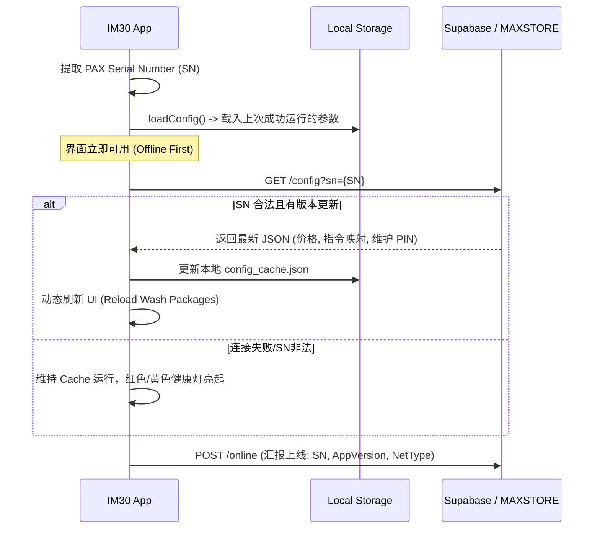
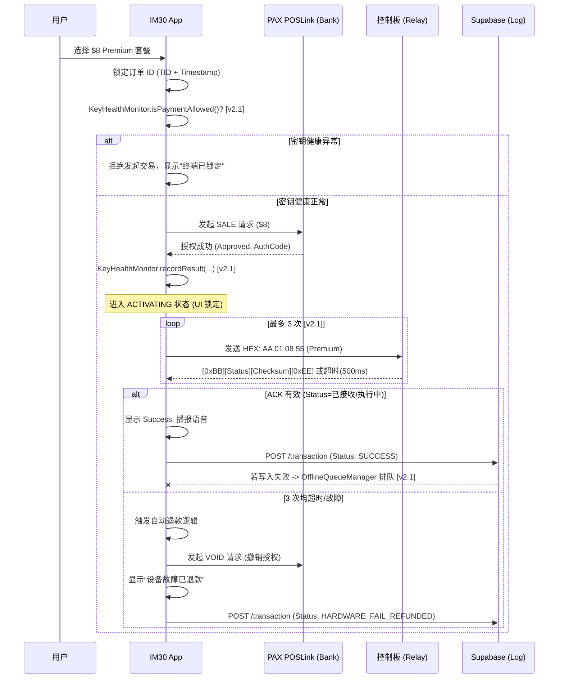

# GS-SSP 系统架构设计规格书 (System Architecture Specification)

> [!NOTE]
> **版本号说明**: 本文档实际由两条独立演进线合并而成（CMP/Supabase 后端的 RLS 修复线，与 Android HAL/产品线的架构演进线），两条线各自独立递增版本号，合并后出现了 `v2.23`/`v2.24`/`v2.27` 各被使用两次、且部分条目未按日期严格排序的情况（例如 `v2.27 (2026-08-20)` 实际是全文最新的一次修改，却排在 `v2.28 (2026-08-09)` 之后）。**版本号不是可靠的时间/依赖排序依据，请以每条目标题里的日期为准**；正文中散落的 `[v2.1]` 等内联标记同理，指的是该版本条目引入的变更，不代表这是当前最新状态。

### v2.49 (2026-08-29) — 补上 vip_cards 缺失的 tier 列：PLATINUM/GOLD 折扣逻辑第一次真正有数据可用 (vip_cards.tier Column Added — Discount Logic Finally Has Data)

紧接 v2.48。上一条目顺手发现的缺口——`vip_cards` 表根本没有 `tier` 列，`feature/wash`/`app/ourea` 里的 PLATINUM/GOLD 阶梯折扣分支永远拿到 Kotlin 侧的默认值 "REGULAR"，折扣从来没真正生效过——这次正式修。

*   **`docs/supabase_full_schema.sql`**：`vip_cards` 加了 `ALTER TABLE ... ADD COLUMN IF NOT EXISTS tier TEXT NOT NULL DEFAULT 'REGULAR' CHECK (tier IN ('REGULAR', 'GOLD', 'PLATINUM'))`——约束值和 `feature/wash`/`app/ourea` 里 `when(card.tier)` 分支已经在判断的三个值完全对应，不是新编的。
*   **v2.48 刚加的 `get_vip_card_by_uid` RPC 同步更新**：`SELECT` 语句加了 `tier`，返回的 JSON 里也加了 `tier` 字段——单纯加表字段不会让 API 自动返回它，两边必须一起改，不然列加了但读不到，等于白加。
*   **`VipRepository.kt`**：`GetVipCardResult` 加 `tier: String? = null`，`getVipCard()` 的映射把 `decoded.tier ?: "REGULAR"` 传进 `VipCard` 构造函数——之前这个字段完全没被传，永远吃 `VipCard.tier` 自己的默认值，就算数据库真的返回了 tier 也会被忽略。
*   **验证**：全仓库 `assembleDebug`+`testDebugUnitTest` 保持绿色。**没有真实 VIP 卡数据可以端到端验证折扣是否真的生效**——RPC 改动依赖用户执行下面这段 SQL，之后需要一张真实的 `tier='PLATINUM'` 或 `'GOLD'` 卡才能看到折扣分支第一次被走到。

### v2.48 (2026-08-29) — aegis-wash 综合排查 + vip_cards 的 RLS 缺口用 RPC（不是照抄 products/devices 那条 anon 策略）修复 (VIP Card RLS Gap Fixed via RPC, Not a Blanket Policy)

紧接 v2.47。用户要求综合分析 `aegis-wash` 还有什么需要完善，排查发现三个问题（`vip_cards` 的 org-scoped RLS 缺口、`hardwareVendor` 硬编码死在 "PAX" 导致 WizarPOS/IDTECH 注册形同虚设、`feature/wash` 零单元测试覆盖），用户确认先修第一个。

*   **一开始的判断需要自我纠正**：最初类比 v2.32/v2.34 给 `products`/`devices` 加的"匿名设备可读"策略，以为 `vip_cards` 能照抄同样的修法。**动手前发现这个类比不成立**：`vip_cards` 存的是具体客户的余额，不是公开商品目录；RLS 是行级别的，没法表达"只有按 card_uid/qr_code 查询时才可见"——只要某个策略让一行"可见"，一个不带过滤条件、直接查全表的客户端一样能读到，等于给任何持有内置匿名 key 的设备开了读取**全平台所有商户 VIP 客户余额**的口子，比 products 目录暴露的风险级别高得多。
*   **改用了仓库里 `deductBalance` 早就在用的同一套模式**：`VipRepository.getVipCard()`/`resolveCardUidByQrCode()` 从直接查表（`postgrest["vip_cards"].select{...}`）改成调用两个新的 `SECURITY DEFINER` RPC——`get_vip_card_by_uid(p_card_uid)`/`resolve_vip_card_uid_by_qr(p_qr_code)`，只接受具体的 uid/二维码参数、只返回那一条匹配记录，不需要在表级开放任何 SELECT 权限。`GRANT EXECUTE ... TO authenticated`（不给 `anon`）——照抄的是 `redeem_coupon` 那条更新、更精确的约定（注释原文："由于走到这里之前 App 早就完成匿名登录了"），不是 `deduct_vip_balance` 当初可能过度防御性地同时给了 `anon` 的旧约定。
*   **顺手发现一个相关但没有在本次修的问题**：`deduct_vip_balance` 本身其实完全没检查调用方设备的 org 是否匹配卡片的 org——任何认证过的设备理论上只要猜到/拿到别的商户的 `card_uid` 就能扣别人的余额。这是这个 RPC 一直就有的缺口，不是这次改动引入的，也不在"给 VIP 查询补 RLS"这个任务范围内，先记下来，不在这次顺手改，避免在同一个改动里引入没被要求的行为变化。
*   **另一个顺手发现、同样没动**：`vip_cards` 表 schema 里根本没有 `tier` 列（`card_uid`/`org_id`/`balance_cents`/`is_active`/`created_at` + 后来加的 `qr_code`/`display_card_number`/`cardholder_name`/`mobile_phone`/`card_expiration_date`），但 Kotlin 的 `VipCard.tier` 有默认值 `"REGULAR"`。这意味着 `feature/wash`/`app/ourea` 里那套 PLATINUM/GOLD 阶梯折扣逻辑（`when(card.tier) { "PLATINUM" -> 0.85; "GOLD" -> 0.90 }`）**实际上永远走不到折扣分支**，因为服务端根本不返回 tier，Kotlin 侧永远拿到默认值 "REGULAR"。这是一个真实的功能缺口，但和这次的 RLS 修复是两件事，没有顺手改。
*   **`docs/supabase_full_schema.sql` 同步更新**（该文件自己声明是"唯一真相来源"）：把两个新 RPC 加进了 `deduct_vip_balance` 后面。**该文件顶部原本就有 DESTRUCTIVE FULL RESET 的警告——完整重新执行这个文件会清空所有表**，所以只把两段新增的 `CREATE FUNCTION`/`REVOKE`/`GRANT` 单独摘出来交给用户执行，不是让用户重新跑整个 schema 文件。
*   **验证**：全仓库 `assembleDebug`+`testDebugUnitTest` 保持绿色，现有的 `VipRepositoryTest`（只测 `classifyDeductResult` 纯函数）不受影响。**没有真实 VIP 卡数据可以端到端验证**——RPC 本身没在真实 Supabase 项目里跑过，需要用户执行 SQL 后再验证。

### v2.47 (2026-08-29) — WizarPOS VIP 拍卡从"永久挂起的空实现"补成真实 Mifare 读卡 (WizarPOS VIP Card Detection Implemented, Was a Silent Hang)

紧接 v2.46 同一天。用户问"WizarPOS 对 VIP card tap 是怎么实现的"，查代码发现 `WizarPosPaymentProvider.startCardDetection()` 原来是：

```kotlin
override fun startCardDetection(amountInCents: Int, callback: IPaymentProvider.PaymentCallback) {
    callback.onProgress("READY")
}
```

只回调一次 `onProgress("READY")`，之后永远不会调 `onCardDetected`/`onSuccess`/`onFailure`——界面会**永久卡住**，没有超时也没有报错，比 PAX 当时的 NeptuneLite stub（好歹有 3 秒 mock fallback）和 ID TECH 的立即成功空实现（有文档注释说明"这个 reader 不做 NFC 识别"）都差。用户随即确认"WizarPOS 已经明确支持 Mifare 刷卡"，于是当场实现：

*   **真实 API 来源**：在本次会话早些时候为了查 D3 Accessory Agent 协议下载的 `D22_Q3_PaymentDemo_20241231.zip`（WizarPOS 官方 EMV Demo）里，`cloudposInterface/ContactlessCardImpl.java` 就是官方自己对接非接触式读卡的示例：
    ```java
    device = (RFCardReaderDevice) POSTerminal.getInstance(ct).getDevice("cloudpos.device.rfcardreader");
    device.open();
    ```
    用 `javap` 反编译 `libs/wizarpos/cloudpos_sdk.aar` 确认了 `com.cloudpos.rfcardreader.RFCardReaderDevice`/`RFCardReaderOperationResult`/`com.cloudpos.card.Card` 的真实方法签名——`RFCardReaderDevice` 声明了 `MODE_MIFARE` 常量、`waitForCardPresent(timeout): RFCardReaderOperationResult`（自带超时的阻塞调用，不需要像 PAX 那样手写轮询循环）、`Card.getID(): ByteArray`（UID）、`Device.cancelRequest()`（真正可以中断阻塞调用，不是 fire-and-forget 的 `Job.cancel()`）。
*   **实现**：`startCardDetection` 走 `POSTerminal.getDevice(POSTerminal.DEVICE_NAME_RF_CARD_READER)` 拿到设备（复用官方 Demo 确认过的基础无参 `open()`，没有用 `RFCardReaderDevice` 自己声明的 `open(mode, param)` 重载——后者的参数含义在拿到的资料里没有实际用例佐证，不猜），`waitForCardPresent(30000)` 拿结果，`resultCode == OperationResult.SUCCESS` 时读 `getCard().getID()` 转成十六进制 UID 字符串；`stopCardDetection` 改成真的调 `device.cancelRequest()`，不再是空函数。Mock 判断统一成 `HardwareConfig.isMock`，和刚改完的 PAX 那条一致。
*   **验证**：全仓库 `assembleDebug`+`testDebugUnitTest` 保持绿色。**同样没有真实 WizarPOS 硬件可以在这个环境里验证**——依据是反编译确认的真实方法签名 + WizarPOS 官方 Demo 的对照用法，`open(mode, param)` 重载的两个参数具体该传什么值目前没有实例可查，所以选择了官方 Demo 里实际用过的、更简单的无参 `open()`，没有编造参数含义。等拿到真机后，PAX 和 WizarPOS 这两条 VIP 拍卡实现应该一起优先验证。

### v2.46 (2026-08-29) — PAX VIP 拍卡从 NeptuneLite stub 切换到 POSLink 自带的真实 PiccManager (VIP Card Detection Now Uses Real POSLink API, Not a Stub)

紧接 v2.45 同一天。v2.45 分析确认"NeptuneLite 唯一剩余真实用途是 VIP 拍卡识别"之后，进一步在项目里已有的 PAX 官方资料（`temp_pax_demo/POSLinkDemo` 的 `MifareActivity.java` 示例 + `temp_pax_semi` 文档）里找到了不需要 NeptuneLite 的真实替代方案，用户确认后直接实现：

*   **改动**：`PaxPaymentProvider.startCardDetection()`/`stopCardDetection()` 从 `dalProvider: () -> IDAL?`（NeptuneLite DAL，本仓库没有真实 AAR，纯 stub）切换成 `com.pax.poslink.peripheries.PiccManager`——**这个类真实存在于项目已经在用的 `libs/pax/PAX_POSLinkAndroid_20260202.aar` 里**，用 `javap` 反编译确认过方法签名（`PiccManager.getInstance(context).open()/detect(DetectMode)/close()`，`CardInfo.getSerialInfo(): byte[]` 就是卡 UID），和 PAX 官方 POSLink Demo App 里 `MifareActivity.java` 的用法完全一致。零新增依赖，不需要再等 PAX 给 NeptuneLite AAR。
*   **Mock 判断从"`dal == null`"改成直接查 `HardwareConfig.isMock`**——更准确地反映真实的 mock/真机开关（之前 `dal` 是否为 null 取决于 `PaxHardwareProvider.init()` 里一堆初始化逻辑，现在直接对齐仓库里其他地方都在用的同一个标志位）。`PaxPaymentProvider` 构造函数因此不再需要 `dalProvider` 参数，`PaxHardwareProvider.getPaymentProvider()` 调用点同步简化。
*   **唯一的能力限制**：这个 AAR 版本的 `PiccManager.DetectMode` 只有 `ONLY_M`（Mifare），没有 NeptuneLite 那种覆盖 ISO14443 A/B 全类型的 `ALL` 模式——对 VIP 会员卡场景足够（银行卡走 `startSale` 的 `PaymentRequest` 路径，不受影响），如果以后要支持非 Mifare 的会员卡介质需要重新评估。
*   **一个真实的踩坑记录，供以后参考**：改动过程中遇到一次编译失败（"Unclosed comment"/"Missing '}'"/"Class not abstract"三个报错同时出现，看起来毫不相关）——根因是 **Kotlin 的块注释 `/* */` 支持嵌套**（和 Java/C 不一样），KDoc 注释正文里写了"`com/pax/**`"这样的说明文字，其中"`pax/**`"字面上包含"`/*`"，被解析成嵌套注释的开始，导致后面唯一的"`*/`"提前闭合了内层注释、外层注释一路开到文件末尾，把整个 `startCardDetection` 方法都吞进了注释里。以后在 Kotlin doc 注释里提到路径/通配符（`foo/**`、`bar/*.kt` 这类）要避免连续出现"`/*`"。
*   **验证**：全仓库 `assembleDebug`+`testDebugUnitTest` 保持绿色。**没有真实 PAX IM30/IM25 硬件可以在这个环境里做真机验证**——这条改动的正确性依据是反编译确认的真实方法签名 + PAX 官方 Demo 的对照用法，不是真机拍卡测试过；后续拿到真机后应该优先验证这一条。

### v2.45 (2026-08-29) — PAX 官方工单回复确认 IM30/IM25 支付走 POSLink 是正确路径；NeptuneLite 唯一剩余真实用途是 VIP 拍卡识别 (PAX Support Confirms POSLink Path, Narrows NeptuneLite Gap)

用户转发了 PAX Technology 支持工单（`[3822-1] Request for NeptuneLite/IDAL SDK & MDB Extension Library for PAX IM25 & IM30`）里 Ming-Hung Yu 的官方回复：IM30/IM25 上做卡支付**不需要 NeptuneLite SDK**，官方支持的路径是"PAX semi-integration"——终端上跑 BroadPOS（PCI 认证的支付 App，商户凭证走 PAXSTORE 配置），应用侧用 POSLink 库发 SALE/AUTH/VOID/结算等请求给 BroadPOS，NeptuneLite 用不上。

*   **对照代码确认**：`PaxPaymentProvider.kt` 的 `startSale`/`voidTransaction`/`refundTransaction`/`closeBatch` 已经全部走 `com.pax.poslink.PosLink`（`libs/pax/PAX_POSLinkAndroid_20260202.aar`，真实 AAR，不是 stub），和 PAX 官方描述的路径完全一致——**这次回复确认的是现有实现方式本来就是对的，不需要改代码**。
*   **顺手核对了原工单里同时问到的 MDB Extension Library**：`PaxMdbProvider.kt`/`PaxGpioProvider.kt` 走的是另一个已经是真实库的 SDK——`libs/pax/UptApi_V1.02.jar`（`pax.util.MDBManager`/`DigitalIOManager`，2022 年编译，`jar tf` 确认真实 class 文件，不是 stub）——不是 NeptuneLite，这部分请求早就有真实库覆盖了，PAX 这次回复没提到但不代表没解决。
*   **缩小后的真实缺口**：`core/hardware/src/main/java/com/pax/**` 那批 NeptuneLite/IDAL 手写 stub（`com.pax.dal.*`），全仓库唯一的真实用途是 `PaxPaymentProvider.startCardDetection()` 里的 `dal.picc`——**读取拍卡 UID 用于 VIP 会员识别，不是走支付的那条路径**。核对了 `UptApi_V1.02.jar` 的 class 列表，里面没有任何 PICC/NFC/card 相关类，无法替代 NeptuneLite 覆盖这个功能。也就是说：真机上 PAX 终端的 VIP 拍卡识别目前还是假的（`dal == null` 时的 mock fallback 在跑），这是唯一还没解决、且这次工单回复没有涉及的缺口——但和支付本身无关，不涉及资金安全，优先级明显低于支付路径。

### v2.44 (2026-08-28) — 准生产加固第一轮：QR/会员卡支付真机验证 + 全面代码复盘，5 个真实 bug 修复 (Pre-Production Hardening Round 1)

紧接 v2.43。用户要求"继续完善，达到准生产的状态"。先查了 build.gradle/AndroidManifest，确认"没有 release 签名/ProGuard 配置、`IS_MOCK` 硬编码 true"是 `app/iris` 也一样的仓库级约定，不是 Ourea 单独的事，没有擅自改——这类决策留给用户定。范围收窄到用户确认的四项：真机跑通 QR/会员卡支付、补代码复盘、支付中断状态加固、补单元测试；用户全选，本轮先做了前两项。

*   **QR/会员卡真机验证**：QR 支付走了真实 Supabase Edge Function（`QrPaymentRepository` 不受 `IS_MOCK` 影响），二维码真实生成、取消流程测过。会员卡输入未知码走了真实网络请求，正确返回"Member code not recognized"、购物车不受影响、无崩溃。
*   **`/code-review high --fix` 复盘了本次会话新增/改动的全部文件**（`app/ourea` 的 MainActivity.kt/OureaScreens.kt，`feature/retail` 的 RetailViewModel.kt/RetailRepository.kt，`core/data` 的 Product.kt/LocalDatabase.kt），发现并自动修复 5 个真实 bug，1 个明确跳过：
    1.  **QR 取消后交易记录永久卡在 PENDING**——测试时我自己手动发现的同一个问题，复盘也独立找到了。修复：取消时先把 `TransactionRepository` 状态更新成 `CANCELLED` 再杀掉轮询协程。真机验证：logcat 确认 `Payment status updated to CANCELLED for OUR-QR-...`。
    2.  **挂单用 `Map<productId, qty>` 编码购物车，同商品不同 modifier 的两行会互相覆盖、modifier 本身也丢失**——比 v2.40 自己以为的"只是没解码"更深一层的问题。修复为 `List<ParkedCartLine>`（含 modifierIds），resume 时按 id 查回真实 `ProductModifier` 对象。
    3.  **Cash 键盘的上限检查判断的是乘法之前的值**——`receivedCents < 100_000_00` 这个判断在旧值上做，下一位数字敲进去之后新值可能一口气冲到近 10 倍上限。真机验证：连点 12 次"9"，修复后金额精确停在 `$99,999.99`，不再失控。
    4.  **会员折扣支付：小票/记录里的 subtotal/tax/tip 是折扣前原价，但 amount 是折扣后总价，三者加起来对不上实收金额**——影响对账和小票可信度。修复为 subtotal/tax 都乘上同一个 `discountFactor`，tip 取余数，保证三项之和精确等于 `finalTotal`。
    5.  **`RetailRepository.syncWithCloud` 只会 upsert，云端下架/删除的商品永远不会从本地缓存清掉**——发现于复盘，不是本次新写的代码，但直接影响刚上线的 Products 页面是否可信。修复：`ProductDao` 加 `deleteAll()`，同步改成同一事务内先清空再插入，真正做到"以云端为准"，顺手去掉了旧代码里一个多余的 `runBlocking`（DAO 方法本来就不是 suspend）。
    *   **明确跳过、没有动**：员工 PIN 硬编码 `"1234"`——`app/iris/MainActivity.kt:133` 一模一样的写法，修复需要一套真实的"设备/员工配置的 PIN"来源，目前整个仓库都没有，属于功能新增而不是这次复盘该顺手改的 bug，只做了记录。
*   **验证**：全仓库 `assembleDebug`+`testDebugUnitTest` 保持绿色（`app/iris` 一并确认没被连累）；Cash 上限修复和 QR 取消修复都在真机上专门复测过，其余三处改动确认编译通过、逻辑走查合理，未逐一在真机上单独复现原始 bug 场景（会员折扣需要真实 VIP 卡数据，挂单 modifier 场景需要商品带 modifier_groups，产品清理需要真的在 CMP 侧改一次商品——目前仓库里都还没有这些条件）。
*   **仍未做（用户选了但本轮没轮到）**：给今晚新写的纯函数补单元测试；支付进行中界面状态从 `remember{}` 提升到可存活配置变更/进程回收的存储方式。

### v2.43 (2026-08-28) — Ourea 新增只读的商品/库存浏览界面（不碰权限模型）(Read-Only Products/Inventory Screen)

紧接 v2.42，次日。用户要求"继续完善界面的产品和库存管理"。动手前先查了 `docs/supabase_full_schema.sql` 里 `products` 表的 RLS：INSERT/UPDATE 只对带 `catalog.manage` 权限的 `authenticated`（真人 CMP 登录）开放，Ourea 设备是匿名认证，完全没有写权限——而且顺手查了 `gs-ssp-cmp` 全仓库，发现虽然 `catalog.manage` 这个权限键早就定义好了，**CMP 那边至今也没有任何产品管理页面**，是真正的空白。把这个发现摆出来，问用户新增/编辑/删除到底该建在 Ourea 还是 CMP，用户选择：**Ourea 这边先做只读的分类浏览 + 库存展示，不碰权限模型**，新建/编辑留给 CMP 以后再做。

*   **`Product.stockQty`**：和 v2.40 的 `category` 走同一套模式——`public.products` 没有专门的库存列，`stock_qty` 挂在 `attributes` JSONB 里，只读派生属性。`null` 表示"这个商品没有跟踪库存"，和真实的 `0`（真的没货了）严格区分，不能把两者混为一谈。
*   **`ProductEntity` 同步补了 `stockQty: Int?` 列，`@Database` 版本号 5→6**（`fallbackToDestructiveMigration()` 已经配置好，纯本地缓存表，版本跳变只是清空重建，不是真正的迁移，风险可忽略）——`RetailRepository.toModel()`/`toEntity()` 双向把 `category` 和 `stock_qty` 一起从/向 `attributes` 打包，冷启动先读本地缓存时库存显示不会跟云端同步之间出现闪烁式的短暂丢失。
*   **UI**：
    *   `OureaStockBadge`——0 件红色"Out of Stock"，≤5 件金色"Low: N left"（阈值 5 是随手定的合理默认值，不是 WizarPOS/CMP 给的规范），其余灰色"N in stock"；`stockQty == null` 时完全不显示徽章（不编造库存数字）。
    *   现有结账页 `ProductCard` 加了库存徽章，库存为 0 时整卡半透明、加入购物车按钮禁用。
    *   `ProductCard.onAdd` 从必填参数改成可空（默认 `null`）——新的只读场景传 `null` 时完全不渲染"+"按钮，而不是渲染一个点了没反应的假按钮。
    *   新增 `OureaProductsScreen`（侧边栏新图标，`Icons.Default.Inventory2`，位置在购物车和交易记录之间）：标题栏统计"N products · N low stock · N out of stock"，复用已有的搜索框和 `OureaCategoryRail`（v2.40 已建），网格用只读版 `ProductCard`（`onAdd=null`）。
*   **验证**：全仓库 `assembleDebug`+`testDebugUnitTest` 保持绿色（`core/data`/`feature/retail` 都改了，确认没连累 `app/iris`）；模拟器真机截图确认 Products 页正确显示全部 7 个商品（含之前被遮挡看不清名字的第 7 个——`GoldSky Tote Bag $18.00`，现在确认了），无分类/无库存数据时优雅降级（不显示分类栏、不显示库存徽章），和结账页表现一致。库存徽章的三种状态（缺货/低库存/正常）尚未用真实数据真机验证——给了用户一段 SQL（合并写入 `attributes.stock_qty`，不改表结构）用于测试，跑完后需要重启 app 才会同步显示。

### v2.42 (2026-08-27) — Master 端不需要 WizarPOS 自家硬件：客户现有 Android 双屏一体机走标准 USB Host 模式即可外接 Q3 mini (Master Role Not Vendor-Locked — Unconfirmed Source)

紧接 v2.41，同一晚。用户表示"如果用客户现有的 Android 双屏一体机做 Master（走标准 USB Host 模式），外接 Q3 mini 作为 Slave，这样也支持"——回应的正是 v2.41 提出的追问清单里最关键的第 1 条（Master 端是否必须是 WizarPOS 自家的 D22/D3）。

**这条结论的信息来源尚未确认（是 WizarPOS 官方回复，还是用户自己的判断/计划，已经追问用户，待补充）**——记录在这里，但先按"未最终确认"处理，不要在此基础上直接写死采购决策或代码实现，等来源确认后再补充这条记录的置信度。

*   **如果属实，采购/硬件策略层面的意义**：不需要专门采购 WizarPOS 的 D3——可以用客户现有的、或者任意第三方 OEM 的 Android 双屏一体机作为 Master（Ourea 跑在上面），只需要单独采购 WizarPOS 的 Q3 mini 作为外接的 Slave 读卡终端，通过标准 Android USB Host 模式对接，不必依赖 v2.41 提到的、疑似 WizarPOS 自家固件专属的 `persist.wp.usbchannel` 系统属性设置流程。这与用户最早的猜测（"随便 OEM 一个双屏机，外接一个 Q3 就可以称为自己的产品"）方向一致。
*   **v2.41 清单里其余三条仍然完全未确认**，不因这一条而放松：真实生产支付 App 包名/组件、VOID/REFUND 的 `TransType` 编号、AuthCode 字段位置——这些仍然需要 WizarPOS 直接确认，`D3UsbPaymentProvider.kt` 仍然保持原样（显式失败，不猜协议）。

### v2.41 (2026-08-27) — D3 集成协议找到真实一手来源，架构结论被推翻：D3/D22 是 Master，Q3(mini) 是 Slave (Real Protocol Found — Master/Slave Roles Reversed)

紧接 v2.40，同一晚。用户提供了 WizarPOS CloudPOS SDK gitbook 的一个具体页面链接（`faq/usb-serial-port/accessory-agent-service-d22-q3`），顺着这个页面找到了三份一手资料：gitbook 页面本身、`AccessoryConnectAgentusermanual.pdf`（官方用户手册，PDF 用 `pdftotext -layout` 成功提取全文，不再是 v2.36 记录的"WebFetch 解析不了"）、以及最关键的 `D22_Q3_PaymentDemo_20241231.zip`（官方支付 Demo 源码，含 `EMVSample`——跑在 Q3 上的完整 EMV 支付 App，和 `PaymentReouterClinet_D22_EMVSample`——跑在 D22 上的支付路由客户端）。此外还核对了 `datasheet-D3.pdf`（用户提供于 `C:\goldsky\合作伙伴资料\wizarPOS`）与 `datasheet-Q3 UPT.pdf`，发现两份资料页上"Integration options: Semi-integration.../All-in-one..."那段文案完全相同——这是 WizarPOS 全系产品线的通用营销文案，不能反推 D3 具体走哪种模式，之前误以为是 D3 专属特性。

*   **推翻此前假设（v2.37/v2.36）：不是"Ourea 主机 USB 外接 D3 读卡器"，而是 D3/D22 = Master（默认），Q3(mini) = Slave（默认）**——gitbook 页面和官方 Demo 的 README 都明确写了角色定义。D3 自带 15.6 寸大屏 + 内置打印机（`datasheet-D3.pdf` 已确认），这个硬件形态本来就更适合当"主机"而不是"外接读卡配件"，现在协议角色定义也印证了这一点。用户之前转述的"计算机主机和 D3 读卡机"这个说法，正确的映射应该是：**D3 本身就是那台"计算机主机"，Q3mini 才是外接的"读卡机"**。
*   **真实协议（来自官方 Demo 源码，不是转述）**：
    *   桥接服务：两台设备都装 `AccessoryConnectionAgent.apk`，包名 `com.smartpos.accessoryagent`，Service 类 `com.smartpos.accessoryagent.service.RemoteAccessoryApiService`，AIDL 接口 `IRemoteAccessoryApi`，有 `remoteIntent(json)` 和 `remoteIntentType(type, json)` 两个方法（官方支付 Demo 实际用的是后者，`type="broadcast"`）。
    *   Master→Slave（发起 Sale）：`remoteIntentType("broadcast", json)`，`json` 里 `packageName="com.smartpos.emvsample"`、`className="com.smartpos.emvsample.receiver.Receiver"`、`action="PAY_REQUEST"`、`putExtra.AidlData={"TransType":1,"TransAmount":"000000012300"}`（12 位补零字符串，单位分，`"000000012300"`=$123.00，代码原注释确认）。
    *   Slave→Master（交易结果）：同样走 `remoteIntentType("broadcast",...)`，`action="PAY_RESPONSE"`，Master 侧注册一个 `BroadcastReceiver` 接收，`putExtra.AidlData` 这次是**已经 `toString()` 过的 JSON 字符串**（请求方向传的是嵌套 JSON 对象，响应方向传的是字符串——两个方向不对称，照抄官方 Demo 各自的写法，不要假设两边格式一致），内容为 `{"RespCode":"00|FF","RespMsg":"Approved|Failed","TransResult":true|false,"TransAmount":<分>,"TransDate":...,"TransTime":...,"Trace":...}`。
    *   开机配置：两台设备都装 `SetUsb.apk`，设置系统属性 `persist.wp.usbchannel=1`，重启；USB 连接后，只接一台 Q3 时自动配对，接多台时开机弹窗选择。
*   **仍然没有搞清楚、明确不去猜的三件事**：
    1.  `com.smartpos.emvsample` 是官方 Demo 自己的包名，**不能假设真机上实际部署的支付 App 就是这个包名/组件**——这一点必须问 WizarPOS 确认，Demo 仅供参考实现模式。
    2.  **VOID/REFUND 在官方 Demo 里根本没实现**——`Receiver.java` 原文注释就写着"Need to unpack the Json and call different transactions with different transType(sale/Void/Refund/....) Now this sample always call Sale transaction"，连 WizarPOS 自己的示例代码都留了空白。`TransType` 目前只确认 `1`=Sale，VOID/REFUND 的编号未知，**不编造**。
    3.  响应报文里没有看到 AuthCode 字段（只有 `Trace`，大概率对应现有代码里的 `refNum`），小票打印需不需要授权码要另外问。
*   **不影响本次不改代码**：`D3UsbPaymentProvider.kt` 保持原样（显式失败），本条目只是记录找到的真实一手协议来源，供下一步实现前先向 WizarPOS 核实上述三点。资料存档在 `%TEMP%\claude\...\scratchpad\wizarpos_accessory\`（本机临时目录，非仓库内，未提交）。

### v2.40 (2026-08-27) — 客户演示前紧急功能补强：Dashboard 重做 + 挂单/取单真机跑通（修复取单的真实 bug）+ 购物车加减按钮 + 商品分类筛选 (Pre-Demo Feature Push)

紧接 v2.39，同一天晚上。用户次日要给客户演示 Ourea，反馈"功能还是比较单一"，参考小红书 Posly 截图（`C:\goldsky\Requirment\Ourea`）按优先级补了四项，全部在模拟器（1920x1200，比之前验证用的 1280x720 大得多）上真机走通：

*   **Dashboard 重做**（最高优先级）：新增 `OureaDashboardScreen`（`app/ourea` 自己的，不是改共享的 `feature/apex` `InsightsScreen`——那个 app/iris 还在用，不动）。今日收入/今日订单/客单价三张统计卡 + 最近订单列表，数据全部来自 `TransactionRepository.getAllLocal()`（`TransactionHistoryScreen` 用的同一份真实本地订单历史），没有任何写死的示例数据——全新设备显示全 0 和空列表。真机验证：跑一笔 Cash 支付后，Dashboard 正确显示 `$4.13`/`1`/`$4.13` 和一条状态为绿色"Paid"的最近订单行。
*   **挂单/取单**：`RetailViewModel.parkCurrentOrder`/`resumeOrder` 后端逻辑其实早就写好了（`ParkedOrderEntity`/`ParkedOrderDao` 都在），但从来没人接到 UI 上。接入过程中**发现一个真 bug**：`resumeOrder()` 只会删除挂单记录、清空购物车，从来没有把 `cartJson` 解码回购物车——"取单"实际上等于把挂起的商品永久丢弃。已修复（解码 `Map<String, Int>`，按 `RetailRepository.catalog` 查回 `Product` 后逐个 `addItem`；引用了目录里已不存在商品时跳过并记警告，不崩溃）。真机验证：挂起"Croissant x2 ($7.50)"→购物车清空、Cart 标题旁出现"Held (1)"→点开弹窗显示"Quick Order $7.50"→点击后购物车正确恢复出 Croissant x2。
*   **购物车 +/- 数量按钮**：原来每行只有一个删除(X)按钮，点一下减1（不直观）。改成 `-`/数量/`+` 三段式（复用已有的 `RetailViewModel.addItem`/`removeItem`，没有新后端逻辑），数量为1时"-"退化成删除图标。
*   **商品分类筛选（右侧分类栏）**：`public.products` 表本身没有 `category` 列（见 `docs/supabase_full_schema.sql`），比照该表已有的"`attributes` JSONB 放硬件专属字段"的既有模式，把 `category` 也放进 `attributes` 而不是加迁移。`Product.category` 是从 `attributes["category"]` 派生的只读属性；`RetailRepository`/`ProductEntity` 两边的 `toModel()`/`toEntity()` 都做了双向映射，保证冷启动先读本地缓存时分类也不丢。**写生产库这一步被 auto-mode 权限分类器拦下了（连只读 SELECT 都拦了）——没有绕过，把现成的 SQL（对 6 个已知演示商品的 `attributes` 做 JSONB 合并更新，不改表结构）交给用户自己在 Supabase SQL Editor 里跑**。UI 侧已验证：没有任何商品带 `category` 时分类栏完全不渲染（不会出现只有"All"一个选项的空壳栏），行为和之前一致，不影响还没跑 SQL 的当下；用户跑完 SQL 并重启 app 后应该就能看到真实分类。
*   **全仓库验证**：每一项改完都单独 `assembleDebug`+`testDebugUnitTest` 保持绿色（`resumeOrder`/`Product.category` 都改在共享模块 `feature/retail`/`core/data`，专门确认了 `app/iris` 没被影响）。四项功能里前三项已经在模拟器上完整走通截图确认；分类筛选的 UI 逻辑走查+空态验证过，真实分类数据渲染效果要等用户跑完 SQL 后再一起确认。

### v2.39 (2026-08-27) — Ourea 支付确认页三个"非功能性"按钮（Cash/QR/Member Card）接入真实后端逻辑 + 两个真机验证发现的布局溢出 bug 修复 (Payment Buttons Wired + Layout Overflow Fixes)

紧接 v2.38，同一天完善。v2.33 记录过"参考截图里的 cash/QR/member-card 支付按钮，本仓库没有对应后端逻辑，故意不做成假按钮"——本次把这三个方法接上已经存在、别处验证过的真实后端，不再是占位：

*   **Cash**：新增 `OureaCashDialog`（数字键盘输入实收现金，实时算找零/差额，Confirm 在实收 < 应收时禁用）+ `MainActivity.triggerCashPayment`。现金没有网关/硬件往返，staff 是在确认"钱已经收到"，所以直接落 `payment_status=PAID`（不同于卡/QR 那种先 PENDING 再翻 PAID 的模式），`payment_method="CASH"`。
*   **QR**：新增 `OureaQrPaymentDialog`（展示 `QrUtils.generateQrCode` 生成的二维码，等待中可取消）+ `MainActivity.startQrPayment`，复用 `QrPaymentRepository`（`feature/wash` 的 kiosk 扫码支付已经在用的同一个 Supabase-backed session/poll 实现，不是客户端假计时器）。取消会 `Job.cancel()` 真正中断轮询。
*   **Member Card**：新增 `OureaMemberDialog`（人工输入/条码枪当键盘输入 6 位会员码，2026-09-20 由 12 位缩短而来，格式校验通过 `VipRepository.resolveCardUidByQrCode` 期望的同一个正则才允许提交）+ `MainActivity.triggerVipPayment`，PLATINUM/GOLD 阶梯折扣逻辑照抄 `feature/wash` 的 `initVipPayment`（应用在购物车总额上，wash 那边是应用在单一价格上）。用手动输入码而不是 NFC 感应，是因为 Ourea 现有硬件 provider 都是刷卡支付终端、不是会员卡 NFC 读卡器，也没有接扫码枪硬件。
*   `OureaPaymentUiState.Success` 从 `authCode: String` 改成通用 `message: String`（cash/QR/member 的成功提示不是一个授权码），四条支付路径在各自的最终提示文案里说明各自结果（找零金额/折扣是否命中等）。
*   **真机验证过程中发现两个真实布局 bug，均已修复**（不是猜的，是模拟器截图直接看到的）：
    1.  支付确认页四个按钮原来用 `.width(280.dp)`/`.width(133.dp)` 固定宽度：在这个 app 实际的横屏分辨率下，左侧 `weight(1f)` 那一栏实际测得的宽度远小于 320dp（侧边栏 + 340dp 的 Bill Details 面板吃掉了大部分宽度），固定宽度按钮溢出到列外，被后画的 Bill Details 面板整个挡住、完全不可见/不可点（QR Code 按钮、Member Card 文字、Back to Order 按钮当时都是这样）。改为 `fillMaxWidth()` + 外层 `widthIn(max = 320.dp)` 解决；两个按钮一行并排也放不下文字（"QR Code"/"Cash" 换行后被固定高度裁切），最终改成四个按钮全部纵向堆叠、`verticalScroll` 兜底。
    2.  `OureaCashDialog`/`OureaQrPaymentDialog` 内容纵向总高度超出这台设备实际可用屏幕高度：没有 `verticalScroll` 时，数字键盘第 3/4 行（含 Confirm/取消按钮）直接超出物理屏幕边界，既看不见也点不到。三个新弹窗的 `Column` 都补了 `verticalScroll(rememberScrollState())`。
*   **验证**：全仓库 `assembleDebug`+`testDebugUnitTest` 保持绿色；在模拟器上真机走通了完整 Cash 支付链路——输入 $5.00 收款、界面正确算出找零 $0.87、`TransactionRepository` 本地落库 `payment_method=CASH`/`payment_status=PAID`（`Local stub created: OUR-CASH-...` + `MOCK: Transaction recorded`）、`ReceiptPrinterManager` 按预期方式优雅失败（模拟器没有真实打印机，同卡支付路径在这个环境下的既有行为一致，不是新问题）、成功弹窗 "Cash received. Change due: $0.87" 正确显示、购物车正确清空。QR/Member 两条路径代码走查与 Cash 同构、编译通过，但受限于测试当时模拟器性能极差（Input dispatching 超时触发多次系统级 ANR 弹窗，与本次改动无关，是环境问题），未能在本次会话里完整真机跑通，留作后续验证项。

### v2.38 (2026-08-27) — Ourea 侧边栏内跳转页面主题一致性修复 (Insights Theming + Real Bug Fix)

紧接 v2.37，继续完善 Ourea 界面。检查侧边栏能跳转到的几个复用页面（Insights/Transactions/Settings）在深色主题下的实际表现：

*   **`SettingsScreen` 本来就是对的**：全程用 `MaterialTheme.colorScheme.*`，深色主题下渲染正常（金色标签、金色按钮、正确的输入框），不用改。
*   **`TransactionHistoryScreen` 用 Material3 `ListItem`**，自带正确的主题色处理，不用改。
*   **`InsightsScreen`（`feature/apex`）发现一个真 bug，不只是配色不统一**：`Revenue: $0.00`/`Transactions: 0` 两行文字之前没有显式指定颜色，在 `app/iris` 的浅色默认主题下凑巧能看见，但在 `app/ourea` 的深色主题下变成了近黑底近黑字，几乎不可读。修复：显式指定 `MaterialTheme.colorScheme.onBackground`。标题颜色此前硬编码为一个和任何主题都无关的固定蓝色 `GoldSkyBlue(#007AFF)`，**没有直接把它换成主题色**（这会连带改变 `app/iris` 现在的样子，这次没有被要求碰 iris），而是加了个 `titleColor: Color = GoldSkyBlue` 参数，`app/iris` 的调用点不用改、行为不变，`app/ourea` 显式传 `OureaGold`。
*   **验证**：模拟器截图确认——`Insights` 标题正确显示金色，两行数字文字清晰可读；`Settings` 页面确认原本就正常。全仓库 `assembleDebug`（含 `app/iris`，确认默认参数没有破坏它）+`testDebugUnitTest` 保持绿色。

### v2.37 (2026-08-27) — D3 集成架构进一步澄清：Ourea 作为 USB Host 接外置读卡终端，非同机部署 (D3 Is External-Over-USB, Not Co-Located — Scaffold Only)

紧接 v2.36，同一天内对 D3 的定位又做了一轮澄清，**推翻了 v2.36"不需要改代码"的结论**。

*   **v2.36 当时的假设**：D3 和 Q3mini 一样，App 装在 D3 终端自己身上、进程内调用同一台设备的支付硬件——按这个假设，现有 `WizarPosPaymentProvider`（本地 socket 127.0.0.1:6666）理论上不用改。
*   **用户后续澄清推翻了这个假设**：实际场景是"计算机主机和 D3 读卡机"——即 **Ourea（大屏桌面 POS）作为 USB Host，去控制一台通过 USB 线外接的、物理上独立的 D3 终端**，不是同一台设备。这是和现有所有硬件集成（PAX/ID TECH/WizarPOS Q3mini，全部是"App 和支付硬件同机、进程内/本地 socket 调用"）完全不同的接入方式——USB 设备枚举、权限申请、连接生命周期、报文协议都不一样，`WizarPosPaymentProvider` 那套代码不适用。
*   **协议细节仍然没有可靠来源**：用户之前转述的"D3 用 PAYWizard AIDL 接口 + Default 连接模式（对比 Q3 的 USB Accessory 模式）"这段文字，和项目里已有的、基于官方协议 PDF 写成并真机验证过的 `docs/wizarpos_upt_integration_spec.md`（Q3mini 走本地 socket，未提及 AIDL 或 USB Accessory 模式）直接矛盾，且转述文字的原始来源一直没有确认（可能是另一个 AI 读 PDF 生成的转述，不是原文）。支付协议报文格式编错是会真的连不上设备甚至处理错真实金额的，不能靠猜。
*   **这次只搭了空壳**：新建 `app/ourea/src/main/java/com/goldsky/ssp/ourea/D3UsbPaymentProvider.kt`，实现 `IPaymentProvider` 接口（和 PAX/IDTECH/WizarPOS 用同一套抽象，方便以后接进 `PaymentProviderFactory`），每个方法体目前都是显式失败（`onFailure(..., isHardwareFault = true)`），没有编造任何 USB 报文格式；`AndroidManifest.xml` 加了 `android.hardware.usb.host` 的 `<uses-feature>` 声明（`required="false"`）。**没有注册进任何 Factory，没有接进 UI**——纯占位，等拿到真实协议文档（D3/D22 对应的、类似 Q3mini 那份"慧银支付应用集成协议"的原始 PDF）再补实现。
*   **验证**：`:app:ourea:assembleDebug` 通过，全仓库构建保持绿色。

### v2.36 (2026-08-27) — WizarPOS "D3 Smart ECR" 澄清：不是新协议，是同一 SDK 下的另一款硬件 (D3 Scoped, No Code Change Needed)

用户要求"把 wizarpos smart erc 集成进来"，并给了 WizarPOS 官方 CloudPOS SDK 文档站的链接。逐页翻查 + 站内搜索后确认：**"Smart ECR" 不是一种集成模式/协议，是 WizarPOS 硬件产品线里的一个具体型号——"D3(Smart ECR)"**，和 Q1/Q2/Q3/Q3mini/Q3PRO/D22/Unattended POS 等并列在同一份 POS_Specs 页面里，用的是同一套 CloudPOS SDK。

*   **结论：现有 WizarPOS 集成理论上不需要改代码就能对接 D3**。`WizarPosHardwareProvider`（`core/hardware`）用的是 CloudPOS SDK 的 `POSTerminal.getInstance(context)`，不针对具体型号；实际收单走的 `WizarPosPaymentProvider`/`WizarPosSocketClient`（P3 本地 Socket 协议，`127.0.0.1:6666` 连同一台设备上跑的 PAYWizard 伴生 App）同样是型号无关的——这套本来就是为了对接 WizarPOS 全系列终端设计的，不是写死给 Q3mini 用的。已在 `WizarPosHardwareProvider.kt` 类注释里明确记录这一点，避免以后有人误以为这套代码是 Q3mini 专属。
*   **和 D3 无关、真正 Q3mini/UPT 专属的部分**：`WizarPosGpioProvider`/`WizarPosMdbProvider`（继电器控制、MDB 总线，vending 无人值守场景用的外设）。D3 作为收银台配套刷卡终端预期不会用到这两个，但代码本身没有限制，真有对应硬件也能调。
*   **没做、也做不了的部分**：D3 的官方 PDF 规格书（`D3_Classic_White(Android_11).pdf`）没法用现有工具解析（WebFetch 处理不了这份 PDF 的二进制内容，本地也没装 PDF 渲染工具），所以 D3 具体外设配置（有没有扫码枪、打印机等）没有确认；手头也没有真实 D3 设备，无法做真机联调。**这两项都需要用户后续补上**——要么找到可读的规格书文本，要么等有真机后再验证。

### v2.35 (2026-08-27) — products 表同一类被掩盖的 RLS 缺口修复 + Ourea 全链路真机验证 (Products RLS Gap Fixed, Full E2E Verified)

紧接 v2.34，同一天完善。目标是把 Ourea 的加购物车→结账→支付这条链路在模拟器里跑通验证，而不是只看界面截图。

*   **又踩到一个和 v2.32（devices 表）一模一样的坑**：`products` 表上 `authenticated` 角色唯一的 SELECT 策略（"Devices can see own org products"）要求 org 归属匹配，而测试用的匿名认证设备从未被后台分配过 org，导致目录同步一直返回空。照搬 v2.32 的修法，按 `is_anonymous` claim 加了一条新策略（不是无条件放开，真人 CMP 登录仍然只走 org 归属那条），同步记录进本文件对应表定义附近。
*   **插入 7 条测试商品**（`vertical_type='RETAIL'`, `org_id` 留空），验证过用只读诊断 SQL（`SET LOCAL ROLE authenticated` + 模拟 `request.jwt.claims`）确认策略生效后能查到全部 7 条。
*   **全链路真机验证结果（模拟器，真实网络调用，非 mock 数据）**：目录同步成功（"Sync complete: 7 products from Supabase cached"）→ 加入购物车（Espresso x2, $7.00）→ CHECKOUT 按钮渐变正确显示启用态 → TipSelectionDialog（共享组件，自动套用新主题金色，未改动）→ 新做的支付确认面板（账单明细 $7.00 + 税 $0.00 + 小费 18%=$1.26 + 应付 $8.26，数字全部正确）→ 点击 Charge Card 后真实调用 `IdTechPaymentProvider.startSale(826, ...)`，因模拟器没接真实读卡器而真实失败（"Failed to start card acceptance (EMV+CTLS+MSR)"，与本 session 更早测试 `app/iris` 时看到的同一条真实硬件层错误一致）→ 红色 PaymentResultDialog 正确弹出。
*   **一个顺带确认的、非 bug 的现象**：交易记录写入日志显示"MOCK: Transaction recorded (skipped remote)"——这是因为 `app/ourea/build.gradle` 的调试构建变体沿用了 `app/iris` 同款的 `IS_MOCK=true` 配置，`TransactionRepository.recordTransactionRemote()` 按设计在此标志位下跳过远程写入，不是这次改动引入的问题。
*   **结论**：Ourea 现在是一个视觉上对齐 GoldSky 品牌、业务逻辑上真实可跑通（硬件调用层面）的桌面 POS 原型，而不只是界面骨架。

### v2.34 (2026-08-27) — Ourea 视觉身份对齐 GoldSky 品牌 logo (Brand-Consistent Visual Identity)

紧接 v2.33，同一天完善。用户提出"基于新一代 AI POS 的理念完善，界面风格和 logo 一致"——两句话分开澄清后确定范围：

*   **"AI POS 理念"这半句**：用户明确"界面看来不要很 AI，但功能上能发现是 AI 赋能过的"，也就是要真实的 AI 能力（不是 AI 风格的视觉皮肤）。但现在代码里没有任何 LLM/AI API 集成，`feature/apex`（品牌上是"AI 助手"）目前只是个 40 行营收计数器，商品目录/交易记录也都是空的、没有真实种子数据可供任何推荐类功能使用。跟用户确认后，**这次范围只做视觉这一块，真正的 AI 能力（语音搜索/智能推荐/等）另外单独讨论范围再做**，不在这次凭空造。
*   **"界面风格和 logo 一致"这半句，本次实际完成的部分**：v2.33 的第一版视觉是从参考截图（"Posly"）直接借来的纯深色+扁平橙色，和 GoldSky 自己的 logo（`core/ui` 下早就有、但此前没人用过的 `goldsky_logo.png`——金色圆弧 + 带电路纹理的天蓝"翼" + 带星尘纹理的暖橙"眼"）没有关系。这次把 `OureaTheme.kt` 的配色改成直接取自 logo 本身（金色 `#F7C948`、天蓝 `#3AB6E8`、暖橙 `#E0621C`），侧边栏顶部的占位图标换成真实 logo 图片，主 CTA（CHECKOUT / Charge Card）改用金→橙渐变而不是纯色块，选中态导航图标从纯色块改成柔和底色+金色图标（更克制、更"高级感"，避免参考截图那种扁平色块的既视感）。
*   **验证**：`assembleDebug`/`testDebugUnitTest` 保持绿色；模拟器里临时跳过 PIN 门禁（验证完已改回）截图确认：logo 正确显示、选中态图标为柔和金色高亮、CHECKOUT 按钮在有效/禁用两种状态下颜色正确切换。
*   **待办（未做，等用户给范围）**：`feature/apex` 品牌定位（"AI 助手"）和实际内容（营收计数器）的落差此前在功能对齐盘点里就标记过，这次仍未处理；真正的 AI 功能要等有具体范围（语音/推荐/等）和必要的基础设施（LLM API key 等，如果需要）才能动手，不能靠现在这点空数据编出效果。

### v2.33 (2026-08-27) — Ourea（桌面 POS）首个可运行版本 (Ourea First Build)

`app/ourea` 不再是空白——按 v2.30/v2.32 确认的定位（Desktop POS，装 `feature:retail` 的柜台结账逻辑）新建了这个模块，UI 视觉风格参照 `C:\goldsky\Requirment\Ourea` 下的 4 张参考截图（来自另一个叫 "Posly" 的产品的小红书截图，**是视觉参考，不是文字需求文档，也不是要逐像素复刻的规范**）。

*   **范围确认（用户选择）**：只重做结账相关的 UI 视觉风格，复用 `feature:retail` 已验证过的业务逻辑（`RetailViewModel`/`RetailRepository`/`TipSelectionDialog`/`triggerPaymentFlow` 真实支付调用），不新增业务逻辑——参考图里的丰富仪表板分析、应用内菜单分类管理这两块明确排除在这次范围外。
*   **新增内容**：`OureaTheme.kt`（深色导航栏配色，自己的主题，不影响 core/ui 共享主题或其他 app shell 的视觉）、`OureaScreens.kt`（左侧图标导航栏 + 商品网格 + 购物车面板 + 支付确认面板）、`MainActivity.kt`（硬件/支付/认证注册逻辑与 `app/iris` 完全一致，直接照搬而非重新推导）。
*   **诚实的取舍**：参考图里的现金/扫码/会员卡/组合支付四种支付方式，代码里目前只有刷卡（真实 `PaymentProviderFactory` 调用）是有实现支撑的，所以只做了这一个,没有为了视觉还原做三个不会真正工作的假按钮。同理，侧边栏只接了 Cart/Insights(现有)/Transactions(现有)/Settings(现有) 四个有真实页面撑着的图标，参考图里的折扣/消息/通知图标因为代码里没有对应功能，没有做成摆设。
*   **验证**：`:app:ourea:assembleDebug` 通过，模拟器真机安装运行，PIN 解锁后侧边栏+购物车+商品网格正常渲染（当前设备目录为空，显示"No products yet"是真实状态，不是 bug）。全仓库 `assembleDebug`+`testDebugUnitTest` 保持绿色。
*   **未验证**：还没有真实商品数据跑过一次完整的加入购物车→小费→支付确认→真实刷卡这一整条链路（模拟器目前没有同步到目录数据）；`app/iris` 自己的内容原样保留未删除（Iris 的真实定位仍待定，见 v2.30）。

### v2.32 (2026-08-27) — JWT 签名密钥轮换已执行，根因确认修复；发现并修复一个被旧 bug 掩盖的独立 RLS 缺口 (JWT Rotation Executed & Verified — Root Cause Actually Fixed)

紧接 v2.31，同一天内用户在 Supabase 控制台完成了轮换（Legacy HS256 → 新的非对称 ECC P-256，两阶段过渡：旧密钥仍对未过期 token 保留验签能力，需要之后手动 revoke）。这次做了真机验证，结论明确：

*   **验证方法**：在模拟器里跑 `app/iris`，用真实的匿名登录 session（`signInAnonymously`，`role: authenticated`，`is_anonymous: true`）发起设备自注册请求，观察真实的成功/失败结果；中途还在 `public.debug_auth_context()`（临时 SQL 函数，验证完已删除）配合 `DeviceRepository.debugAuthContext()`（临时诊断调用，验证完已删除）确认了 PostgREST 实际赋予这次请求的 Postgres 角色。
*   **确认根因已修复**：轮换后，`current_role`/`jwt_role_claim` 均正确显示为 `authenticated`（此前的核心 bug——每个 authenticated session 被 PostgREST 当 anon 处理——不再发生）。这在架构上说得通：新的非对称密钥体系下 GoTrue 和 PostgREST 从同一个密钥管理源头验签，不再存在 v2.31 里说的"raw string vs base64-decoded"编码歧义。
*   **轮换刚做完时曾报告"仍然失败"，后来查明是另一个独立缺口，不是轮换没生效**：`devices` 表的自注册请求是 `upsert`（`on_conflict=sn`），upsert 需要 SELECT 权限做冲突检测——这个模式此前在 `heartbeats` 表上就出现过一次（`return=representation` 需要重新 SELECT 插入的行）。`authenticated` 角色在 `devices` 上唯一的 SELECT 策略（"Org members can view org devices"）要求 `is_sys_admin()` 或已有 org 归属，一个刚自注册、还没分配 org 的匿名设备两个条件都不满足，upsert 因此被拒。**这个缺口一直存在，只是被"authenticated 被当 anon 处理"这个旧 bug 意外掩盖了**——旧 bug 下请求实际走的是 `anon` 角色，而 `anon` 早就有无条件的 SELECT 策略（v2.29 之前加的），所以自注册"能用"完全是巧合。轮换把认证修对之后，这个一直存在的洞就露出来了。
*   **修复**：没有照抄 anon 那条无条件 SELECT（本文件里另有一段注释记录过，之前给 `authenticated` 开过一次无条件 SELECT，导致任何 CMP 商户管理员都能看到别的租户设备清单，后来专门收窄改掉——不能重蹈覆辙）。改用按 `is_anonymous` claim 区分：只放行"匿名登录的设备 session"，真人 CMP 登录（`is_anonymous: false`）仍然只能走 org 归属那条策略。
    ```sql
    DROP POLICY IF EXISTS "Anonymous devices can view own row for upsert" ON public.devices;
    CREATE POLICY "Anonymous devices can view own row for upsert" ON public.devices
    FOR SELECT TO authenticated
    USING (COALESCE((auth.jwt() ->> 'is_anonymous')::boolean, false));
    ```
    应用方式同 v2.29/v2.31：已通过 Supabase SQL Editor 在生产库执行，同步追加进本文件对应表定义附近。
*   **验证结果**：修复后，同样的自注册请求成功（`Device SN_UNKNOWN registered successfully`，非 mock 分支的真实网络路径）。
*   **未验证 / 后续待办**：
    *   `transactions` 走的是纯 `insert()`（无 `on_conflict`），不会触发同样的 upsert-需要-SELECT 缺口，理论上现在应该能正常写入了，但**没有跑完整的收银流程实测**（只测到设备自注册这一步）——下次有空跑一次真实结账验证 `transactions` 真的落库。
    *   `heartbeats`/`device_shadows`/`device_commands`/`qr_payment_sessions`/`vip_cards`/`coupons` 同理，理论上现在 authenticated 角色应该能正常工作了（根因已修），但没有逐个实测，不排除其中某些也有类似 devices 这种被掩盖的独立缺口。
    *   `devices`/`products` 上 v2.29 加的 anon 策略**仍未收回**——虽然根因已修，但还在旧密钥的 token 过期窗口内，暂缓收回，等确认所有客户端都已经用上新密钥签发的 token 之后再动（同 v2.31 的 TODO）。

### v2.31 (2026-08-27) — JWT 根因修复路径复核：轮换风险被高估，anon RLS 补丁范围有缺口 (JWT Root-Fix Path Re-Assessed)

延续 v2.27 (2026-08-08)/v2.24/v2.23 那条 RLS 修复线，以及本文档未单独成条但已发生的"GoTrue/PostgREST 密钥编码不一致导致 authenticated session 被当 anon 处理"根因诊断（当时决定不轮换、改用 anon 策略打补丁）。这次功能对齐盘点发现两个新情况，合并记录：

*   **anon 策略补丁范围有缺口**：此前只给 `devices`（约1102-1113行）和 `products`（约1134-1137行）补了 `anon` 角色策略；`transactions`（约1202-1230行）、`heartbeats`、`device_shadows`、`device_commands`、`qr_payment_sessions`、`vip_cards`、`coupons` 等仍然只有 `authenticated` 策略，理论上仍会被同一根因问题挡住写入。`transactions` 的 ownership 校验（`device_sn IN (SELECT ... WHERE auth_user_id = auth.uid())`）依赖真实身份，不能像 devices/products 那样简单补一条无条件 `anon` 策略——那会让持有（公开的）anon key 的任何人读写任意设备的交易记录，这对财务表是不可接受的降级，所以这次没有照搬同一个补丁模式。
*   **轮换风险重新核实，比之前评估的低**：把 Supabase 轮换弹窗点名的 11 个 Edge Function（`gs-epos` 6 个、`gs-ssp-cmp` 的 `esp32-ads`、`gs-ssp` 自己的 `create-qr-session`/`submit-acquirer-onboarding`/`sync-acquirer-settlements`/`upload-acquirer-document`）逐个查了源码，**没有一个手动引用 JWT secret 的值**——全部只是走平台自带的 `verify_jwt`（默认开启）网关，函数代码本身不掺和密钥编码。之前"轮换太危险"的判断是在没读这些函数代码、只看轮换弹窗名单的情况下做出的，偏保守。真正的轮换风险只是"轮换那一刻起，旧密钥签发的 token 全部失效，客户端要重新登录/刷新拿新 token"——如果 Supabase 的轮换支持 Standby key 两阶段流程（先激活新密钥、旧密钥仍可验签一段时间、之后再手动 revoke），这个过渡是平滑的，需要在控制台里确认具体是不是这种两阶段模式。

*   **结论 / 待办**：
    *   推荐路径改为轮换到新的非对称 JWT Signing Keys，从根上消除 GoTrue/PostgREST 的编码不一致问题——而不是继续给每张表挨个补 anon 策略（每补一张都是在稀释真实的行级安全，且没有一次性解决问题，后续任何新表都可能踩同一个坑）。
    *   **TODO（轮换成功验证后再做，现在不要动）**：`devices`/`products` 上现在开着的 `anon` 角色策略（1102-1113行、1134-1137行）应该收回/收紧回 `authenticated`-only，因为它们的存在理由（"当前 auth 是坏的"）在轮换后就不成立了。收回前要先确认轮换后 `authenticated` 角色的读写确实恢复正常，不能顺手删。
    *   轮换本身（Supabase 控制台操作）是否真的走两阶段过渡，需要用户在控制台确认后再决定是否执行——这一步没有做，只是把复核结果和待办记录下来。

### v2.30 (2026-08-27) — Aegis 系列重命名执行完成 + Iris/Ourea 归属澄清 (Rename Executed, Iris/Ourea Scope Corrected)

紧接 v2.29 的设计结论，同一天内完成了实际执行，并且中途发现 v2.29 自己对 Iris/Ourea 的归属判断有误，一并记录修正——**这条目是当前权威状态，v2.29 的"现状→目标映射"表格里 Iris/Ourea 那两行已被本条目取代**。

*   **已执行**：`app/aegis`（洗车）→ `app/aegis-wash`；`app/ourea`（原装自助售货）→ `app/aegis-vend`；`app/sentinel`（充电桩）→ `app/aegis-ev`。三者包名/applicationId/模块目录/展示名均按 v2.29 确认的子包规范改好，业务内容不变。`settings.gradle` 同步更新。全仓库 `assembleDebug` + `testDebugUnitTest` 验证通过。`app/aegis-parking` 仍未搭建（`feature/parking` 还是 1 文件占位骨架）。
*   **执行中的一次误判，已被产品侧纠正**：v2.29 曾判断"`app/iris` 现装的完整柜台结账流程（`feature:retail`）应该迁到 Ourea（桌面 POS）名下"，据此把该内容原样复制建了一个新的 `app/ourea` 模块。**产品侧随即纠正：`feature:retail` 那套代码本来就应该属于 Iris，不是 Ourea 的内容**——`app/ourea` 副本已撤销删除，`settings.gradle` 里对应的 `include` 也已移除。
*   **当前准确状态**：`app/iris`（`com.goldsky.ssp.iris`）= `feature:retail` 完整柜台结账流程，确认归属正确。`app/ourea`（桌面 POS）**尚不存在**，其真实功能范围待产品侧另行定义，**不能靠复制 Iris 内容来搭建**——这是本次唯一还悬着的开放问题。

### v2.29 (2026-08-27) — GoldSky 品牌产品线分类澄清 + Aegis 系列拆分设计 (Brand Taxonomy Correction, Design Only — Not Yet Implemented)

`app/*` 四个 app shell（`iris`/`ourea`/`aegis`/`sentinel`）此前是在**没有拿到真实品牌命名规范**的情况下，靠猜测把现有空壳目录和业务内容配对起来的——`iris` 被塞入了完整的柜台结账流程、`aegis` 塞入洗车、`ourea` 塞入自助售货、`sentinel`（一个规范里根本不存在的名字）塞入充电桩。这次由产品侧给出权威澄清，暴露出四个映射全部或部分错误。**本条目只记录设计结论，代码重命名/迁移尚未开始**，是后续实施的依据。

*   **确权的品牌产品线**：
    | 代号 | 中文/含义 | 定位 |
    |---|---|---|
    | GoldSky Raqia | 天空结构 | GS-SSP 本身（系统底座），不是某个具体 app |
    | GoldSky Cael | 天空空间 | CMP，即 `gs-ssp-cmp`（已在该仓库正确使用这一品牌名） |
    | GoldSky Ourea | 山神 | 桌面 POS（Desktop POS，有人值守柜台收银） |
    | GoldSky Iris | 虹 | 手持 POS（Handheld POS） |
    | GoldSky Aegis | 盾 | 无人值守终端**系列品牌**（不是单一 app，见下） |
    | GoldSky Apex | 顶峰 | AI 助手 |

*   **关键澄清：Aegis 不是一个统一 app**。此前实现假设"无人值守"应该是一个用 Flavor/入口区分业态的单一 app（沿用重构前单体的模式），但产品侧明确：**wash / vending / parking / EV 每个业态各自独立构建成一个 app，只是统一挂在 "Aegis" 这个系列品牌下**——即 "GoldSky Aegis Wash"、"GoldSky Aegis Vend"、"GoldSky Aegis EV"、"GoldSky Aegis Parking" 是四个并列的、独立可安装的 app，不是一个 app 内的四个模式。

*   **确认的命名规范**：子包形式。包名 `com.goldsky.ssp.aegis.<vertical>`（如 `com.goldsky.ssp.aegis.wash`），模块目录 `app/aegis-<vertical>`（如 `app/aegis-wash`），applicationId 与包名一致，展示名形如 "GoldSky Aegis Wash"。

*   **现状 → 目标 映射（尚未执行）**：
    *   `app/aegis`（现装洗车内容）→ 改名为 `app/aegis-wash`，包名/applicationId 改为 `com.goldsky.ssp.aegis.wash`。业务内容本身基本不用动，只是壳子命名要对齐系列规范。
    *   `app/ourea`（现装自助售货内容，品牌名用错）→ 改名为 `app/aegis-vend`，包名 `com.goldsky.ssp.aegis.vend`。
    *   `app/sentinel`（现装充电桩内容，"Sentinel" 不是规范里的名字）→ 改名为 `app/aegis-ev`，包名 `com.goldsky.ssp.aegis.ev`。
    *   `app/aegis-parking`：目前 `feature/parking` 仍是 1 文件占位骨架，对应的 app shell 尚未搭建，暂不在这次范围内。
    *   `app/iris`（现装完整柜台结账流程：购物车/小费/收银/收据打印/Insights/Expenses 等）→ 这套内容按定位更接近**桌面 POS**，应迁移/改名为正确的 "Ourea"（Desktop POS），而不是留在 "Iris" 名下。
    *   "Iris"（手持 POS）自己应该承载什么功能，目前还没有明确规格——现有柜台结账流程整体迁给 Ourea 之后，Iris 需要重新定义范围，这是待确认的开放问题，不能凭空杜撰。

*   **为什么会出这个偏差**：品牌命名规范此前既不在本文档、`CLAUDE.md`，也不在任何可检索到的仓库文档里存在记录——这不是"忘记"了已知信息，而是这份信息从未被录入过任何一份可被读取的文档。本条目连同 `CLAUDE.md` 的模块布局章节的同步更新，是把这份此前只存在于产品侧口头澄清里的规范正式固化下来，避免未来任何一次改动再靠猜测复现同样的错误。

### v2.28 (2026-08-09) — MVP 功能实测：远程设备控制完全不可用 (Found via Live Browser Testing)
按 CMP.GOLDSKY.CA 规划建议书的 MVP 验收标准（登录权限、设备绑定、对账大盘、远程触发继电器）逐项在浏览器里实测，而不是只看代码。前三项通过；**第四项——后台远程触发继电器功能，是 MVP 的核心卖点——完全不可用**。
*   **现象**：Device Diagnostics 页面点击 One-Click Remote Restart / Start Service 均返回 "Command failed to send"，网络面板显示 `POST device_commands` 返回 400。
*   **根因**：线上 `device_commands` 表缺少 `payload JSONB` 列，但 `deviceService.sendDeviceCommand()` 每次插入都会带 `payload` 字段——PostgREST 因未知列拒绝请求。本文档的表定义（下方 `CREATE TABLE public.device_commands`）本来就包含这一列，同样是"文档/代码已经是对的，线上从未同步"这一类问题，与 v2.27 的 RLS 缺口同源。
*   **修复**：`ALTER TABLE public.device_commands ADD COLUMN IF NOT EXISTS payload JSONB DEFAULT '{}';`，已在生产库执行并重新在浏览器里验证 REBOOT 与 START_SERVICE 均写入正确的 `payload`。
*   **顺带发现（未修复，需要产品决策）**：Transaction Monitor 的一键补偿（Compensate）功能，遇到设备尚未分配商户（`devices.org_id IS NULL`）的交易时会直接报错"Couldn't resolve this transaction's merchant"且无法处理——线上至少 14 条真实交易记录处于这个状态。这类交易通常正是"ACK Missing"最需要补偿的场景，但目前卡死。

### v2.27 (2026-08-08) — RLS 策略核对与补齐 (Verified Against Live DB)
此前 v2.23–v2.25 记录的多轮"终极修复"从未真正在生产数据库执行成功——直接用 `supabase db query --linked` 核对 `pg_policies` 后发现，`organizations` 表实际只剩一条 `SELECT` 策略，`INSERT`/`UPDATE`/`DELETE` 完全没有策略（RLS 已开启 + 无匹配策略 = 默认拒绝），`locations` 表甚至一条策略都没有。这才是 42501 反复出现、以及门店管理功能完全不可用的真正原因。
*   **organizations**: 按 `is_sys_admin()` 惯例补齐 `INSERT`/`UPDATE`/`DELETE` 三条策略（详见下方 SQL），与已存在的 `SELECT` 策略保持同一套约定，不再使用未落地的 `master_admin_policy`。
*   **locations**: 补齐 v2.22 中记录但从未实际执行的 `SELECT` 与管理员 `ALL` 策略。
*   **已在生产库核实**: 修复后重新查询 `pg_policies` 确认四条策略均已生效；`npm run build`/`tsc --noEmit` 通过。
*   **遗留问题**: 本地 `gs-ssp-cmp/supabase/migrations` 与远程库存在系统性漂移（`supabase migration list --linked` 显示所有本地文件时间戳都对不上远程记录），说明近期的 schema 变更都是通过 SQL 控制台手工执行、从未走迁移文件——这也是本次修复丢失的根本原因，值得后续专项处理。

### v2.27 (2026-08-20) — 工业级闭环：Q3mini UPT、PAX UPTAPI 与云端对账代理 (The Industrial Pivot)
全面确立了以无人值守终端 (UPT) 为核心的架构基准，实现了全厂商工控适配与金融级对账闭环。
*   **硬件分发**: 确立 Q3mini UPT 为无人值守主力机型，PAX IM30 为高性能平替。
*   **工控标准化**: 实装了 GPIO (Digit IO) 触发、MDB 事件驱动 (ExtBoard) 和串口双段读取的最佳实践。
*   **支付 2.0**: 切换至 PAYwizard 本地 Socket 集成 (P3 协议)，建立“诚实报错”机制，杜绝虚假成功。
*   **云端运维**: 实装 V3 Signature 签名代理与 Varsheet API，支持远程注入 Nuvei 参数。
*   **数据韧性**: 引入基于 JSON 文件的防掉电持久化存储与 WorkManager 异步补单队列。

### v2.26 (2026-08-17) — WizarPOS 平台集成方案补齐 (WizarPOS Integration)

### v2.25 (2026-08-16) — 全产品线分类与业务定义 (Full Taxonomy & Specs)
正式确立了五大核心产品线及其业务与硬件交互模型。
*   **多业态定义**: 新增第 11 章，详细规范了 Wash, Vending, Parking, EV, Retail 的业务特征。
*   **硬件分发矩阵**: 定义了不同业态下的通讯协议（MDB vs Modbus vs Serial）与资金流模型（预付 vs 预授权）。
*   **零售分支实装**: 引入了 `retail` 变体，支持有人值守场景下的员工审计与购物车逻辑。

### v2.24 (2026-08-08) — RLS 策略终极穿透 (Final RLS Pass)
解决了由于函数递归与 Returning 子句导致的 42501 权限错误。
*   **透传式策略**: 弃用 `is_sys_admin()` 函数判权，将校验逻辑直接内联至 RLS `WITH CHECK` 中，确保 100% 执行成功。
*   **可见性对齐**: 强化了管理员的 `SELECT` 权限，支持 `insert().select()` 的原子操作反馈。

### v2.23 (2026-08-08) — RLS 权限深度修复 (Security Policy Fix)
解决了商户管理模块在生产环境下的写操作冲突。
*   **函数加固**: 将 `is_sys_admin()` 升级为 `SECURITY DEFINER` 并显式授权，解决了 RLS 递归校验导致的拒绝错误。
*   **策略优化**: 优化了 `organizations` 表的 `INSERT` 策略，确保管理员权限判定具有物理隔离的确定性。
*   **反馈清理**: 移除了前端调试用的 Alert，统一使用 `sonner` 消息系统提供高质量交互。

### v2.24 (2026-08-14) — Vending 业态 Compose UI 实装 (Vending Compose UI)
针对 IM25 小屏终端，实装了基于现代 Compose 框架的 Vending 专用 UI。
*   **状态机架构**: 引入 MVI (Model-View-Intent) 模式，由 `VendingViewModel` 驱动 UI 状态流转。
*   **UI 适配**: 针对 2.8 寸竖屏优化了高对比度布局，包含欢迎页、支付引导页、出货等待页。
*   **动画引导**: 引入了 NFC 支付热区（Hotzone）提示动画，提升无人值守下的支付成功率。
*   **编译链路**: 升级了 Kotlin 2.0 与 Compose Compiler Plugin，支持多产品线编译变体。

### v2.23 (2026-08-14) — 平台全业态架构重构 (Full Product Line Refactoring)
正式建立了 GS-SSP 的多业态分支架构，支持不同机型（IM25/IM30）与不同业务场景。
*   **包名统一**: 全量从 `com.goldsky.carwash` 迁移至 `com.goldsky.ssp`。
*   **编译变体 (Flavors)**: 引入 Gradle Product Flavors，定义了 `wash` (洗车), `vending` (售货), `parking` (停车), `ev` (充电) 四条产品线。
*   **机型自适应**: 引入 `DeviceAdapter` 自动识别 IM25 (紧凑型) 与 IM30 (大屏型)，支持 UI 分流加载。
*   **Manifest 动态化**: 应用名称与 Application ID 根据 Flavor 动态生成，支持同一台开发机安装多个版本。

### v2.22 (2026-08-08) — 商户管理详情与资产划拨 (Asset Management)
深化了 CMP 平台的组织管理能力，支持多门店维度及未归属设备的灵活划拨。
*   **权限闭环**: 为 `locations` 补齐 RLS 策略；增加 `SYS_ADMIN` 对全量设备的管理权限（用于划拨）。
*   **服务扩展**: `orgService` 新增门店 CRUD；`deviceService` 新增未分配设备查询及一键划拨逻辑。
*   **UI 升级**: `OrganizationManagement` 引入侧边详情抽屉（Sheet），集成门店清单与资产划拨工作流。

### v2.21 (2026-08-08) — 权限补丁与交互加固 (Auth & UI Hotfix)
修复了商户管理模块的写权限漏洞并优化了提交反馈。
*   **权限修复**: 为 `organizations` 表补齐了 `INSERT`, `UPDATE`, `DELETE` 的 RLS 策略，解锁 `SYS_ADMIN` 的管理权限。
*   **交互优化**: 为定价管理模块的推流操作增加了失败状态提示（Toast），提升了异常场景下的确定性。

### v2.20 (2026-08-08) — IoT 远程应急启动 (Remote Activation)
实现了从云端控制台直接触发终端继电器的“救火”逻辑。
*   **指令增强**: `device_commands` 表新增 `payload` (JSONB) 字段，支持携带 HEX 指令代码。
*   **终端执行**: `RemoteCommandManager` 实装 `START_SERVICE` 分流，通过 HAL 层 `sendHexString()` 直接驱动物理继电器。
*   **UI/UX**: CMP 控制台新增“Remote Start”交互区，支持按套餐选择远程启动服务，并伴随 TTS 语音提醒。

### v2.19 (2026-08-08) — 全链路进化 (P0-P2 Evolution)
系统已进化至生产级状态，涵盖了安全加固、分级营销与自动化运维。
*   **物理安全**: 引入 PCI 7 防篡改监控，实装 HAL 层级 `getTamperStatus()`。
*   **分级营销**: 实装 VIP 会员阶梯折扣（白金/黄金卡），增强用户忠诚度。
*   **热更新**: 广告引擎支持“秒级”策略热重载，无需重启 App。
*   **自愈运维**: 新增存储自动治理 Worker (Weekly) 与工业级 CRC16 串口校验。

### v2.18 (2026-08-08) — 营销报表实时看板 (Proof of Play)
构建了全链路营销数据采集体系，支持广告曝光与点击率的实时监控。
*   **曝光采集**: 新增 `ad_playback_logs` 表，精准记录每条广告的播放时长与完成状态（播完或被用户点击中断）。
*   **埋点引擎**: 引入 `AnalyticsManager` 异步上报引擎，实现广告播放动作的云端留痕。
*   **实时看板**: 新增 `vw_marketing_summary` 数据库视图，为商户提供 Impressions、Interactions 及平均驻留时长等核心指标。

### v2.17 (2026-08-07) — 资金结算自动化 (Batch Close)
实装了每日自动批次结算逻辑，确保商户交易资金及时清算。
*   **自动化调度**: 使用 `WorkManager` 注册每日周期性任务 `BatchCloseWorker`，调用 PAX `BatchRequest` 进行结算。
*   **手动清算**: 在 **Technician Dashboard 2.0** 新增 “CLOSE BATCH” 拨测按钮，支持人工干预。
*   **审计闭环**: 结算操作同步记录至 `maintenance_records` 与 `audit_logs`（由 RPC 触发）。

### v2.16 (2026-08-07) — 多租户权限深度加固 (Security Hardening)
引入设备私钥与严密的 RLS 策略，确保商户数据物理级隔离。
*   **身份防伪**: `devices` 表引入 `secret_key`。`sync_device_identity` RPC 现在强制校验密钥，防止 SN 冒用攻击。
*   **素材私有化**: `advertisements` 增加 `org_id`。RLS 策略确保终端只能拉取全局或所属商户的素材。
*   **原子联锁**: 增加 `check_playlist_org_consistency` 触发器，防止云端误指派跨租户广告资源。

### v2.15 (2026-08-07) — 云端广告精准投放 (Targeted Delivery)
引入基于规则的动态广告投放引擎，支持时段、日期及优先级控制。
*   **规则模型**: 在 `playlists` 表引入 `targeting_rules` JSONB，支持 `start_hour`, `end_hour`, `days`, `priority` 等。
*   **本地评估**: 新增 `AdTargetingEvaluator`，在终端本地实时过滤并排序有效广告列表，确保离线一致性。
*   **架构升级**: `AdSyncWorker` 现在同步完整的规则元数据，`AdActivity` 根据当前时间动态切换内容。

### v2.14 (2026-08-06) — 引入多厂商硬件抽象层 (Multi-Vendor HAL)
针对集成 ID TECH 和 PAX 两套 SDK 的需求，对硬件交互逻辑进行了深度解耦。确立了以 `HardwareFactory` 为中心的驱动分发机制。
*   **统一接口**: 定义了 `IHardwareProvider`、`IPaymentProvider`、`IScannerProvider` 标准接口，屏蔽厂商 SDK 差异。
*   **PAX 集成路线**: 确立了基于 `POSLink` (AIDL 模式) 与 `NeptuneLite` 的生产级驱动模型。
*   **ID TECH 集成路线**: 确立了基于 `Universal SDK` (USB/Serial 模式) 的驱动模型。
*   **现状评估**: `hardwareVendor` 目前是硬编码常量。PAX 分支已实作框架，但存在 **AIDL 监听器未回调**、**取消接口空实现**等阻断性 bug。扫码/NFC/亮度调节仍走旧路径，尚未完全收敛至 HAL 之下。详见 `docs/pax_integration_spec.md` v1.1。

### v2.13 (2026-08-01) — 补充参考架构四段式合规性核查
新增 §3.4，用行业通用的"①终端发起支付请求 → ②支付网关清算与鉴权 → ③硬件控制与出货确认 → ④云端对账与设备状态"四段式参考架构，逐段核对 §3.3 列出的现状 API，标注 ✅/🟡/🔴。结论：①③④基本遵循（③④各有一处局部缺口：ID TECH 的 void/refund 未接、每日批结算未做），②（网关清算）是唯一真正的空白——ID TECH 的 `GO_ONLINE` 目前故意拒绝而非转发给网关，卡在收单行（Worldpay/Elavon/PayFacto）尚未选定。

### v2.12 (2026-08-01) — 补充半集成支付架构与核心 API 调用清单
新增 §3.3，把 PAX POSLink / ID TECH NEO2 两条"半集成 (Semi-Integrated)"刷卡路径、Stripe 网关托管扫码支付、VIP 闭环余额、优惠券核销、硬件出闸、记账/离线补报/诊断这几层实际会跑到的 API 调用，逐一列成表格（作用/所属文件/入参/出参）。文档层面此前只有 §2.2 一张偏 PAX-only 的时序图和 §3.1/3.2 的配置/串口协议，没有一份"调用点清单"能覆盖当前已经并存的多套支付路径，容易让人以为只有一条主线。

### v2.11 (2026-07-23) — Stripe 接入并跑通完整闭环
选定网关（Stripe，Checkout Session 模式）后，实现了 `_shared/gateways/stripe.ts`：`createPaymentIntent` 建 Checkout Session（`client_reference_id` 存 `tx_id` 用于 webhook 回调对应）；`verifyWebhook` 用 `constructEventAsync` + `SubtleCryptoProvider`（Deno 边缘运行时没有 Node `crypto` 模块）验签，按事件类型分流成 `invalid`/`ignored`/`event` 三态。

部署到 Supabase 后用 Stripe CLI（`stripe listen` / `stripe trigger`）+ 真实测试模式付款做了完整调试，过程中发现并修复两个真实问题（细节见 `docs/qr_payment_integration.md` §3.4）：`payment-webhook` 的 JWT 校验关闭在重新部署已存在函数时可能不生效（Supabase CLI 已知 bug，靠 Dashboard 手动关闭解决）；密钥设置命令手滑导致 `PAYMENT_GATEWAY` 变量的值被设成了 Stripe 密钥本身，让网关选择一直悄悄退化到 stub——靠临时诊断日志定位。**2026-07-23 用 Stripe 测试模式的测试卡实测跑通了全链路**：建会话 → 真实收银页 → 付款 → webhook → `qr_payment_sessions` 正确标记 `PAID`。

剩余已知问题：`success_url`/`cancel_url` 还是占位域名，付款后客户会看到一个报错页（不影响支付本身，但体验待改进）；重复 webhook 的幂等性、webhook 延迟的定时兜底查询这两项还没有专门测过。调试过程中出现过一次 Stripe **live** 模式密钥被贴入对话的情况，已引导用户在 Stripe Dashboard 上 roll 掉；这提醒了一个操作规范：任何密钥都应该由用户自己在本地终端设置，不经过对话过程。

### v2.10 (2026-07-23) — QR 支付网关无关的骨架
应用户要求（"先做成和具体网关无关的"）搭好了 `create-qr-session`/`payment-webhook` 两个 Supabase Edge Function 的骨架（`supabase/functions/`），核心是一个 `PaymentGateway` 接口（`_shared/gateway.ts`）把"下单"和"验签+解析回调"两件事跟具体网关（Stripe/支付宝/微信）完全解耦——两个 Edge Function 只认这个接口，选哪个网关只影响 `_shared/gateways/<name>.ts` 这一个新文件和一个环境变量，不改函数本体。默认生效的是 `stub` 实现（造假 `code_url`，`verifyWebhook` 恒返回 null），保证在没有商户账号之前也能把 `create-qr-session` 全链路跑通（建会话、渲二维码、轮询超时），只是永远等不到 PAID。

客户端配合改动：`QrPaymentRepository.createSession()` 从直接 `INSERT qr_payment_sessions` 改为调用 `create-qr-session`（返回值也从 `Boolean` 改成真实 `code_url`），`MainActivity.initQrPayment()` 渲染这个真实 URL 而不是拼接的假地址。新增 `SupabaseClientProvider.invokeFunction()` 作为 Edge Function 调用的统一入口——supabase-kt 2.6.1 没有 Functions 插件，用了一个专用小 Ktor client，但鉴权 token 仍取自 `client.auth` 这一个共享会话，没有重新引入 v2.7 修的双重匿名身份问题。

`assembleDebug`/`assembleRelease`/`testDebugUnitTest` 全绿；直接 curl 未部署的 Edge Function 端点确认返回干净的 404（`sb-error-code: NOT_FOUND`），验证了 App 侧的失败处理路径行为符合预期。**这些 Edge Function 尚未部署**（`supabase functions deploy` 还没跑过），且真实网关适配器（`_shared/gateways/stripe.ts` 等）尚未实现——这两步仍卡在需要先选定网关+拿到商户凭证。

### v2.9 (2026-07-23) — 结项两个搁置的架构决策
应用户要求（"两个搁置的架构决策，按照评估后的最佳方案"）对 v2.4 提出但一直搁置的两项做出决定并落地，卡支付次要项按要求继续搁置（等厂商 POSLink SDK 文档到位后再处理，本轮不动）。

*   **`vertical_type` 枚举/查找表：决定不建查找表。** 现在系统只有 WASH 一个业态真正在跑（LAUNDRY 只存在于种子数据，从未接入任何 UI），为一个假设的未来业态提前建查找表属于过度设计。改为最小代价修复实际的不一致：`products.vertical_type` 之前是裸 `TEXT`，没有约束，而 `devices.vertical_type` 有 `CHECK (... IN ('WASH','LAUNDRY','EV','VEND'))`——两张表本该同源却一个有约束一个没有，`products` 表能悄悄插入拼错的业态值。现已给 `products.vertical_type` 补上跟 `devices` 完全一致的 CHECK 约束。
*   **`products` 表与 `app_configurations.products` JSONB 的关系：明确为"目录 vs 已发布快照"，不是重复数据。** `ConfigManager` 运行时读的是 `app_configurations.products`（JSONB 快照），从来不查 `products` 表本身——这不是 bug，而是 `app_configurations` 按 `version` 主键做版本化、要求已发布版本不可变（设备靠 `devices.config_version` 钉住某个具体版本）这个设计的必然结果：如果 JSONB 是 `products` 表的实时视图，编辑目录会反向改动已经发布给设备的历史版本，版本化就失去意义了。现状是：`products` 表是可编辑的"目录/草稿"，`app_configurations.products` 是发布时的"冻结快照"，两者故意分离。已在 schema 注释里把这个关系写清楚。**未完全解决的部分**：目前没有任何后台/发布工具，两边种子数据仍是手工对应的，存在人工同步漏改的风险；等以后真的做管理后台时，应该做一个"从 `products` 表组装 `app_configurations.products` 并发布新版本"的 RPC，把手工同步这一步去掉——这属于新增功能而不是架构决策本身，本轮未实现。

### v2.8 (2026-07-23) — 架构收敛：统一数据访问层，纠正 VIP 失败分类
应用户要求（"下一步的优化点，如何把想做的更像一个整体，逻辑合理，架构合理"）做的两轮收敛式重构，不新增功能，只消除已确认会导致 bug 的架构不一致：

**第一轮：统一数据访问层。** `DeviceRepository`/`ConfigManager`/`DiagnosticManager`/`HeartbeatWorker` 之前各自持有独立的裸 Ktor client，`TransactionRepository`/`VipRepository`/`QrPaymentRepository`/`ShadowManager`/`RemoteCommandManager` 则用 `SupabaseClientProvider.client.postgrest`——这种"一部分仓库一套访问方式，另一部分另一套"正是 v2.7 双重匿名身份 bug 的根本模式（两条独立路径、两套心智模型）。现已把前四个也收敛到 `SupabaseClientProvider.client.postgrest`/`.rpc()`，全应用只剩 `AdSyncWorker` 用独立 client（下载公开广告文件，不涉及鉴权/RLS，性质不同，予以保留）。验证：真实 session token 直接对 `products` SELECT、`maintenance_records` INSERT 发请求，均成功，与迁移后代码的请求形状一致。

**第二轮：纠正 VipRepository 的失败分类，而非机械套用离线队列。** 原计划是把 `TransactionRepository` 的离线队列（失败进本地文件、后台 Worker 重放）套用到 `VipRepository`/`QrPaymentRepository`，深入代码后发现这个类比不成立，予以修正：
*   `TransactionRepository` 的队列合理，是因为它写的是**事后审计记录**——洗车已经发生，只是记录动作可以延后补交，重放是安全的（`ecr_ref_num` 唯一约束天然幂等）。
*   `VipRepository.deductBalance()`/`QrPaymentRepository.createSession()` 是**服务前置的同步网关操作**，顾客正站在机器前等结果。更关键的是 `deduct_vip_balance()` RPC 没有幂等键——如果网络失败是发生在"请求已到服务器、只是响应丢了"这种情况，盲目用队列重放会导致**重复扣款**。
*   因此真正要修的不是"加队列"，而是**区分"网络/RPC 调用失败"和"业务上真的拒绝了"**——原来两者都返回 `false`，UI 一律显示"余额不足"，网络故障时这是一句误导用户的错误提示。`deductBalance()` 返回类型改为 `VipDeductResult`（`Success`/`Rejected(reason)`/`NetworkError`），MainActivity 按类型分别提示："余额不足"/"卡已停用"/"卡未识别"/"网络错误请重新拍卡"，且 `NetworkError` 明确不重试，避免重复扣款风险。
*   `QrPaymentRepository.createSession()` 补上了 `retryWithBackoff`（跟 `DeviceRepository.registerDevice()` 一致的即时重试，而非延后队列）——瞬时网络抖动值得在同一次交互里多试几次，而不是让顾客自己手动重新点。
*   顺带把 `VipRepository.getVipCard()`（此前一直未被调用的死代码）也迁到了 postgrest，保持文件内部一致。

模拟器实测：VIP 扣款成功路径（`Success` 分支）无回归，`assembleDebug`/`assembleRelease`/`testDebugUnitTest` 全绿。

### v2.7 (2026-07-23) — 线上联调：修复双重匿名身份与 VIP 交易唯一键冲突
针对 v2.4/v2.5/v2.6 的改动首次在真实（已应用新 schema 的）Supabase 项目上做端到端联调，过程中排查出的问题大部分是线上环境状态问题（详见下方"联调过程"），但也定位并修复了两个真实代码 bug：
*   **发现并修复（严重）：`DeviceRepository` 和 `SupabaseClientProvider` 各自独立匿名登录，产生两个不同的匿名用户**。`DeviceRepository.authenticateDevice()` 之前是自己直接 `POST /auth/v1/signup`，与 `SupabaseClientProvider.ensureAuthenticated()`（supabase-kt SDK 的会话）完全独立。`sync_device_identity()` 用 `DeviceRepository` 的身份调用，把 `device_auth_map` 填的是这个身份；但 `TransactionRepository`/`VipRepository`/`ShadowManager`/`QrPaymentRepository`/`RemoteCommandManager` 全部走 `SupabaseClientProvider.client`，用的是另一个身份——`device_auth_map` 从来没记录过后者，导致所有靠 `device_auth_map` 判权的 RLS 策略对这些仓库永远拒绝，哪怕 `sync_device_identity` 明明返回了 `success:true`。现已改为 `DeviceRepository` 完全复用 `SupabaseClientProvider` 的会话（`SupabaseClientProvider.client.auth.currentAccessTokenOrNull()`），全应用只有一个匿名身份。顺带简化：`DeviceRepository` 不再自己维护 50 分钟 token 有效期缓存，`getAuthToken()` 每次都从 supabase-kt 的会话取最新值（该 SDK 自带后台自动刷新），避免长期运行的收银机进程用到过期 token。
*   **发现并修复：VIP 交易的 `ecr_ref_num` 固定为 `"VIP_$uid"`，同一张卡第二次消费就会撞 `transactions.ecr_ref_num` 的 UNIQUE 约束**，永久失败并卡进离线队列（线上实测复现："duplicate key value violates unique constraint transactions_ecr_ref_num_key"）。已改为 `"VIP_${uid}_${System.currentTimeMillis()}"`，每次尝试唯一。
*   **联调过程中定位到的环境问题（非代码 bug，记录备查）**：项目里有一个遗留的 `on_auth_user_created` 触发器挂在 `auth.users` 上，导致匿名注册报 500，已由用户手动 `DROP TRIGGER` 清除；另外多次出现"schema 文件明明重新跑了，但 seed data /函数体/RLS 状态却还是旧的"，根源是 SQL Editor 的编辑框里残留了之前粘贴的内容，点"运行"时把整个缓冲区都执行了一遍——不是脚本本身的问题，用空白编辑框重新粘贴整份文件后问题消失。
*   模拟器上完整验证：匿名登录 → 设备注册 → `sync_device_identity` → 刷卡支付（PENDING→PAID→ACK_RECEIVED）→ VIP 扣款（`deduct_vip_balance` RPC，余额从 2500 分正确扣至 2100 分）全链路打通，且可重复执行不再冲突；`assembleDebug`/`assembleRelease`/`testDebugUnitTest` 全绿；测试过程中在本地积累的 14 条陈旧离线队列记录（每次模拟器重启都会生成新的随机 mock SN，导致旧记录的 device_sn 再也匹配不上 `device_auth_map`）已清理，真实设备不会有这个问题（硬件 SN 不会变）。

### v2.6 (2026-07-22) — Schema 改为整表重置，种子数据补全
应用户要求（"schema 中的新建表加入 drop 语句，因为数据库中已经有了一版；seed data 需要再完整一些"）调整了 `docs/supabase_full_schema.sql` 的应用策略与种子数据覆盖面：
*   **整表重置**：文件开头新增 0.1 节，在所有 `CREATE TABLE` 之前对本文件管理的每一张表执行 `DROP TABLE IF EXISTS ... CASCADE`（以及 `DROP VIEW IF EXISTS public.vw_active_fleet`）。这是一个刻意的策略转向：本项目尚未有真实设备/客户数据（未出货、无真实流量），整表重置比"追踪哪些约束变更（NOT NULL、FK ON DELETE、CHECK 取值）无法通过 `ALTER` 幂等应用"要简单可靠得多。文件头部新增醒目警告：**这份文件现在是破坏性的**，一旦仓库开始承载真实生产数据，必须先改回纯增量迁移写法才能再次执行。原先 `devices.org_id` 的"安全网" `ALTER TABLE ... ADD COLUMN IF NOT EXISTS` 也一并移除（不再需要，因为表总是从空重建）。
*   **种子数据补全**：`transactions` 补齐 `PENDING`/`DECLINED`/`VOIDED`/`REFUNDED` 四种此前完全没有示例数据的状态（对应 v2.5 新加的刷卡可靠性状态机）；新增 `heartbeats`（3 条）、`app_error_logs`（1 条）、`maintenance_records`（1 条）、`device_commands`（1 条）——这四张表此前种子数据完全为空，无法在不接真实设备的情况下验证索引、`vw_active_fleet` 视图或 `RemoteCommandManager` 的订阅路径；`app_configurations` 新增 org 2（LAUNDRY）的配置行，使 `ConfigManager` 的 `org_id` 租户过滤（v2.4）有真实的多租户数据可选，而不是只能走单租户代码路径；`qr_payment_sessions` 补充 `PAID`/`EXPIRED` 示例，覆盖状态机的终态分支。
*   本轮同样尚未在真实 Supabase 项目上应用——执行前请再次确认这是你愿意接受的整表重置，而不是要保留的现有数据。

### v2.5 (2026-07-22) — 刷卡支付可靠性加固
应用户要求（"下一步的开发重点" → 选择先做卡支付可靠性）实现了 `docs/card_payment_integration.md` §3.1 的三项高优先级资金安全待办，详见该文档的更新记录（同一批改动，避免重复描述）。核心变化：
*   `transactions` 表的 `payment_status` CHECK 约束新增 `PENDING`；刷卡在调用 `ProcessTrans()` 前先落一条 `PENDING` 行，批准后原地更新为 `PAID`（不再插入第二行），杜绝"银行已扣款、本地无痕迹"的崩溃窗口。
*   顺带修复一个相邻 bug：硬件 ACK 失败时，原代码用同一个 `ecr_ref_num` 再插入一条 `VOIDED` 记录，会撞 `ecr_ref_num` 的 UNIQUE 约束——现已改为更新同一行。
*   新增 `MainActivity.paymentInFlight` 标志与配套的 `TransactionRepository.updatePaymentStatus()` / `PaymentService.ResultCallback` / `PaymentService.voidOrRefund()`；刷卡或 VIP 扣款进行中时，取消按钮与 60 秒支付超时的自动关闭均被抑制（提示"处理中请稍候"），避免 UI 提前解除但银行侧交易仍在后台继续执行的静默不一致。
*   新增 `PaymentService.refundTransaction()` 与 `voidOrRefund()` 自动降级（VOID 失败自动改走 REFUND），两者都失败时触发 `DiagnosticManager` CRITICAL 告警要求人工介入；REFUND 的 `transType` 编码未经真实 POSLink 文档核实，已在代码与文档中标注。
*   已在模拟器上完整跑通刷卡模拟支付的端到端链路（PENDING 写入被 RLS 拒绝 → 正确落入离线队列 → PAID/ACK_RECEIVED 状态更新 → 收据打印，`Ref#` 与预写的 `ecr_ref_num` 保持一致），验证方式为真实 `adb`/logcat 观察而非纸面检查；`assembleDebug`/`assembleRelease`/`testDebugUnitTest` 全绿。
*   本轮同样尚未在真实 Supabase 项目上应用 schema 变更（`payment_status` CHECK 约束新增 `PENDING`），需要人工执行更新后的 `docs/supabase_full_schema.sql`。

### v2.4 (2026-07-22) — 表结构运维/扩展性核查与修复
应用户要求（"分析目前的表结构是否合理，来有效支撑系统运维和发展"→"直接解决以上发现的问题"）对 `docs/supabase_full_schema.sql` 做了一轮更彻底的核查，重点是 RLS 策略覆盖度与多租户隔离，而不只是字段名对齐。**这份 SQL 尚未在真实 Supabase 项目上执行**，以下改动全部只存在于本地文件中，需要人工在 Supabase SQL Editor 或 `supabase db push` 里应用。

*   **发现并修复（严重）：`devices`/`locations`/`transactions`/`device_shadows` 四张表此前都是"RLS 已开启，但一条策略都没有"**——PostgREST 对没有匹配策略的表默认拒绝所有非 service-role 请求，意味着这四张表对 `anon`/`authenticated` 角色 100% 读写失败（不是"降级"，是彻底不可用）。其中 `transactions` 影响最大：`TransactionRepository` 的每一次交易审计写入都会静默失败并永久落入离线补报队列，从未真正到达云端。已为四张表补齐 `device_auth_map` 范围化的策略；`devices` 单独用一条宽松的自注册策略（`FOR ALL USING(true)`），因为设备第一次注册时 `device_auth_map` 里还没有它的记录，无法用该表做范围限定。
*   **发现并修复：双重 Supabase 客户端未共享登录态**。`DeviceRepository` 内部用原始 Ktor client 真正执行了匿名登录；但 `SupabaseClientProvider.client`（`TransactionRepository`/`ShadowManager`/`QrPaymentRepository`/`VipRepository`/`RemoteCommandManager` 都用它）虽然装了 `Auth` 插件，却从未调用登录，所有请求实际上都以 `anon` 身份发出。新增 `SupabaseClientProvider.ensureAuthenticated()`，在 `MainActivity.extractDeviceIdentity()` 的异步链路最前面调用。
*   **发现并修复：`DiagnosticManager` 一直用裸 `anon` key 发请求**，从未使用真实设备 token，导致 `app_error_logs`/`maintenance_records` 的写入无论其他修复是否到位都会被 RLS 拒绝。已改为优先用 `DeviceRepository.getAuthToken()`。
*   **用 `sync_device_identity(p_sn)` RPC 替换 `checkDeviceActive()`**：`SECURITY DEFINER` 函数在返回 `is_active`/`org_id` 的同时，顺带把 `(auth.uid(), device_sn, org_id)` upsert 进 `device_auth_map`——**这正好解决了 v2.3 里"发现但未修复"的那一项**（谁来写 `device_auth_map`）。答案是：设备用匿名 session 首次联网并调用这个 RPC 时自动写入，不需要额外的供应链/后台预录入流程。
*   **发现并修复：`ConfigManager.tryFetchRemoteConfig()` 此前完全没有租户过滤**，直接取全表按时间倒序的第一行——多租户环境下，任何设备收到的都是"全平台最后一次插入的那个 org 的配置"，与自己所属租户无关。已改为 `loadConfig(context, orgId)`，`orgId` 为 null（设备身份尚未解析出来）时直接跳到 cache/assets 层，不冒险拉取无关租户的配置。
*   **发现并修复：`vip_cards.balance` 用 `NUMERIC(10,2)` 浮点货币**，与仓库里其余表（`transactions`/`qr_payment_sessions` 等）统一的"以分为单位存整数"惯例不一致，`deduct_vip_balance()` RPC 内部还要 `/100.0` 转换，累积浮点误差风险。已改为 `balance_cents INTEGER`，RPC 直接整数运算，Kotlin 侧 `VipCard.balance_cents`/`DeductBalanceResult.new_balance_cents` 同步改名改类型。
*   **发现并修复：`app_error_logs`/`maintenance_records` 的设备外键是 `ON DELETE CASCADE`**——删除一台设备会把它的历史故障/维保记录一起删掉，审计/服务履历应该在设备下线后依然可查。已改为 `ON DELETE SET NULL`（`heartbeats` 保持 `CASCADE`，纯遥测数据没有留存价值）。
*   **新增缺失索引**：`app_error_logs`/`maintenance_records`/`heartbeats`/`transactions`/`playlists` 均按 `device_sn`（+部分按 `created_at`/`status`）补充索引——原表在这些高频查询列上完全没有索引，设备数/流水量增长后这些表的运维查询会全表扫描。
*   **收紧 `qr_payment_sessions` 的 RLS 策略**：原策略是 `TO anon, authenticated USING(true)`，对所有人开放；但 `tx_id` 是客户端生成的毫秒时间戳，可枚举，等于任何人都能刮取任意设备的扫码会话数据。已收紧为仅 `authenticated`，并用 `device_auth_map` 范围化。
*   **发现并修复（脚本级 bug）：种子数据里 `device_auth_map` 的 INSERT 使用了虚构的 `auth_user_id` UUID**，这些 UUID 在真实的 `auth.users` 表里并不存在，会直接违反外键约束，导致整个 schema 脚本执行到这一步就中断——这是本地没有 Postgres 可实际跑一遍脚本、靠人工通读发现的。已删除该 INSERT，改为注释说明 `sync_device_identity()` 会在设备首次联网时自动填充这张表。
*   **有意搁置（产品/架构决策，非 bug）**：(1) `products.vertical_type` 目前是自由文本而非 CHECK 枚举或独立查找表；(2) `products` 既是一张表又允许 `app_configurations.products` 里塞 JSONB 副本，两者关系未定义——这两项需要你先确认产品方向（是否要支持"未预注册的临时商品"、配置快照是否需要独立于 `products` 表版本化）才能决定怎么改，不属于我能单方面判定的技术修复。
*   **模拟器实测验证**（非仅编译通过）：`assembleDebug`/`assembleRelease`/`testDebugUnitTest` 全绿；在 `PAX_IM30_MOCK` 模拟器上安装运行，`onCreate`/`extractDeviceIdentity()` 的整条新链路（`ensureAuthenticated()` → `registerDevice()` → `syncDeviceIdentity()` → `applyActiveState()` → `loadInitialConfig()`）实际跑通，无崩溃：因线上 Supabase 项目**尚未应用**这份新 schema，`sync_device_identity` RPC 返回 404、匿名登录因项目未开启 Anonymous Sign-In 而失败——均按设计优雅降级（配置回退到 assets 层，UI 正常渲染），符合"离线优先，绝不因云端不可用而阻塞/崩溃"的既定原则。**额外发现一项需要人工处理的运维事项**：线上 Supabase 项目的 Auth 设置里 Anonymous Sign-In 当前是关闭状态，这是项目配置问题，不是代码 bug——应用这份新 schema 之前，需要先在 Supabase Dashboard 的 Authentication → Providers 里开启 Anonymous Sign-In，否则 `DeviceRepository`/`SupabaseClientProvider` 的整条鉴权链路会持续失败。

### v2.3 (2026-07-22) — 数据库 Schema 统一与代码/表结构一致性核查
应用户要求，核查了每一个 Kotlin 数据类与其对应 Supabase 表/RPC 的字段是否严格匹配（`kotlinx.serialization` 按字段名精确匹配，不匹配会静默丢数据或直接请求失败），并把所有建表脚本统一到 `docs/supabase_full_schema.sql` 一个文件里。
*   **`vip_cards` / `qr_payment_sessions` 表、`deduct_vip_balance()` RPC 此前只存在于 `supabase/migrations/*.sql`，`docs/supabase_full_schema.sql`（"Full Database Schema"）里完全没有**——现已合并进去，`supabase/migrations/` 目录已删除，避免两份 schema 各自漂移。
*   **发现并修复：`app_configurations` 表结构与 `AppConfig.kt` 解码形状不匹配**。原表是单个 `payload JSONB` 列，但 `ConfigManager.tryFetchRemoteConfig()` 把 REST 行直接解码成 `AppConfig`（顶层要 `products`/`settings`/`branding`）。这意味着即使云端配置行存在且请求成功，`products`/`settings`/`branding` 也会静默退化为空/默认值，日志还显示"Loaded config from CLOUD"，云端配置这条链路实际从未真正生效过。已改为顶层 JSONB 列并补充种子数据。
*   **发现并修复：`HeartbeatWorker` 的请求体字段名 `sn` 与 `heartbeats` 表的列名 `device_sn` 不一致**，导致每次心跳上报都会被 PostgREST 以"列不存在"拒绝——这与模拟器实测时观察到的 `HeartbeatWorker` 持续 `RETRY` 完全吻合。已把 Kotlin 端字段改名为 `device_sn`（而不是改表，因为其余所有表都统一用 `device_sn` 这个命名）。
*   **顺带修复：`HeartbeatWorker.getSn()` 此前硬编码返回占位符 `"IM30_HARDWARE_SN"`**（代码里甚至留了注释承认这是待办）。新增 `DeviceRepository.persistDeviceSn()`，在 `MainActivity.extractDeviceIdentity()` 解析出真实/模拟 SN 后持久化到 SharedPreferences，供没有 DAL 访问权限的后台 Worker 读取真实值。
*   `docs/supabase_full_schema.sql` 新增/补全的种子数据：一条真正匹配新 schema 形状的 `app_configurations` 示例行、三张 `vip_cards`（含一张余额不足、一张已停用，UID `VIP_CARD_UID_6789` 与模拟器 mock NFC 检测的硬编码值一致，可端到端测试 `deduct_vip_balance()`）、一条 `qr_payment_sessions` 示例行。
*   已跑 `assembleDebug` / `assembleRelease` / `testDebugUnitTest` 全绿确认无回归；数据库侧的两处修复（heartbeats 字段名、app_configurations 结构）尚未在真实 Supabase 项目上重新应用/验证，需要人工执行新的 `docs/supabase_full_schema.sql`。
*   **发现但未修复（需要你的决策，不是纯技术 bug）：`device_auth_map` 表从未被任何代码写入过**。`heartbeats`/`app_error_logs` 的 INSERT 策略、`products` 的 SELECT 策略都要求 `device_sn IN (SELECT device_sn FROM device_auth_map WHERE auth_user_id = auth.uid())`，但没有任何地方在设备匿名登录后把 `(auth_user_id, device_sn, org_id)` 写进这张表——种子数据的注释里其实也承认了这点（"To test RLS, you must manually insert a record"）。实际后果：**只要设备走匿名鉴权流程，`heartbeats`/`app_error_logs` 的写入会被 RLS 永久拒绝**（这可能是心跳持续 `RETRY` 的另一重原因，字段名不匹配只是其中之一）。没有实现的原因是这需要先回答一个产品/供应链问题——"新设备第一次联网时，它的 `org_id` 应该由谁、以什么方式决定？"（管理员后台预先按 SN 录入？设备自注册到一个默认租户？）——这不是我能替你决定的业务逻辑，需要你明确供应链模型后再实现自动写入 `device_auth_map` 的逻辑。

### v2.2 (2026-07-22) — 支付流程可配置化
*   `KioskSettings` 新增 `print_receipt_enabled`（是否打印小票，云端可配置，默认 `false`）与 `payment_method_mode`（0=全部/1=仅卡支付/2=仅扫码，默认 0）。
*   新增 `ReceiptPrinterManager`，封装 `com.pax.dal.IPrinter`（新增的本地占位桩），硬件不可用时自动降级为日志 mock 打印，不阻塞支付流程。
*   `payment_method_mode` 非 0 时，支付方式选择弹窗（"Select Payment Method"）整页跳过，直接进入对应的单一支付流程；为 0 或非法值时行为不变（展示两个选项，安全兜底）。
*   顺带修复：`PaxScannerManager` 的硬件可用性检测此前只用 `Class.forName` 判断类是否可加载，但本仓库自己的 `com.pax.**` 占位桩类本身就一直在 classpath 上，导致该检测在任何环境（含模拟器）下都会误判"真实硬件可用"，进而在无真实硬件时走真实分支并空指针崩溃，用户会卡在"Tap Card"界面。已修正为额外探测 `getDal(context)` 是否真返回非空对象；新写的 `ReceiptPrinterManager` 从一开始就采用了修正后的写法。
*   均已在模拟器上实测跑通三种模式 (0/1/2) 的完整交互，非纸面检查。
*   详见 `docs/card_payment_integration.md`。

### v2.1 (2026-07-22) — 安全与可靠性加固
本轮针对文档中标注为"必须实现"但代码尚未覆盖的缺口做了实现，详见各章节内嵌的 **[v2.1]** 标记。核心变化：
*   VIP 余额扣减改为服务端 RPC 原子操作，堵住客户端直接改表的漏洞。
*   扫码支付从客户端伪造轮询改为真实的云端会话表轮询（网关 webhook 对接仍待完成，见第 10 章）。
*   串口指令新增 ACK 读取与重试，不再是"发了就当作成功"。
*   新增离线交易补报队列，网络中断期间的交易不再丢失审计记录。
*   新增密钥健康监控、设备合法性网关（`devices.is_active`）与远程 LOCK/UNLOCK 的实际执行逻辑。
*   Release 包开启代码混淆与资源瘦身。
*   新增首批单元测试（ACK 帧解析、离线队列、密钥健康状态机）。
*   详见第 10 章「已实现清单」与「待实现功能 / Roadmap」。

---

## 1. 角色定义与职责 (Actor Responsibilities)

### 1.1 IM30 终端 (Android App)
作为系统的控制核心，IM30 负责用户交互、支付处理及硬件调度。
*   **Vertical Engine**: 根据云端下发的 `vertical_type` 动态渲染 UI（如洗车 2x2 布局或洗衣列表）。
*   **ConfigManager**: 实现“三级降级”配置加载逻辑，支持多租户产品目录。
*   **DiagnosticManager**: 实时监听异常并记录技术员维护轨迹，实现故障追溯。
*   **Identity Provider**: 提取 PAX 硬件 SN，作为唯一合法标识。
*   **WashStateMachine**: 管理支付流转，并根据 `Product.attributes` 执行对应的硬件指令。
*   **HAL Layer**: 统一封装 Serial, MDB 与 Pulse 指令。

### 1.2 GS-SSP 云端 (Supabase Backend)
作为系统的运管平台，负责设备群的集中控管。
*   **Provisioning API**: 根据终端 SN 下发对应商户的费率、指令映射及功能开关。
*   **Transaction Audit**: 记录完整交易流水，对比银行支付结果与硬件执行结果。
*   **Realtime Bridge**: 通过 WebSocket 推送紧急指令（如重启、远程停止、调价通知）。
*   **Telemetry Analytics**: 分析各站点设备的在线率及硬件故障趋势。

### 1.3 硬件控制平台 (Relay/MDB Controller)
作为洗车机的物理执行机构。
*   **Instruction Executor**: 接收并解析来自 IM30 的 HEX 指令。
*   **Local Timer**: (针对 Pulse/Simple Serial 模式) 接收指令后独立开启继电器并倒计时，保证即使 App 崩溃，洗车流程也能按时结束。
*   **Feedback Loop**: 发送 ACK 信号给 IM30，确认洗车动作已启动。

---

## 2. 端到端流程设计 (End-to-End Flows)

### 2.1 启动与合法化流程 (Provisioning)
展示设备开机如何获取参数并建立“合法运行”状态。



### 2.2 交易闭环与硬件联动 (Transaction & Hardware)
核心设计目标是“收钱”与“硬件动作”的原子化。

**[v2.1]** 发起刷卡前新增 `KeyHealthMonitor` 前置校验；硬件指令改为 `SerialPortManager.sendCommandWithAck`，单次发送在 500ms 内等待 `[0xBB][Status][Checksum][0xEE]` 反馈帧，超时/故障最多重试 3 次后才判定为硬件失败并触发 VOID。云端写入（`POST /transaction`）若因断网失败，会落入 `OfflineQueueManager` 本地队列，由 `TransactionReplayWorker` 联网后补报，不再直接丢失。



---

## 3. 接口协议规格 (Interface Specs)

### 3.1 云端配置模型 (Sample)
```json
{
  "device_id": "PAX_SN_123456",
  "config_version": "2026.07.21.01",
  "packages": [
    { "id": "p1", "label": "Starter", "price": 400, "cmd": "AA010455" },
    { "id": "p2", "label": "Deluxe",  "price": 600, "cmd": "AA010655" }
  ],
  "settings": {
    "maintenance_pin": "1234",
    "telemetry_sec": 900
  }
}
```

### 3.2 串口通讯协议 (Serial Protocol)
*   **波特率**: 9600 bps, 8-N-1
*   **指令结构**: `[Header(0xAA)] | [Mode] | [Value] | [Footer(0x55)]`
*   **常用码表**:
    *   `AA 01 04 55`: 4分钟模式
    *   `AA 01 06 55`: 6分钟模式
    *   `AA 01 08 55`: 8分钟模式
    *   `AA 00 00 55`: 紧急停止 (Emergency Stop)
*   **[v2.1] 反馈帧（已实现，见 8.1）**: `SerialPortManager.sendCommandWithAck()` 发送指令后等待 `[0xBB][Status][Checksum][0xEE]`，500ms 超时、最多重试 3 次。**Checksum 当前实现为 `XOR(Header, Status)`，这是合理占位，尚未与真实继电器板协议文档核对，量产前必须与硬件厂商确认。**

### 3.3 半集成支付架构与核心 API 调用清单 (Semi-Integrated Payment Architecture & Core API Inventory)

**"半集成 (Semi-Integrated)"在本平台里的准确含义**：App 只负责"传金额进去、拿结果出来"，敏感卡片数据（磁道、芯片明文、PIN）、密钥管理、EMV/CTLS 内核处理全部封装在终端/读卡器一侧，App 进程从不接触、也不存储任何明文卡片数据——这是行业标准做法，好处是显著缩小 App 自身的 PCI-DSS 合规范围（能落在 SAQ A-EP，而不是要求全量合规的 SAQ D）。**但不是本平台所有支付路径都是这个模式**，下面按实际架构性质分组，不要混为一谈：

| 路径 | 是否半集成 | 原因 |
| :-- | :-- | :-- |
| PAX POSLink（刷卡，当前主线） | ✅ 半集成 | App 只发 `PaymentRequest`（金额+ECR参考号）给本机 `127.0.0.1:10009` 的 PAX 内部 AIDL 进程，卡片数据在 PAX 自己的安全模块里处理，App 只收到 `resultCode`/`authCode` |
| ID TECH NEO2（刷卡，多厂商 HAL 备选路径） | ✅ 半集成 | App 只调 `emv_startTransaction`/`ctls_startTransaction`/`msr_startMSRSwipe` 传金额，卡片数据在读卡器自己的安全硬件里处理，App 只收到 `IDTEMVData.result` 等状态码 |
| WizarPOS PAYWizard（刷卡，Q3mini UPT 主线，v2.27 新增） | ✅ 半集成，且比 PAX/ID TECH 更彻底 | App 完全不直连读卡器/EMV kernel，只通过本机 Socket (`127.0.0.1:6666`) 把金额/订单号交给独立的 WizarPOS 官方支付 App（PAYWizard/Nuvei），卡片数据、EMV 处理、密钥全部在对方进程里，App 进程连 SDK 级别的卡片对象都接触不到。完整 API/协议清单见第 13 章，不在本节重复列出——该路径独立于本节 3.3.1-3.3.7 的厂商 SDK 直连式 HAL 抽象 |
| Stripe QR（扫码支付） | ❌ 不是半集成，是**网关托管收银页** | 客户在**自己手机**上打开 Stripe 托管的收银页完成支付，App 全程不经手任何支付信息，连"半集成"的直连读卡器都没有，PCI 范围比半集成更小（SAQ A） |
| VIP 余额扣款 | ❌ 不适用 PCI 分类 | 不涉及银行卡，是纯内部储值账本操作，直接调己方 Supabase RPC |

---

#### 3.3.1 半集成刷卡支付层 — PAX POSLink（当前主线）

| API / 方法 | 作用 | 所属文件 | 入参 | 出参 |
| :-- | :-- | :-- | :-- | :-- |
| `PaymentService.startCardPayment()` | 发起 SALE 交易（Tap/Insert/Swipe），先过 `KeyHealthMonitor` 密钥健康前置校验 | `payment/PaymentService.kt` | `amountInCents: Int`, `txRefNum: String`, `callback: PaymentCallback` | 回调 `onSuccess(txId, refNum)` 或 `onFailure(errorMsg)`；内部经 `PosLink().ProcessTrans()`，读 `paymentResponse.resultCode`（`"000000"`=批准） |
| `PaymentService.voidTransaction()` | 撤销一笔未结算的授权（硬件故障时的第一选择） | `payment/PaymentService.kt` | `refNum: String`, `callback: ResultCallback` | 回调 `onSuccess()` 或 `onFailure(errorMsg)` |
| `PaymentService.refundTransaction()` | 冲正一笔已结算的交易（VOID 失败后的降级路径） | `payment/PaymentService.kt` | `refNum: String`, `amountInCents: Int`, `callback: ResultCallback` | 回调 `onSuccess()` 或 `onFailure(errorMsg)`；`transType=5` 是按行业惯例的占位值，**未经真实 POSLink 文档核实** |
| `PaymentService.voidOrRefund()` | 统一容错入口：先试 VOID，失败自动降级 REFUND，两者都失败则要求人工对账 | `payment/PaymentService.kt` | `refNum: String`, `amountInCents: Int`, `onResolved: (success, method) -> Unit` | `onResolved(success: Boolean, method: "VOID"\|"REFUND"\|"NONE")` |
| `KeyHealthMonitor.isPaymentAllowed()` / `recordResult()` | 发起交易前的密钥健康门禁；每次交易结果反馈进状态机（连续 2 次密钥类失败即锁定终端） | `payment/KeyHealthMonitor.kt` | `recordResult(resultCode: String?, message: String?)` | `isPaymentAllowed(): Boolean`, `lockReason(): String?` |

#### 3.3.2 半集成刷卡支付层 — ID TECH NEO2（多厂商 HAL 备选路径，本轮加固对象）

| API / 方法 | 作用 | 所属文件 | 入参 | 出参 |
| :-- | :-- | :-- | :-- | :-- |
| `HardwareFactory.getPaymentProvider()` | 按 `hardwareVendor` 配置返回对应厂商的支付驱动实例（当前只有 IDTECH 分支） | `payment/hardware/HardwareFactory.kt` | `context: Context`, `vendor: String` | `IPaymentProvider` 实例 |
| `IdTechPaymentProvider.startSale()` | 并发武装插卡(EMV)+拍卡(CTLS)+刷卡(MSR) 三通道，谁先出结果谁生效 | `payment/hardware/idtech/IdTechPaymentProvider.kt` | `amountInCents: Int`, `ecrRefNum: String`, `callback: PaymentCallback` | 回调 `onSuccess(authCode, refNum)` 或 `onFailure(errorMsg, isHardwareFault)` |
| `IdTechPaymentProvider.cancelCurrentTransaction()` | 用户中途取消：同时取消三通道 + 熄灭背光，防止 USB 句柄锁死 | `payment/hardware/idtech/IdTechPaymentProvider.kt` | 无 | 无返回值（副作用：三通道停止监听） |
| `IdTechPaymentProvider.voidTransaction()` / `refundTransaction()` | 冲正/退款接口 | `payment/hardware/idtech/IdTechPaymentProvider.kt` | `refNum: String`（refund 另需 `amountInCents: Int`）, `callback: PaymentCallback` | **恒定** `onFailure("... not yet implemented for ID TECH")`——尚未接入真实网关，诚实报未实现而非假装成功 |
| `classifyEmvResult()` | 把 SDK 原始状态码（`IDTEMVData.result`）映射为业务分类 | `payment/hardware/idtech/EmvResultClassifier.kt` | `result: Int` | `EmvResultCategory`（`APPROVED`/`DECLINED`/`ONLINE_AUTH_REQUIRED`/`TIMEOUT`/... 共 10 类，纯函数，已单元测试覆盖） |
| `IdTechHardwareProvider.getFirmwareVersion()` / `getSerialNumber()` | 读取读卡器固件版本/物理序列号，用于运维面板与云端设备身份 | `payment/hardware/idtech/IdTechHardwareProvider.kt` | `context: Context`（仅 `getSerialNumber`） | `String`（失败时分别返回 `"FW_UNKNOWN"`/`"SN_UNKNOWN"`） |

#### 3.3.3 网关托管扫码支付层 — Stripe Checkout（非半集成）

| API / 方法 | 作用 | 所属文件 | 入参 | 出参 |
| :-- | :-- | :-- | :-- | :-- |
| `QrPaymentRepository.createSession()` | 调云端 Edge Function 建支付会话，拿网关签发的真实收银页 URL | `payment/QrPaymentRepository.kt` | `txId: String`, `deviceSn: String`, `amountCents: Int` | `code_url: String?`（渲染成二维码；失败返回 `null`） |
| `PaymentService.generateQrCode()` | 把 `code_url` 本地渲染成二维码位图，纯本地 ZXing 操作 | `payment/PaymentService.kt` | `url: String`, `width/height: Int = 300` | `Bitmap?` |
| `QrPaymentRepository.pollUntilPaid()` | 轮询会话状态直到 `PAID`/`CANCELLED`/`EXPIRED` 或超时 | `payment/QrPaymentRepository.kt` | `txId: String`, `maxAttempts: Int = 60`, `intervalMs: Long = 2000` | `Boolean`（仅当后端真实标记 PAID 才返回 true，从不本地伪造成功） |
| `create-qr-session`（Edge Function，服务端） | 唯一持有网关密钥的地方；调 `PaymentGateway.createPaymentIntent()` 建 Stripe Checkout Session | `supabase/functions/create-qr-session/index.ts` | HTTP Body：`tx_id`, `device_sn`, `amount_cents` | `{ code_url: string }` |
| `payment-webhook`（Edge Function，服务端） | 唯一能把 `qr_payment_sessions.status` 写成 `PAID` 的地方；验签+幂等更新 | `supabase/functions/payment-webhook/index.ts` | Stripe 推送的 webhook 请求体+签名头 | 200/401（对网关的响应），副作用：`UPDATE qr_payment_sessions ... WHERE status='PENDING'` |

#### 3.3.4 闭环储值支付层 — VIP 余额（不涉及银行卡，直连己方 RPC）

| API / 方法 | 作用 | 所属文件 | 入参 | 出参 |
| :-- | :-- | :-- | :-- | :-- |
| `VipRepository.getVipCard()` | 按 NFC 拍卡读到的 `card_uid` 查会员卡 | `payment/VipRepository.kt` | `uid: String` | `VipCard?`（`card_uid`, `balance_cents`, `is_active`） |
| `VipRepository.resolveCardUidByQrCode()` | 按扫码扫到的 6 位会员码（2026-09-20 由 12 位缩短）反查 `card_uid` | `payment/VipRepository.kt` | `qrCode: String` | `String?`（card_uid，查不到返回 null） |
| `VipRepository.deductBalance()` | 调 `deduct_vip_balance` RPC 原子扣款（校验+扣减在同一 Postgres 事务里，行锁防并发重复扣款） | `payment/VipRepository.kt` | `uid: String`, `amountInCents: Int` | `VipDeductResult`：`Success(newBalanceCents)` \| `Rejected(reason)` \| `NetworkError` |

#### 3.3.5 优惠券 / 会员码核销层（非支付类 RPC，用于折扣计算）

| API / 方法 | 作用 | 所属文件 | 入参 | 出参 |
| :-- | :-- | :-- | :-- | :-- |
| `CouponRepository.redeemCoupon()` | 调 `redeem_coupon` RPC 原子核销（存在性/有效期/次数/租户校验+计数在同一事务里） | `payment/CouponRepository.kt` | `code: String`, `deviceSn: String` | `CouponRedeemResult`：`Success(type, value, applicableProductId)` \| `Rejected(reason)` \| `NetworkError` |

#### 3.3.6 硬件出闸执行层（授权通过后，触发继电器/出水）

| API / 方法 | 作用 | 所属文件 | 入参 | 出参 |
| :-- | :-- | :-- | :-- | :-- |
| `DispenseEngine.dispense()` | 支付成功后的唯一入口，按云端配置选协议适配器(`PulseCreditAdapter`等)+确认策略(`FramedAckStrategy`等) | `dispense/DispenseEngine.kt` | `job: DispenseJob`（`amountCents`, `startHex`, `deviceSn`, `txRef`）, `isSimulationMode: Boolean`, `onProgress: (unitsSent, totalUnits) -> Unit` | `DispenseOutcome`：`Confirmed` \| `DeliveredUnconfirmed` \| `Failed(reason)` |
| `SerialPortManager.sendCommandWithAck()` | 发送单帧 hex 指令并等待继电器板 ACK 帧，超时/故障最多重试 3 次 | `serial/SerialPortManager.kt` | `hexStr: String`, `timeoutMs: Int = 500`, `maxRetries: Int = 3` | `Boolean`（是否收到有效 ACK） |
| `SerialPortManager.sendHexString()` / `sendBytes()` | 无确认的裸发送（用于不回 ACK 的旧款板子） | `serial/SerialPortManager.kt` | `hexStr: String` 或 `data: ByteArray` | `Boolean`（是否成功写出串口，不代表板子执行了） |

#### 3.3.7 记账、离线补报与诊断层（跨所有支付路径复用）

| API / 方法 | 作用 | 所属文件 | 入参 | 出参 |
| :-- | :-- | :-- | :-- | :-- |
| `TransactionRepository.recordTransaction()` | 写入一笔新交易记录（银行授权前预写 PENDING，防止崩溃导致有钱无痕迹） | `payment/TransactionRepository.kt` | `context: Context`, `record: TransactionRecord`（`device_sn`, `amount`, `payment_status`, `ecr_ref_num`, `payment_method`, `product_id` 等） | `Boolean`；失败自动降级进 `OfflineQueueManager` 本地队列 |
| `TransactionRepository.updatePaymentStatus()` / `updateHardwareStatus()` | 翻转已有行的支付状态（PENDING→PAID/VOIDED/REFUNDED）或硬件执行状态 | `payment/TransactionRepository.kt` | `context: Context`, `ecrRefNum: String`, `status: String` | `Boolean`；同样失败降级进离线队列 |
| `OfflineQueueManager.enqueue()` / `drain()` | 文件落盘的断网重试队列；联网后由 `TransactionReplayWorker` 定期调 `drain()` 补报 | `payment/OfflineQueueManager.kt` | `enqueue`: `filesDir: File`, `op: PendingOp`；`drain`: `filesDir: File`, `send: suspend (PendingOp) -> Boolean` | `enqueue` 无返回值；`drain` 无返回值，副作用是把失败的 op 重新写回队列文件 |
| `DiagnosticManager.reportError()` | 上报关键故障供云端运维可见（如 `IDTECH_HARDWARE_FAULT`/`HARDWARE_PULSE_FAIL`/`VOID_AND_REFUND_FAILED`） | `payment/DiagnosticManager.kt` | `sn: String`, `code: String`, `severity: String = "ERROR"`, `trace: String? = null` | `Job`（可选 `.join()` 等待，供崩溃处理器这类"进程即将退出"场景使用） |

### 3.4 参考架构四段式合规性核查 (Reference Architecture Compliance Check)

行业通用的无人值守收单终端参考架构把支付/出货全链路拆成四段：**① 终端发起支付请求 → ② 支付网关清算与鉴权 → ③ 硬件控制与出货确认 → ④ 云端对账与设备状态**。逐段核对 GS-SSP 当前实现（对应 §3.3 的具体 API），标注遵循程度：

| 状态 | 含义 |
| :-- | :-- |
| ✅ | 已实现，符合参考架构要求 |
| 🟡 | 部分实现，存在已知的局部缺口 |
| 🔴 | 未实现/明确留白 |

#### ① 💳 终端发起支付请求 API — ✅ 基本遵循

| 参考要求 | GS-SSP 现状 |
| :-- | :-- |
| 调用方：边缘客户端/大屏 UI → 支付终端接口 | `MainActivity` → `PaymentService`（PAX）/ `IdTechPaymentProvider`（ID TECH），见 §3.3.1/3.3.2 |
| 协议：本地 SDK / TCP / Serial / HTTP | PAX 走本机 AIDL（`127.0.0.1:10009`）；ID TECH 走本地 USB SDK 直连——均属"本地 SDK"一类 |
| 传输：交易金额、交易类型、超时时间 | PAX：`PaymentRequest.amount`+`transType`+`CommSetting.timeout="60000"`；ID TECH：`emv_startTransaction(amount, ..., 30, ...)`/`ctls_startTransaction(amount, ..., 30, ...)`，30 秒超时显式传参 |
| 作用：唤醒终端硬件，引导刷卡/插卡/Tap | `IdTechPaymentProvider.startSale()` 并发武装插卡(EMV)+拍卡(CTLS)+刷卡(MSR) 三通道，同时唤醒三种输入方式（见 §3.3.2 表） |

#### ② 🔐 支付网关清算与鉴权 API — 🔴 当前唯一真正未打通的环节

| 参考要求 | GS-SSP 现状 |
| :-- | :-- |
| 调用方：终端 → 收单行网关（Worldpay/Elavon/PayFacto） | 🟡 PAX：封装在 `PosLink().ProcessTrans()` 内部，是黑盒——PAX 自己的证书化模块处理 ISO 8583 报文，App 侧代码看不到也不需要实现 |
| 加密卡密文、KSN、TID、交易金额 | 🔴 ID TECH：`GO_ONLINE`/`GO_ONLINE_CTLS` 回调（`emvTransactionData()`）正是该把加密数据转发给网关的节点，**目前故意实现为拒绝而非转发**——`reader?.emv_completeTransaction(false, ...)`，见 §3.3.2。此前版本这里是伪造批准，本轮已改为"拒绝而非造假"消除资金安全风险，但这不等于环节②被实现，只是把"假成功"换成了"诚实失败" |
| 收单行解密 → 卡组织扣款 → 返回 Approval/Decline | 🔴 尚无任何真实网关对接代码。Worldpay/Elavon/PayFacto 三选一未定；SDK jar 内置的 `WorldPay`/`forwardTransaction` 类可用但未接线，另两家无对应实现 |
| KSN/TID 传递 | 🔴 `device_getKSN()`、Terminal ID 获取均在 API 清单内但从未被调用 |

**结论**：这是四段里唯一"设计上明确留白"的环节，卡在收单行选择——选定后才能确定该往哪个具体网关接、用哪套协议（Worldpay 走 SDK 内置桥接类；PayFacto/Elavon 目前证据显示更可能走 PAX 原生认证路径而非 ID TECH，见此前分析）。

#### ③ ⚙️ 硬件控制与出货确认 API — ✅ 机制遵循，🟡 ID TECH 失败闭环不完整

| 参考要求 | GS-SSP 现状 |
| :-- | :-- |
| 调用方：边缘控制服务 → 设备控制器/继电器板 | `DispenseEngine.dispense()` → `SerialPortManager`，见 §3.3.6 |
| 协议：MDB / GPIO / RS232 / MQTT | 用 RS232（`SerialPortManager` 走 UART_1，对应 `/dev/ttyS1`）；本场景（洗车继电器）不需要 MDB/MQTT，不算缺口 |
| 出货指令、状态查询、ACK/NACK | `SerialPortManager.sendCommandWithAck()` 解析 `[0xBB][Status][Checksum][0xEE]` 帧，映射 `OK/FAULT/TIMEOUT/MALFORMED`，500ms 超时、重试 3 次 |
| 出货失败 → 触发撤单/退款 API | 🟡 PAX 路径完整：`startFinalizationSequence` 硬件失败分支调 `PaymentService.voidOrRefund()`。**ID TECH 路径这一环是断的**：`IdTechPaymentProvider.voidTransaction()`/`refundTransaction()` 恒定返回"未实现"（见 §3.3.2），插卡成功但出闸失败时钱退不回去 |

#### ④ ☁️ 云端对账与设备状态 API — ✅ 基本遵循，一处已知缺口

| 参考要求 | GS-SSP 现状 |
| :-- | :-- |
| 协议：HTTPS REST / WebSocket | Supabase Postgrest/RPC/Edge Function（HTTPS）+ Supabase Realtime（`RemoteCommandManager`，WebSocket） |
| 交易凭证（Token/AuthCode） | `TransactionRepository.recordTransaction()` 写 `auth_code`/`ecr_ref_num`，见 §3.3.7 |
| 设备心跳 | `HeartbeatWorker`（周期性 WorkManager 任务） |
| 故障日志 | `DiagnosticManager.reportError()`，本轮已把 ID TECH 硬件故障接入（`IDTECH_HARDWARE_FAULT`） |
| 每日 Batch 结算状态 | 🔴 未实现，`docs/card_payment_integration.md` §3.2 已记录为已知缺口："需确认由网关自动完成还是需要 App/后端显式触发" |

#### 总体结论

四段里 **①③④ 基本遵循参考架构**（③④ 各有一处局部缺口：ID TECH 的 void/refund 未接、每日批结算未做），**唯独②（网关清算）是真正的空白**——不是实现质量问题，是尚无网关可接。这也是为什么本轮的优先级判断始终是：先确定收单行、拿到密钥注入信息，环节②才有具体的下手点；在此之前继续深化 ID TECH，价值仅限于①③④这三段的通用加固（本轮已完成的 CTLS 接线、USB 静默授权、状态码分类、并发解析防重复等，均属于此类）。

---

## 4. 无人值守稳定性设计 (Resilience)
1.  **Watchdog（双层）**:
    *   硬件层：`IDeviceControl.watchdogFeed()` 每 15s 喂狗，App 整体死锁/挂起时由 PAX 硬件强制重启整机。
    *   软件层：注册全局 `UncaughtExceptionHandler`（`MainActivity.setupCrashHandler`），Java/Kotlin 异常崩溃时先上报 `DiagnosticManager`（最多等待 2s 让上报发出，避免被 `System.exit` 打断），再拉回 `MainActivity`。**[v2.1]** 崩溃上报此前是发后不等（fire-and-forget），已修正为有界等待。
2.  **Network Resilience**: `DeviceRepository` 的直连 HTTP 调用（认证、设备注册）已接入指数退避重试 (`retryWithBackoff`，3 次/初始 500ms/上限 8s)。**[v2.1]** 此前全仓库未实现，现为部分覆盖——基于 WorkManager 的 Worker（心跳、广告同步、交易补报）依赖 `Result.retry()` 自带的退避策略，未额外包装。
3.  **Kiosk Mode**: 锁定状态栏、导航栏，屏蔽 HOME 键，确保用户无法退出支付界面。
4.  **[v2.1] 离线交易补报 (Offline Transaction Replay)**: `TransactionRepository` 的云端写入失败时落入 `OfflineQueueManager`（本地 JSON 文件队列），由 `TransactionReplayWorker` 每 15 分钟 + 联网条件触发重放，成功后出队、失败继续保留顺序等待下一轮。
5.  **[v2.1] 密钥健康监控 (Key Health Gate)**: `KeyHealthMonitor` 连续 2 次疑似密钥/PIN Pad 相关的 POSLink 失败即锁死刷卡通道，技术员在维护面板执行"强制同步"时一并清除该锁定。
6.  **[v2.1] 设备合法性网关与远程锁定 (Device Access Gate)**: `DeviceAccessManager` 统一管理两类锁定来源——`devices.is_active`（管理员后台禁用）与 `RemoteCommandManager` 收到的 `LOCK`/`UNLOCK` 实时指令，锁定状态持久化于 SharedPreferences，支付入口 (`showPaymentDialog`) 统一拦截，健康灯新增黑色表示"已锁定"。

---

## 5. 行业基准：竞争对手架构模式 (Industry Benchmarks)

为确保 GS-SSP 具备行业领先的专业性，系统架构对标竞争对手（如 Nayax, Cantaloupe）普遍采用的 7 大核心模块。

### 5.1 设备身份与注册 (Device Provisioning)
*   **机制**: 设备出厂烧录唯一 ID (SN/IMEI)，首次上线必须向云平台注册。
*   **云端返回**: 合法性确认、商户绑定信息 (MID/TID)、初始配置版本号。
*   **👉 行业共识**: 设备必须先“被平台认可”，才能开始工作。

### 5.2 配置拉取 (Configuration Fetch)
*   **机制**: 采用“设备主动拉取 + 平台被动推送”双机制。
*   **内容**: 费率映射 (Min ↔ $)、支付开关、网络参数、UI 素材、运营参数。
*   **👉 行业共识**: 所有配置必须可远程下发，且必须具备版本号管理。

### 5.3 密钥注入与安全 (Key Injection / Security)
*   **机制**: 满足 PCI/EMV 要求。支持远程密钥更新 (DUKPT)。
*   **逻辑**: 设备实时监控密钥状态。若密钥异常，立即禁止交易并上报。
*   **👉 行业共识**: 密钥健康状态是设备能否收款的“生死线”。

### 5.4 计费模型 (Tariff / Pricing Model)
*   **机制**: 云端统一管理映射规则，终端仅负责执行。
*   **支持**: 固定费率、阶梯费率、封顶价、峰谷调价。
*   **👉 行业共识**: 计费规则逻辑严禁写死在终端代码中。

### 5.5 实时控制 (Remote Command & Push)
*   **机制**: 基于 MQTT/WebSocket 长连接实现秒级响应。
*   **功能**: 远程重启、锁定设备、即时调价、远程诊断。
*   **👉 行业共识**: 必须具备双向实时通道，否则无法实现运营级管理。

### 5.6 状态汇报 (Telemetry / Heartbeat)
*   **机制**: 30~60s 高频心跳。
*   **画像**: 硬件健康 (CPU/温控)、网络信号 (RSSI)、支付成功率、运营状态 (硬件占用/空闲)。
*   **👉 行业共识**: 终端必须持续汇报画像，否则平台无法进行精细化运营。

### 5.7 交易流程 (Payment Flow)
*   **流程**: 订单生成 -> 支付请求 -> 银行授权 -> 硬件执行 -> 云端留痕。
*   **审计**: 交易必须在云端产生完整链路日志，用于财务对账与风控。
*   **👉 行业共识**: 交易必须云端留痕，实现全链路审计。

### 🏆 行业共同做法总结与实现要求

| 模块 | 行业标准做法 | GS-SSP 实现要求 | **[v2.1] 实现状态** |
| :--- | :--- | :--- | :--- |
| **设备注册** | 云端验证合法性 | **必须实现** (基于 PAX SN) | ✅ 已实现，并新增 `devices.is_active` 网关拦截支付入口 |
| **配置管理** | 主动拉取 + 云端推送 | **必须实现** (三级降级逻辑) | ✅ 已实现 (`ConfigManager`) |
| **密钥注入** | 安全决定收款权限 | **必须实现** (POSLink 托管) | 🟡 部分实现：`KeyHealthMonitor` 基于结果码关键字匹配锁定收款，**具体 PAX 错误码尚未对照真实 POSLink 文档核实**；DUKPT 远程密钥更新本身仍托管于 POSLink SDK，未在 App 侧实现 |
| **计费模型** | 云端统一管理 | **必须实现** (配置驱动 UI) | ✅ 已实现，`Product.attributes` 驱动 UI 与指令 |
| **实时控制** | MQTT / WebSocket | **强烈建议** (Supabase Realtime) | ✅ 已实现，`RemoteCommandManager` 支持 `REBOOT` / `SYNC_CONFIG` / `LOCK` / `UNLOCK` |
| **状态上报** | 心跳 + 硬件健康 | **必须实现** (TelemetryService) | ✅ 已实现 (`HeartbeatWorker`，15 分钟周期) |
| **交易流程** | 云端留痕 / 审计 | **必须实现** (Transaction Table) | ✅ 已实现，并新增离线补报 (`OfflineQueueManager` + `TransactionReplayWorker`) 防止断网丢单 |

---

## 6. IM30 终端详细设计 (IM30 Detailed Design)

IM30 端的 App 采用 **MVVM (Model-View-ViewModel)** 架构，结合 **Repository** 模式，确保业务逻辑与硬件、网络层解耦。

### 6.1 模块架构 (Module Architecture)
*   **UI Layer (Activity/Layout)**: 仅负责数据展示与用户交互事件捕获。
*   **ViewModel Layer**: 维护当前 `WashState` 状态机，驱动支付流转。
*   **Repository Layer**: 
    *   `ConfigManager`: 封装三级降级逻辑（Remote > Cache > Asset）。
    *   `PaymentService`: 封装 POSLink 调用逻辑，处理 `ProcessTrans` 返回结果；**[v2.1]** 发起交易前经 `KeyHealthMonitor` 前置校验。
    *   `VipRepository`: **[v2.1]** 余额扣减改为调用 Supabase `deduct_vip_balance` RPC（服务端原子校验+扣减），不再由客户端直接 PATCH 表。
    *   `QrPaymentRepository`: **[v2.1] 新增**，创建/轮询 `qr_payment_sessions` 会话，替代此前客户端伪造的轮询结果。
    *   `TransactionRepository`: 交易写入失败时经 `OfflineQueueManager` 落盘排队。
    *   `DeviceRepository`: **[v2.1]** Auth Token 持久化于 SharedPreferences（50 分钟 TTL 刷新），直连请求接入指数退避；新增 `checkDeviceActive()` 查询远程锁定状态。
*   **Access Control Layer**: **[v2.1] 新增**
    *   `DeviceAccessManager`: 统一管理 `devices.is_active` 与远程 `LOCK`/`UNLOCK` 两类锁定来源，支付入口单点拦截。
    *   `KeyHealthMonitor`: 追踪 POSLink 密钥相关失败，达到阈值即锁死刷卡通道。
*   **Offline Resilience Layer**: **[v2.1] 新增**
    *   `OfflineQueueManager`: 文件队列，暂存断网期间失败的交易写入。
    *   `TransactionReplayWorker`: WorkManager 周期任务，联网后重放队列。
    *   `NetworkUtils.retryWithBackoff`: 直连 Ktor 请求的通用指数退避封装。
*   **HAL Layer (Hardware Abstraction)**: 
    *   `SerialHAL` (`SerialPortManager`): 封装 `com.pax.dal.IUart`。**[v2.1]** 新增 `receive()` 读取反馈帧，`sendCommandWithAck()` 提供超时+重试。
    *   `ScannerHAL`: 封装 `com.pax.dal.IScanner`。

### 6.2 三级配置同步策略 (3-Tier Config Strategy)
1.  **Level 1 (Memory)**: 启动后 `ConfigManager` 持有单例，全局共享。
2.  **Level 2 (Internal Storage)**: 每次拉取远程配置成功后，写入 `app_config.json`。
3.  **Level 3 (Assets)**: 内置 `default_config.json`，确保设备即使从未联网也能在默认价格下运行。

### 6.3 稳定性保障 (Resilience)
*   **Kiosk 守护**: 屏蔽安卓系统级弹窗，接管 `onBackPressed`。
*   **崩溃自重启**: 注册全局 `UncaughtExceptionHandler`（`setupCrashHandler`），**[v2.1]** 崩溃时先有界等待（≤2s）`DiagnosticManager` 上报完成再重启，避免 `System.exit` 抢跑丢失崩溃遥测。
*   详见第 4 章「无人值守稳定性设计」，第 4 章为完整版，此处不重复列出离线补报 / 密钥健康 / 设备锁定网关等细节。

---

## 7. GS-SSP 云端后台详细设计 (Cloud Detailed Design)

后端采用 **Supabase (Serverless + PostgreSQL)** 架构，提供实时高可用的数据支持。

### 7.1 核心数据库设计 (Key Database Schema)
*   **`devices` 表**:
    *   `sn`: 主键，物理序列号。
    *   `mid/tid`: 商户与终端编号（用于支付路由）。
    *   `config_version`: 当前设备正在运行的配置版本。
    *   `is_active`: 管理员手动锁定开关。**[v2.1]** 该列已在 `docs/supabase_full_schema.sql` 的 `devices` 表定义中；`DeviceRepository.checkDeviceActive()` 读取并驱动 `DeviceAccessManager`。
*   **`app_configs` 表**:
    *   `version`: 时间戳版本号。
    *   `payload`: JSONB 类型，存储价格、指令映射、维护密码。
*   **`transactions` 表**:
    *   `ecr_ref_num`: PAX 生成的交易参考号。
    *   `amount`: 金额。
    *   `payment_status`: APPROVED / DECLINED / VOIDED.
    *   `hardware_status`: ACK_RECEIVED / TIMEOUT / ERROR.
*   **[v2.1] `vip_cards` 表 — 写权限已收紧**: `anon`/`authenticated` 角色的 `INSERT`/`UPDATE`/`DELETE` 已在 `docs/supabase_full_schema.sql` 中 revoke；余额扣减唯一合法路径是 `deduct_vip_balance(p_card_uid, p_amount_cents)` RPC（`SECURITY DEFINER`，行锁防并发双花）。此前客户端直接 `PATCH` 该表是可被反编译 APK 绕过的安全漏洞，现已修复。
*   **[v2.1] `qr_payment_sessions` 表（新增）**: 定义见 `docs/supabase_full_schema.sql`。
*   **[v2.2]** 该表原本没有任何种子数据用于验证 Cloud 层配置是否真的生效，且列结构（`payload` JSONB 单列）与 `AppConfig.kt` 的解码形状（顶层 `products`/`settings`/`branding`）不匹配——`ConfigManager.tryFetchRemoteConfig()` 直接把 REST 行解码成 `AppConfig`，`payload` 列不会被展开，导致即使云端配置行存在，`products`/`settings`/`branding` 也会静默退化成空值/默认值，日志却仍显示"Loaded config from CLOUD"。已在 `docs/supabase_full_schema.sql` 中改为顶层 JSONB 列（`products`/`settings`/`branding`）并补充了一条种子数据，与代码实际解码形状对齐。
    *   `tx_id`: 主键，交易 ID。
    *   `device_sn` / `amount_cents`: 发起设备与金额。
    *   `status`: `PENDING` / `PAID` / `EXPIRED` / `CANCELLED`。`anon`/`authenticated` 仅有 `INSERT`/`SELECT` 权限，**只有 service role（支付网关 webhook）能写 `PAID`**，防止客户端伪造支付成功。
    *   **⚠️ 待办**: 目前仅有会话表和轮询逻辑，尚未接入真实支付宝/微信/Stripe 的 webhook 来实际写入 `PAID`，见第 10 章。

### 7.2 实时控制链路 (Realtime Pipeline)
*   **Push 通知**: IM30 订阅 Supabase 的 `device_commands` 表变更。
*   **远程动作**: 管理员在 Web 后台插入一条 `REBOOT` 记录，终端通过 WebSocket 实时捕获并执行。
*   **[v2.1]** `LOCK` / `UNLOCK` 指令此前是空实现（只打日志），现已接入 `DeviceAccessManager.setRemoteLock()`，真正阻断终端的支付发起入口。

---

## 8. 硬件平台详细设计 (Hardware Detailed Design)

通过 RS232 串口与洗车机控制板（继电器）进行工业级可靠通讯。

### 8.1 帧结构规范 (Frame Specification)
*   **发送帧 (IM30 -> MCU)**: `[0xAA][Mode][Value][0x55]`
    *   `Mode`: 0x01 (开始), 0x00 (停止)。
    *   `Value`: 时间或档位代码。
*   **反馈帧 (MCU -> IM30)**: `[0xBB][Status][Checksum][0xEE]`
    *   `Status`: 0x00 (已接收), 0x01 (执行中), 0x02 (故障)。

### 8.2 安全逻辑 (Safety Logic)
*   **硬件自锁定**: 控制板应具备“心跳超时自动复位”功能。若 IM30 在运行中死机且未发送 STOP 指令，控制板在到达预设最大时长后应强制切断电源，防止水资源浪费。**⚠️ 待办**: 此为对控制板固件的要求，App 侧无法验证，需与硬件厂商确认已实现。
*   **ACK 确认机制**: 发送指令后 500ms 内未收到 `0xBB` 反馈，App 自动重试 3 次，若全部失败则触发支付 `VOID`。**[v2.1] ✅ 已实现** (`SerialPortManager.sendCommandWithAck`)，Checksum 校验算法为占位实现，需与硬件文档核对（见 3.2）。

---

## 9. 动态广告引擎详细设计 (Dynamic Ad Engine Design)

广告引擎负责终端在空闲状态下的多媒体展示，支持云端异步分发与本地高性能循环播放。

### 9.1 数据模型 (Database Schema)
*   **`advertisements` 表**:
    *   `id`: UUID。
    *   `media_url`: 素材下载地址 (Supabase Storage)。
    *   `media_type`: `VIDEO` / `IMAGE`。
    *   `md5_hash`: 文件指纹，用于完整性校验和版本对比。
*   **`playlists` 表**:
    *   `device_sn`: 关联特定终端。
    *   `ad_id`: 关联广告素材。
    *   `play_order`: 播放顺序索引。

### 9.2 同步与缓存机制 (Sync & Cache)
*   **Background Worker**: 基于 `WorkManager` 实现，每 2 小时检查一次云端 `playlists`。
*   **增量下载策略**: 
    1.  对比云端 `md5_hash` 与本地文件。**[v2.1] ✅ 已实现**：此前 `AdSyncWorker` 只按文件是否存在判断，同 ID 素材内容变更后永远不会重新下载；现已用 `MessageDigest("MD5")` 真正比对本地文件与 `ad.md5_hash`。
    2.  下载缺失或变更的素材至 `context.filesDir/ads/`。
    3.  删除不再属于 `playlists` 的旧素材以释放空间。
*   **MD5 校验**: 确保下载过程无损，防止视频文件损坏导致播放器卡死。**[v2.1] ✅ 已实现**：下载完成后二次校验 MD5，不匹配则删除该文件，避免播放器加载到损坏素材。

### 9.3 播放器实现 (Playback Implementation)
*   **AdActivity**: 核心播放容器。
*   **混合队列**: 统一管理视频流与位图资源。
*   **降级播放**: 若同步任务从未成功或存储为空，系统强制回退至 `res/raw/ad_placeholder`。
*   **统计上报**: 每次素材完整呈现后，记录一次 `play_event` 并异步上报云端，用于生成展示效果报表。

---

## 10. v2.1 已实现清单与待实现功能 (Implemented & Roadmap)

### 10.1 本轮已实现 (Implemented)
| 领域 | 变更 | 涉及文件 |
| :--- | :--- | :--- |
| 构建 | 修复 Supabase-kt 2.x/3.x 依赖版本混用 (`auth-kt`→`gotrue-kt`，`createChannel`→`channel`)，锁定整个 group 版本 | `app/build.gradle`, `SupabaseClientProvider.kt`, `RemoteCommandManager.kt`, `ShadowManager.kt` |
| 安全 | VIP 余额扣减改为服务端 RPC 原子操作，收回客户端直接写表权限 | `VipRepository.kt`, `docs/supabase_full_schema.sql` |
| 支付 | 扫码支付改为真实云端会话轮询，替代客户端伪造成功 | `QrPaymentRepository.kt`, `docs/supabase_full_schema.sql`, `PaymentService.kt`, `MainActivity.kt` |
| 硬件 | 串口指令新增 ACK 读取 + 超时重试 (500ms × 3) | `IUart.java`, `SerialPortManager.kt` |
| 可靠性 | 离线交易补报队列 + 周期重放 Worker | `OfflineQueueManager.kt`, `TransactionReplayWorker.kt`, `TransactionRepository.kt` |
| 安全 | 密钥健康监控，锁死刷卡通道 | `KeyHealthMonitor.kt`, `PaymentService.kt` |
| 广告引擎 | MD5 增量同步真正生效（原先只判断文件是否存在） | `AdSyncWorker.kt` |
| 稳定性 | 崩溃上报改为有界等待，不再被 `System.exit` 打断 | `DiagnosticManager.kt`, `MainActivity.kt` |
| 运营控制 | 设备合法性网关 (`devices.is_active`) + 远程 LOCK/UNLOCK 真正生效 | `DeviceAccessManager.kt`, `DeviceRepository.kt`, `RemoteCommandManager.kt`, `docs/supabase_full_schema.sql` |
| 可靠性 | Auth Token 持久化 (SharedPreferences, 50 分钟 TTL) + 直连请求指数退避 | `DeviceRepository.kt`, `NetworkUtils.kt` |
| 生产加固 | Release 包开启 `minifyEnabled` + `shrinkResources`，补齐此前缺失的 `proguard-rules.pro` | `app/build.gradle`, `app/proguard-rules.pro` |
| 测试 | 新增 18 个单元测试（ACK 帧解析 / 离线队列 / 密钥健康状态机） | `app/src/test/**` |

以上均已在本机用项目自带的 Gradle 9.5.0 + Android Studio JBR 实际跑通 `assembleDebug` / `assembleRelease` / `testDebugUnitTest` 验证，非纸面检查。

### 10.2 待实现功能 / 已知限制 (Roadmap / Known Limitations)
| 项目 | 说明 | 阻塞原因 |
| :--- | :--- | :--- |
| 真实支付网关 Webhook | `qr_payment_sessions.status` 只能由 service role 写入，但目前没有任何服务在监听支付宝/微信/Stripe 的支付回调并执行这次写入——扫码支付会话建好后永远等不到 `PAID` | 需要商户网关凭证与一个 Webhook 服务（Supabase Edge Function 或独立后端），本仓库/本环境无法提供 |
| PAX 密钥错误码核实 | `KeyHealthMonitor` 目前用字符串关键字 (`KEY`/`DUKPT`/`PIN PAD` 等) 猜测密钥失败，未对照真实 POSLink 集成文档 | 仓库内 `com.pax.poslink.*` 是本地占位桩，非厂商真实 SDK，无法验证真实错误码 |
| 串口 ACK Checksum 算法 | 当前实现为 `XOR(Header, Status)`，是合理占位，未与真实继电器板协议文档核对 | 同上，`com.pax.dal.IUart` 为占位桩，真实校验算法需继电器板厂商确认 |
| 控制板固件侧安全联锁 | 8.2 节要求的"心跳超时自动复位"需在继电器板固件中实现，App 侧无法验证 | 硬件固件不在本仓库范围内 |
| 集成测试覆盖 | 已有的 18 个测试均为纯逻辑单测；`ConfigManager` 三级降级、`PaymentService` 完整流程等仍缺集成测试 | 现有 `object` 单例 + 直接实例化 Ktor Client 的写法不便注入 Mock，需要先做依赖注入重构才能低成本补齐 |
| 仓库卫生 | `app/build/` 构建产物目录被历史提交进了 git（未被 `.gitignore` 排除），导致 `git status` 长期有大量噪音 | 需要人工确认后执行 `git rm -r --cached app/build` 并补充 `.gitignore`，本次未处理 |

---

## 11. 产品线分类与业务特征 (Product Line Taxonomy)

自 v2.27 起，系统正式确立以 **UPT (Unattended Payment Terminal)** 为核心的硬件矩阵，支持跨厂商 HAL 驱动下发。

### 11.1 业务矩阵概览 (The Matrix)

| 变体 (Flavor) | 核心场景 | **主力硬件** | 物理协议 | 资金流模型 | 关键技术特征 |
| :--- | :--- | :--- | :--- | :--- | :--- |
| **`wash`** | 自助洗车 | **Q3mini UPT** | Digit IO (Pulse) | 预付单扣 | **更正 2026-09-22（此前两版条目均已过时）**：出货经 `DigitIoAdapter` 直连 `WizarPosGpioProvider`，由 `DispenseEngine.dispense()` 对 Q3mini/IM30 UPT + `WASH` 场景自动选路，不再经 Console 串口；现场实测于 2026-09-18 在真机确认可出货，随后 2026-09-22 现场接线核实下游计时板实际接在 **Pulse 电路 PIN1**（非 Relay 电路 PIN6/7），代码已对应改为 `setPulseVoltage`/`triggerPulse`。物理接线/API 对照见 §13.2 与 `docs/wizarpos_upt_integration_spec.md` §1.1 |
| **`vending`** | 自动售货 | **Q3mini UPT** | **MDB** | 预付+确认 | ExtBoard 事件驱动模式（含 vend 应答），自动对账与库存同步 |
| **`parking`** | 智慧停车 | IM30 / Q3mini | Pulse / DI | 预付单扣 | 车牌识别集成预留，闸机抬杆脉冲控制 |
| **`ev`** | 新能源充电 | IM30 / Q3mini | **Modbus** | **预授权** | 实时电量 (kWh) 采集，支持 Nuvei 押金模式 |
| **`retail`** | 零售收银 | **Q1 / Q2** | Internal API | **有人值守** | 购物车逻辑，员工 ID 审计，手持扫码理货 |

### 11.2 工业控制 HAL 层标准化
*   **Digit IO (GPIO)**: `DigitIoAdapter` 已作为 `IDispenseAdapter` 接入 `DispenseEngine`（**更正 2026-09-22，此前条目误称"尚未接入"**）——Q3mini/IM30 UPT 上的 `wash` 出货现经此路，已真机验证（2026-09-18）。驱动的是 **Pulse 电路（PIN1，`portNum=0`）**，经 `ExtBoardDevice.setPulseVoltage`/`triggerPulse` 硬件计时下发（**更正，同日**：早前一版误用 Relay 电路 PIN6/7 的 `triggerRelayOn/Off`，现场接线核实后改正——Relay 电路是继电器线圈驱动端，跟下游计时板要的逻辑脉冲信号是两回事）。见 §13.2 与 `docs/wizarpos_upt_integration_spec.md` §1.1。
*   **MDB High-Level API**: 采用 `pollEvent` 状态机接收 VMC 事件；`approveVend()`/`denyVend()` 已实装，经 `ExtBoardDevice.respondEvent()` 应答 VMC 的 vend 请求（此前版本完全缺失这一步）。**该应答机制未经官方 MDB 协议 PDF 或真机验证**。业务层经新增的 `IMdbController`/`WizarPosMdbController` 桥接层接入 `VendingViewModel`（仅 `WIZARPOS_Q3MINI` 机型启用，其余机型沿用 `MockMdbController` 模拟器）。
*   **Double-Stage Serial**: 串口通讯遵循 **Header-Body** 双段读取最佳实践，规避工业电磁干扰。

---

## 12. 未来演进路线 (v1.1 Roadmap)

### 12.1 边缘枢纽化 (EdgeNexus Integration)
未来版本将支持通过 **EdgeNexus (ESP32)** 网关实现“一控多”。

### 12.2 全球化对账 (Global Reconciliation)
*   **汇率引擎**: 支持跨国界多币种实时结算。
*   **统一看板**: CMP 支持对洗车、充电、售货业务的混合营收分析。

---

## 13. WizarPOS Q3mini UPT 全量集成方案 (WizarPOS UPT Integration)

针对无人值守机型 **Q3mini UPT**，系统采用了“支付分流、工控直连”的架构。

### 13.1 支付集成：PAYWizard Local Socket
GS-SSP 通过本地 Socket (`127.0.0.1:6666`) 调用预装的 **PAYWizard** 安全支付应用。
*   **协议规范**: **P3 (PayProtocol)**。采用 4-byte 大端序长度前缀 + JSON Payload。
*   **报文示例**: `{"transType": "SALE", "amount": "100", "orderNo": "..."}`。
*   **生产环境**: 支持通过 **Varsheet API** 远程注入 Nuvei MID/TID/Key。

### 13.2 硬件控制：三路并行 HAL
1.  **左路 (Digit IO)**: `DigitIoAdapter` 已作为 `IDispenseAdapter` 接入 `DispenseEngine`（**更正 2026-09-22，此前多条"尚未接入"/"走 Relay 电路"的记录均已过时**）——`DispenseEngine.dispense()` 对 Q3mini/IM30 UPT + `vertical_type == "WASH"` 自动选用 `DigitIoAdapter`，`wash` 出货实际经此路直连 **Pulse 电路（PIN1，`portNum=0`）**，非 Console 串口，也不是 Relay 电路（PIN6/7，2026-09-22 现场接线核实排除，见 §1.1 与 `docs/wizarpos_upt_integration_spec.md` §1.1 的完整 10-Pin 定义）。经 `ExtBoardDevice.setPulseVoltage(0)`/`triggerPulse(0, 0, 500, 500, 1)` 硬件计时下发，`voltage=0` 由现场实测 PIN1 待机 12V/高电平推得，非猜测。Relay 电路的硬件计时接口（`triggerRelay(port, onMs, offMs, times)`）仍保留在 `WizarPosGpioProvider` 里，留给未来真正要驱动继电器线圈的场景（如 EV 接触器、停车道闸）复用。
2.  **中路 (MDB Slave)**: 事件驱动状态机（`WizarPosMdbProvider.pollEvent`），用于对接售货机 VMC；已实装 `approveVend()`/`denyVend()`（经 `ExtBoardDevice.respondEvent()` 应答 VMC 的 vend 请求，此前完全缺失这一步）。**⚠️ 应答机制未经官方 MDB 协议 PDF 或真机验证**。业务层通过新增的 `IMdbController`/`WizarPosMdbController` 桥接层接入 `VendingViewModel`（仅 `WIZARPOS_Q3MINI` 机型启用，其余机型仍用 `MockMdbController` 模拟器）。
3.  **右路 (Console)**: **Port 6 (ID_SERIAL_EXT2)**。实装双段读取，用于第三方 HEX 板卡（`PulseCreditAdapter`/`SingleCommandAdapter` 等非 UPT 或非 WASH 场景走这一路，见 `DispenseEngine.dispense()` 选路逻辑）。

---

## 14. PAX UPTAPI 驱动架构 (PAX UPTAPI Driver)

针对 **PAX IM30/IM25**，系统从底层 DAL 升级为业务级 **UPTAPI**。

### 14.1 组件设计
*   **DigitalIOManager**: 封装对 IM30 后置 6-pin 接口的继电器控制。
*   **MDBManager**: 提供单例化的 MDB 总线访问，支持 Slave 模式。
*   **MiscManager**: 统一管理系统 SN、固件版本及休眠策略。

---

## 15. 云端对账与安全代理 (Cloud Reconciliation & Security Proxy)

为实现全链路财务闭环，系统在 Supabase 侧建立了 V3 安全代理。

### 15.1 V3 Signature 算法
为了保护 `AppSecret`，所有敏感请求均在 **Supabase Edge Functions** 中完成签名：
1.  参数升序排列 -> 拼接 `appSecret` -> **HMAC-SHA256** 哈希。
2.  CMP 前端仅通过 `wizarpos-proxy` 发起请求，不接触密钥。

### 15.2 业务闭环
*   **QueryOrder**: 针对“硬件 ACK 缺失”的订单，主动向网关核实真实成交状态。
*   **Varsheet API**: 管理员可在后台一键下发支付参数，实现零现场调试部署。

---

## 16. 可靠性与持久化加固 (Reliability & Persistence)

### 16.1 防掉电存储
*   **JSON Persistence**: 核心库存 (`inventory_v2.json`) 与订单 (`orders_v2.json`) 实时落盘。
*   **WorkManager**: 采用指数退避重试机制，确保断网期间的交易记录在恢复后自动重放补单。
